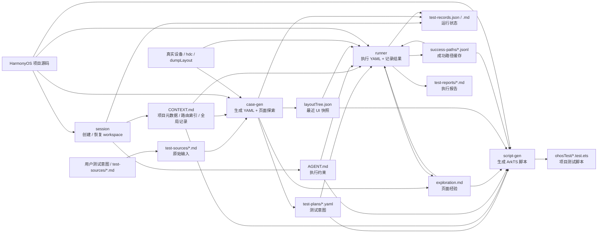
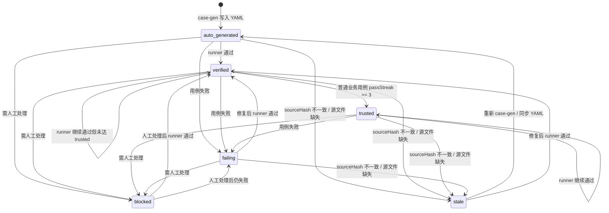

# 鸿蒙 UI 测试工作流

这是一套面向 HarmonyOS / ArkUI 项目的 Agent UI 交互测试工作流。它把“用户想测什么”和“设备上实际怎么点、怎么断言”分开管理：用户只写自然语言测试意图，Agent 负责读源码、上设备探索、生成 YAML、执行验证、记录成功路径，并在用例稳定后生成项目内 `ohosTest` ArkTS 脚本。

核心目标：

- YAML 保持意图层，不固化 selector、index 或坐标。
- Agent 通过源码、hdc 和 `dumpLayout` 实时判断 UI 状态。
- 每次执行沉淀页面经验、运行记录和成功路径，让后续重复执行更快、更稳。
- 支持停止后隔天继续，由 session 恢复 workspace 上下文。

## 快速开始

安装全部 skill：

```bash
./install.sh
```

只安装到指定平台，例如 Codex：

```bash
./install.sh codex
```

新项目第一次使用：

```text
session 新建 workspace
-> 复制 test-sources/example.md 并改写
-> case-gen 生成 YAML
-> runner 执行 YAML
-> runner 重复执行直到 verified / trusted
-> script-gen 生成 ArkTS
```

隔天继续工作：

```text
session 继续已有 workspace
-> 查看恢复摘要和建议
-> 优先处理 running / failing / stale / blocked / auto_generated
-> 根据建议执行 runner、case-gen 或 script-gen
```

只想补探索页面：

```text
session 继续 workspace
-> case-gen 批量探索缺少 exploration 的页面
-> 生成 smoke YAML
-> runner 执行 smoke YAML
```

## 整体流程

| skill | 什么时候用 | 做什么 | 主要结果 |
|-------|------------|--------|----------|
| `harmony-ui-test-session` | 开始或继续测试工作 | 创建 / 恢复 `UITestWorkspace-*`，读取 `AGENT.md`，汇总上下文 | `CONTEXT.md`、`AGENT.md`、`references/`、`test-records.json` |
| `harmony-ui-test-case-gen` | 把测试想法变成可执行用例 | 读取 `test-sources/*.md` 或自然语言，读源码和设备探索，生成结构化 YAML | `test-plans/*.yaml`、`explorations/<page>/exploration.md`、`layoutTree.json` |
| `harmony-ui-test-runner` | 在真机上执行 YAML | 执行操作和断言，失败时读源码修正，记录运行状态和成功路径 | `test-reports/*.md`、`test-records.json`、`success-paths/*.jsonl` |
| `harmony-ui-test-script-gen` | YAML 已验证，需要生成项目测试脚本 | 基于 YAML、页面经验和成功路径生成 ArkTS UI 测试代码 | `<module>/src/ohosTest/ets/test/*.test.ets`、`List.test.ets` |



## 使用步骤

### Step 1：创建或恢复工作空间

使用 `harmony-ui-test-session`。

新建 workspace 时，session 会提取 Bundle、Product、入口 Ability，并记录 route_map 路由索引。如果存在多个 route_map 候选，session 阶段选择一个主 `routeMap`，避免后续 case-gen / script-gen 卡住。

继续已有 workspace 时，session 会读取 `AGENT.md`、`CONTEXT.md`、records、YAML、exploration、报告和中断状态摘要，给出恢复建议，但不会默认刷新项目路由。

产物：

```text
UITestWorkspace-login-test/
├── CONTEXT.md
├── AGENT.md
├── references/
├── test-sources/example.md
├── test-plans/
├── explorations/
├── test-records.json
├── test-records.md
└── test-reports/
```

### Step 2：编写源用例

在 workspace 的 `test-sources/` 下写 Markdown。新建 workspace 会自带 `test-sources/example.md`，可以复制后改名。

```markdown
# 登录页错误密码

页面：accountLoginPage

前置：
- 未登录状态
- 已进入登录页

操作：
1. 输入账号 wrong_user
2. 输入密码 wrong_pass
3. 勾选协议
4. 点击登录

预期：
- 不跳转到首页
- 出现账号或密码错误提示
```

源用例只表达测试意图，不写 selector、控件 id、index 或坐标。一个源文件可以写多个场景，case-gen 会拆成多个 YAML。

### Step 3：生成 YAML 和页面探索数据

使用 `harmony-ui-test-case-gen`。

case-gen 会读取源用例，按目标页面读取已解析路由；缺失时按 `CONTEXT.md ## 路由索引` 从 route_map 懒加载。正常新建 workspace 时 session 已选择主 `routeMap`；如果旧 workspace 或手工修改后的 `CONTEXT.md` 仍存在 route_map 候选不唯一且未选择主 `routeMap`，当前源文件 / 页面记录为需人工处理，不阻塞批量中其他项。

产物：

```text
test-plans/accountLoginPage-1.yaml
explorations/accountLoginPage/exploration.md
explorations/accountLoginPage/layoutTree.json
test-records.json
```

YAML 示例结构：

```yaml
# 阅读说明：
# - 这是结构化测试意图，不是可直接回放的脚本。
# - action / assert 只描述“要做什么、要验证什么”。

caseId: account-login-error-password
target: accountLoginPage
source: test-sources/account-login-error.md
sourceHash: sha256:...
navigation:
  - deeplink: codemao://lunar/accountLogin
steps:
  - action:
      kind: inputText
      targetRole: 账号输入框
      text: wrong_user
  - action:
      kind: click
      targetRole: 登录按钮
    assert:
      - type: toastPresent
        value: 账号或密码错误
```

case-gen 只可初始化 `auto_generated` 记录，不写 passed / failed / trusted；单个源文件或页面失败不阻塞后续项。

### Step 4：执行 YAML

使用 `harmony-ui-test-runner`。

runner 会启动或确认 App 在前台，实时 `dumpLayout`，根据 YAML 意图、页面经验和源码分析执行操作。失败时先读源码和 UI 状态尝试修正；同一目标最多重试 3 次，仍失败就记录为失败 / blocked，批量中继续后续用例，fatal 设备问题除外。

产物：

```text
test-reports/2026-06-04-153000.md
test-records.json
test-records.md
explorations/accountLoginPage/success-paths/accountLoginPage-1.jsonl
```

### Step 5：重复执行，提高稳定性

继续使用 `harmony-ui-test-runner`。重复执行会增加 `passStreak`，让普通用例从 `verified` 升级为 `trusted`，并让 success-path 更可靠。smoke 用例通过后最高只到 `verified`。

### Step 6：生成 ArkTS 测试脚本

使用 `harmony-ui-test-script-gen`。

script-gen 默认只为 `verified` / `trusted` YAML 生成脚本；其他状态必须展示风险并等待用户明确确认。生成脚本时会复用 runner 验证过的页面经验和 success-path 语义证据，但不会把历史 hdc 命令或坐标写进 ArkTS。

产物：

```text
<module>/src/ohosTest/ets/test/AccountLogin.test.ets
<module>/src/ohosTest/ets/test/List.test.ets
<module>/src/ohosTest/module.json5
```

ArkTS 关键约束：

- `findComponent` 必须判 `null`，`findComponents` 必须判 `length > 0`。
- 所有 Component / Driver 异步方法必须 `await`。
- 不使用 `any`、`Object`、匿名对象字面量、动态属性索引、`Level` 或 `done` 回调。

## 工作空间与产物

| 文件 / 目录 | 谁创建 | 谁读取 | 谁写入 | 作用 |
|-------------|--------|--------|--------|------|
| `CONTEXT.md` | session | case-gen、runner、script-gen | session 创建；case-gen / runner / script-gen 增量追加 | 全局上下文，包含项目路径、Bundle、Product、路由索引、已解析页面路由、页面导航和全局记录 |
| `AGENT.md` | session | 所有 skill | session 创建 | 工作空间内的强约束，包括写入边界、遇阻先读代码、超限记录、ArkTS 语法限制 |
| `references/` | session | case-gen、runner、script-gen | session 创建 | 设备检查和 UiTest API / 指南文档 |
| `test-sources/*.md` | 用户或 case-gen | case-gen | 用户为主；case-gen 可规范化自然语言输入 | 人类原始用例输入，格式宽松 |
| `test-plans/*.yaml` | case-gen | runner、script-gen | case-gen | 测试意图，一个 YAML 一个用例 |
| `explorations/<page>/exploration.md` | case-gen 或 runner | case-gen、runner、script-gen | case-gen / runner 增量追加 | 页面经验库，记录导航、控件定位、状态规律、弹窗、修正和失败尝试 |
| `explorations/<page>/layoutTree.json` | case-gen 或 runner | runner、script-gen | case-gen / runner 覆盖最近快照 | 最近一次真实 `dumpLayout` 证据快照 |
| `explorations/<page>/success-paths/*.jsonl` | runner | runner、script-gen | runner 仅在 YAML 完整通过后覆盖 | 成功路径缓存，用于后续加速；复用前必须实时校验 |
| `test-records.json` | session | session、runner、case-gen | runner 为主；case-gen 只初始化 `auto_generated` | 机器运行状态唯一事实源 |
| `test-records.md` | session | 用户 | runner 覆盖刷新 | 人工查看的执行总览 |
| `test-reports/*.md` | runner | session、用户 | runner | 每轮执行报告、失败详情、缓存使用情况 |

数据原则：

- `test-sources/*.md` 是人类输入，格式宽松。
- `test-plans/*.yaml` 是结构化测试意图，不写 selector、index 或坐标。
- `CONTEXT.md` 只记录全局信息和跨页面信息。
- `exploration.md` 记录页面级经验。
- `layoutTree.json` 只是最近一次真实 UI 快照，不是完整状态库。
- `test-records.json` 是机器状态唯一事实源。
- `test-records.md` 是人工总览，可由 runner 覆盖。
- `success-paths/*.jsonl` 是成功路径缓存，不是盲回放脚本。

人类常看的产物都会自带“阅读说明”：

| 产物 | 说明形式 | 解释重点 |
|------|----------|----------|
| `test-plans/*.yaml` | 顶部 YAML 注释 | YAML 是结构化测试意图，不是回放脚本；`sourceHash`、`action`、`assert` 的作用 |
| `explorations/<page>/exploration.md` | `## 阅读说明` | 页面经验、控件定位、已验证修正、失败尝试记录分别怎么用 |
| `test-reports/*.md` | `## 阅读说明` | 本轮执行结果、records、failureType、success-path 的关系 |
| `test-records.md` | `## 阅读说明` | 这是人工总览，会被覆盖；机器事实源是 `test-records.json` |

`test-records.json` 和 `success-paths/*.jsonl` 主要给 agent / runner 读取，不强行写入解释文本，避免破坏机器读取和追加写入。

## 运行语义

### 状态流转

`test-records.json.cases[*].status` 表示用例的长期状态；`lastAttempt.result` 只表示最近一次执行结果。session 继续工作时会优先读取这些状态恢复上下文。



| status | 含义 | 如何离开 |
|--------|------|----------|
| `auto_generated` | case-gen 已生成 YAML，尚未被 runner 验证 | runner 执行后变为 `verified`、`failing`、`stale` 或 `blocked` |
| `verified` | runner 至少通过一次，当前可用 | 普通业务用例连续通过后升 `trusted`；失败时降为 `failing/stale/blocked` |
| `trusted` | 普通业务用例连续通过达到阈值，默认 `passStreak >= 3` | 继续通过保持 `trusted`；失败时降为 `failing/stale/blocked` |
| `failing` | 用例执行失败，如断言不满足、控件找不到、测试数据错误 | 修复数据、页面经验或 YAML 后重跑 |
| `stale` | 来源或 YAML 已变化，当前记录不再可信 | 重新 case-gen 或同步 source/YAML 后重跑 |
| `blocked` | 自动流程无法继续，需要人工处理信息、环境或前置条件 | 人工处理后重新执行 runner 或 case-gen |

补充规则：

- smoke YAML 通过后最高只到 `verified`，不会升级 `trusted`。
- `verified` 和 `trusted` 的执行流程没有本质区别；差异主要是信任等级和展示优先级。
- `lastAttempt.result="running"` 不是长期状态，它表示上次可能中断；session 继续时会提示重新处理该 YAML，但不会继承上次设备页面状态。
- `skipped` 只记录在 `lastAttempt.result`，不改变长期 `status` 和 `passStreak`。

### 特殊机制

| 机制 | 规则 |
|------|------|
| 多次执行 case-gen | `sourceHash` 未变化且 YAML 通过基础校验时默认跳过；同 `caseId` 有实质变化时更新同一 YAML，状态降回 `auto_generated`，清零 `passStreak` |
| smoke YAML | 批量探索模式生成的页面冒烟用例，每个页面最多一个 `test-plans/smoke-<page>.yaml`；只验证页面可达和核心锚点，不代表业务逻辑正确 |
| hash 校验 | `sourceHash` 不一致时 runner 记录 `staleSource` 并跳过当前 YAML；`yamlHash` 变化时禁用 success-path，按常规智能执行 |
| success-path | runner 在单个 YAML 完整通过后写入；复用前必须实时校验页面锚点、弹窗、键盘和目标控件；失败、跳过、中断或设备异常时不得覆盖已有缓存 |

### 长流程异常处理

case-gen 和 runner 都按长流程自动化设计：用户启动后，Agent 读源码和 hdc 自行判断，异常优先写入产物，避免中途频繁打断用户。

- 单个源文件、页面或 YAML 失败，不阻塞后续项。
- 目标页面无法唯一确认：case-gen 将当前源文件标记为需人工处理，不写 YAML，继续后续源文件。
- 测试数据缺失：case-gen 记录缺口，不编造数据，不写对应 YAML。
- 导航路径无法确认：case-gen / runner 记录候选依据和失败原因，当前页面或 YAML 标记为需人工处理 / blocked。
- 同一目标最多重试 3 次，仍失败就记录为 `failing` 或 `blocked`。
- `sourceHash` 不一致或源文件缺失：runner 将当前 YAML 记为 `staleSource` / `stale`，跳过执行，继续后续 YAML。
- `fatalDeviceIssue` 例如设备断开、App 无法启动、连续无法 `dumpLayout`，会停止批量流水线并记录恢复信息。
- script-gen 写入项目代码前仍可保留必要确认；它不是长时间无人值守执行链路。
- script-gen 默认只为 `verified/trusted` YAML 生成脚本；未验证、失败、过期或 blocked 的 YAML 必须展示风险并由用户明确确认。

## 安装细节

当前平台目录包括：`claude`、`codex`、`cursor`、`hermes`、`openclaw`。其中 Cursor 使用 Agent Skills 目录安装，不再使用 commands 形式。

也可以单独安装某一个 skill：

```bash
cd harmony-ui-test-runner
./install.sh codex
```
