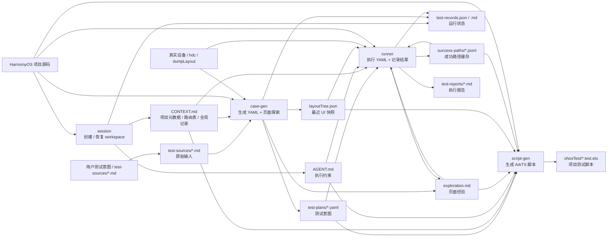

# 鸿蒙 UI 测试工作空间

这是一套面向 HarmonyOS / ArkUI 项目的 Agent UI 交互测试工作流。它把“用户想测什么”和“设备上实际怎么点、怎么断言”分开管理：用户只写自然语言测试意图，Agent 负责读源码、上设备探索、生成 YAML、执行验证、记录成功路径，并在用例稳定后生成项目内 `ohosTest` ArkTS 脚本。

这个框架的核心目标是：

- 让测试用例保持意图层，不在 YAML 里固化 selector、index 或坐标。
- 让 Agent 通过源码 + hdc + `dumpLayout` 实时判断 UI 状态。
- 让每次执行沉淀页面经验、运行记录和成功路径，后续重复执行更快、更稳。
- 支持停止后隔天继续，由 session 恢复 workspace 上下文。

## 框架组成

框架由四个 skill 组成，推荐按顺序使用。

| skill | 什么时候用 | 做什么 | 主要结果 |
|-------|------------|--------|----------|
| `harmony-ui-test-session` | 开始一个新测试工作，或继续已有工作 | 创建 / 恢复 `UITestWorkspace-*`，读取 `AGENT.md`，汇总上下文 | `CONTEXT.md`、`AGENT.md`、`references/`、`test-records.json` |
| `harmony-ui-test-case-gen` | 需要把测试想法变成可执行用例 | 读取 `test-sources/*.md` 或自然语言，读源码和设备探索，生成 v2 YAML | `test-plans/*.yaml`、`explorations/<page>/exploration.md`、`layoutTree.json` |
| `harmony-ui-test-runner` | 需要在真机上执行 YAML | 执行操作和断言，失败时读源码修正，记录运行状态和成功路径 | `test-reports/*.md`、`test-records.json`、`success-paths/*.jsonl` |
| `harmony-ui-test-script-gen` | YAML 已验证，需要生成项目测试脚本 | 基于 YAML、页面经验和成功路径生成 ArkTS UI 测试代码 | `<module>/src/ohosTest/ets/test/*.test.ets`、`List.test.ets` |

## 工作空间结构

执行 session 后会创建或恢复一个 `UITestWorkspace-*` 目录。

```text
UITestWorkspace-<name>/
├── CONTEXT.md
├── AGENT.md
├── references/
│   ├── device-setup.md
│   ├── UiTest-API.md
│   └── UiTest-指南.md
├── explorations/
│   └── <page>/
│       ├── exploration.md
│       ├── layoutTree.json
│       └── success-paths/
├── test-sources/
│   └── example.md
├── test-plans/
├── test-records.json
├── test-records.md
└── test-reports/
```

## 产物和文档

| 文件 / 目录 | 谁创建 | 谁读取 | 谁写入 | 作用 |
|-------------|--------|--------|--------|------|
| `CONTEXT.md` | session | case-gen、runner、script-gen | session 创建；case-gen / runner 增量追加 | 全局上下文，包含项目路径、Bundle、Product、路由表、页面导航和全局记录 |
| `AGENT.md` | session | 所有 skill | session 创建 | 工作空间内的强约束，包括写入边界、遇阻先读代码、超限即停、ArkTS 语法限制 |
| `references/` | session | case-gen、runner、script-gen | session 创建 | 设备检查和 UiTest API / 指南文档 |
| `test-sources/*.md` | 用户或 case-gen | case-gen | 用户为主；case-gen 可规范化自然语言输入 | 人类原始用例输入，格式宽松 |
| `test-plans/*.yaml` | case-gen | runner、script-gen | case-gen | v2 测试意图，一个 YAML 一个用例 |
| `explorations/<page>/exploration.md` | case-gen 或 runner | case-gen、runner、script-gen | case-gen / runner 增量追加 | 页面经验库，记录导航、控件定位、状态规律、弹窗、修正和失败尝试 |
| `explorations/<page>/layoutTree.json` | case-gen 或 runner | runner、script-gen | case-gen / runner 覆盖最近快照 | 最近一次真实 `dumpLayout` 证据快照 |
| `explorations/<page>/success-paths/*.jsonl` | runner | runner、script-gen | runner 仅在 YAML 完整通过后覆盖 | 成功路径缓存，用于后续加速；复用前必须实时校验 |
| `test-records.json` | session | session、runner、case-gen | runner 为主；case-gen 只初始化 `auto_generated` | 机器运行状态唯一事实源 |
| `test-records.md` | session | 用户 | runner 覆盖刷新 | 人工查看的执行总览 |
| `test-reports/*.md` | runner | session、用户 | runner | 每轮执行报告、失败详情、缓存使用情况 |

## 整体流程



## 安装

在本仓库根目录执行：

```bash
./install.sh
```

只安装到指定平台，例如 Codex：

```bash
./install.sh codex
```

当前平台目录包括：`claude`、`codex`、`cursor`、`hermes`、`openclaw`。

也可以单独安装某一个 skill：

```bash
cd harmony-ui-test-runner
./install.sh codex
```

## 使用步骤

### Step 1：创建或恢复工作空间

使用 `harmony-ui-test-session`。

目的：

- 新建 `UITestWorkspace-*`。
- 提取 HarmonyOS 项目的 Bundle、Product、入口 Ability 和路由表。
- 写入 `CONTEXT.md` 和 `AGENT.md`。
- 创建基础目录和 `test-records.json`。
- 在继续模式下恢复已有 workspace 的上下文，包括 records、YAML、exploration、报告和中断状态摘要。

用户需要提供：

- 工作名。
- HarmonyOS 项目代码仓库路径。
- 如果项目有多个 product，按提示选择。

结果：

```text
UITestWorkspace-login-test/
├── CONTEXT.md
├── AGENT.md
├── references/
├── test-sources/example.md
├── test-plans/
├── explorations/
├── test-records.json
├── test-records.md
└── test-reports/
```

继续已有 workspace 时，session 会展示恢复摘要和建议下一步，例如：

```text
运行记录：trusted 1 / verified 1 / failing 0 / stale 0 / auto_generated 1
中断记录：无

恢复建议：
1. runner：重新处理 test-plans/accountLoginPage-1.yaml
2. case-gen：补探索 settingsPage
3. script-gen：已 trusted 的用例可生成脚本
```

### Step 2：编写源用例

在 workspace 的 `test-sources/` 下写 Markdown。新建 workspace 会自带 `test-sources/example.md`，可以复制后改名。

推荐格式：

```markdown
# 登录页错误密码

页面：accountLoginPage

前置：
- 未登录状态
- 已进入登录页

操作：
1. 输入账号 wrong_user
2. 输入密码 wrong_pass
3. 勾选协议
4. 点击登录

预期：
- 不跳转到首页
- 出现账号或密码错误提示
```

目的：

- 让用户只表达测试意图。
- 不要求用户写 selector、控件 id、index 或坐标。
- 支持一个源文件写多个场景，case-gen 后续会拆成多个 YAML。

结果：

```text
test-sources/account-login-error.md
```

### Step 3：生成 YAML 和页面探索数据

使用 `harmony-ui-test-case-gen`。

目的：

- 读取用户写的 `test-sources/*.md` 或用户直接输入的自然语言。
- 结合 `CONTEXT.md` 的路由表定位目标页面。
- 读源码分析控件、业务逻辑、前置条件和断言。
- 通过 hdc / `dumpLayout` 获取真实 UI 文本和控件结构。
- 生成 v2 YAML 和页面经验。

结果：

```text
test-plans/accountLoginPage-1.yaml
explorations/accountLoginPage/exploration.md
explorations/accountLoginPage/layoutTree.json
test-records.json
```

YAML 示例结构：

```yaml
schemaVersion: 2
caseId: account-login-error-password
target: accountLoginPage
source: test-sources/account-login-error.md
sourceHash: sha256:...
navigation:
  - deeplink: codemao://lunar/accountLogin
steps:
  - action:
      kind: inputText
      targetRole: 账号输入框
      text: wrong_user
  - action:
      kind: click
      targetRole: 登录按钮
    assert:
      - type: toastPresent
        value: 账号或密码错误
```

注意：

- YAML 只表达意图，不写强执行细节。
- 控件定位经验写入 `exploration.md`。
- case-gen 只可初始化 `auto_generated` 记录，不写 passed / failed / trusted。

### Step 4：执行 YAML

使用 `harmony-ui-test-runner`。

目的：

- 读取 `test-plans/*.yaml`。
- 启动或确认 App 在前台。
- 实时 `dumpLayout`，根据 YAML 意图、页面经验和源码分析执行操作。
- 执行断言，失败时读源码和 UI 状态尝试修正。
- 更新运行状态，生成报告。
- 用例完整通过后写入 success-path，后续重复执行可加速。

结果：

```text
test-reports/2026-06-04-153000.md
test-records.json
test-records.md
explorations/accountLoginPage/success-paths/accountLoginPage-1.jsonl
```

runner 的关键规则：

- 每个 YAML 开始和结束都原子更新 `test-records.json`。
- 遇阻先读代码，不盲目重试。
- 同一目标最多重试 3 次，仍失败就汇报卡点。
- success-path 只做加速缓存，复用前必须实时校验页面锚点和目标控件。
- 失败、跳过、中断或设备异常时不得覆盖旧 success-path。

建议：

- 新生成 YAML 第一次跑通常是探索和修正阶段。
- 同一个普通用例连续通过 3 次后才会升级为 `trusted`。
- smoke 用例通过后最高只标记 `verified`。

### Step 5：重复执行，提高稳定性

继续使用 `harmony-ui-test-runner`。

目的：

- 验证用例是否稳定。
- 让 runner 复用并刷新 success-path。
- 发现页面状态差异、弹窗、键盘遮挡、等待不足等问题。
- 将可验证修正沉淀到 `exploration.md`。

结果：

- `passStreak` 增加。
- 普通用例从 `verified` 升级为 `trusted`。
- success-path 变得更可靠。
- `test-records.md` 中人工总览更清晰。

### Step 6：生成 ArkTS 测试脚本

使用 `harmony-ui-test-script-gen`。

目的：

- 将已经验证过的 YAML 转成 HarmonyOS `ohosTest` 脚本。
- 同页面多个业务用例合并到一个 `.test.ets`。
- 增量更新 `List.test.ets`。
- 缺少 `ohosTest/module.json5` 时创建测试模块配置。

结果：

```text
<module>/src/ohosTest/ets/test/AccountLogin.test.ets
<module>/src/ohosTest/ets/test/List.test.ets
<module>/src/ohosTest/module.json5
```

script-gen 的关键规则：

- 优先使用 runner 验证过的页面经验和 success-path 语义证据。
- 不把历史 hdc 命令或坐标写进 ArkTS。
- `findComponent` 必须判 `null`，`findComponents` 必须判 `length > 0`。
- 所有 Component / Driver 异步方法必须 `await`。
- 不使用 `any`、`Object`、匿名对象字面量、`Level` 或 `done` 回调。

## 常见使用顺序

### 新项目第一次使用

```text
session 新建 workspace
-> 复制 test-sources/example.md 并改写
-> case-gen 生成 YAML
-> runner 执行 YAML
-> runner 重复执行直到 verified / trusted
-> script-gen 生成 ArkTS
```

### 隔天继续工作

```text
session 继续已有 workspace
-> 查看恢复摘要和建议
-> 优先处理 running / failing / auto_generated
-> 根据建议执行 runner、case-gen 或 script-gen
```

### 只想补探索页面

```text
session 继续 workspace
-> case-gen 批量探索缺少 exploration 的页面
-> 生成 smoke YAML
-> runner 执行 smoke YAML
```

## 数据原则

- `test-sources/*.md` 是人类输入，格式宽松。
- `test-plans/*.yaml` 是结构化测试意图，不写 selector、index 或坐标。
- `CONTEXT.md` 只记录全局信息和跨页面信息。
- `exploration.md` 记录页面级经验。
- `layoutTree.json` 只是最近一次真实 UI 快照，不是完整状态库。
- `test-records.json` 是机器状态唯一事实源。
- `test-records.md` 是人工总览，可由 runner 覆盖。
- `success-paths/*.jsonl` 是成功路径缓存，不是盲回放脚本。

## 何时应该停下来问用户

Agent 大多数问题会读源码和 hdc 自行判断，但以下情况应该停下来：

- 目标页面无法唯一确认。
- 测试数据缺失，例如账号、密码、验证码策略。
- 导航路径无法从路由表、源码或设备探索中确认。
- 同一目标重试 3 次仍无法定位或断言。
- 设备断开、App 无法启动、连续无法 `dumpLayout`。
- script-gen 无法确认项目里的可编译 deeplink / `startAbility` 写法。

