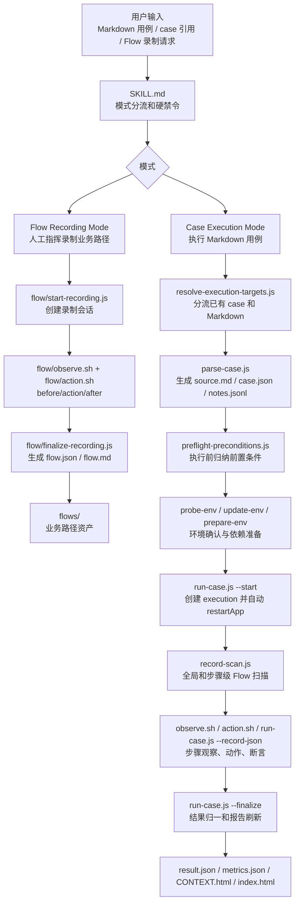
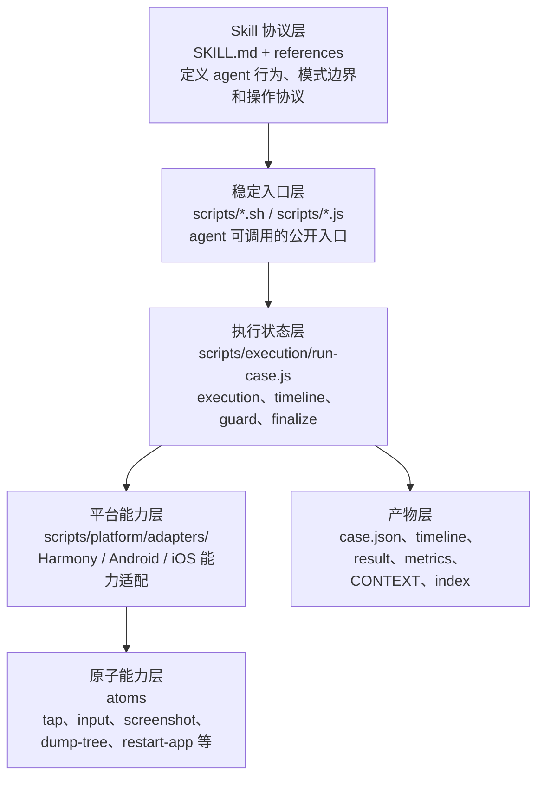
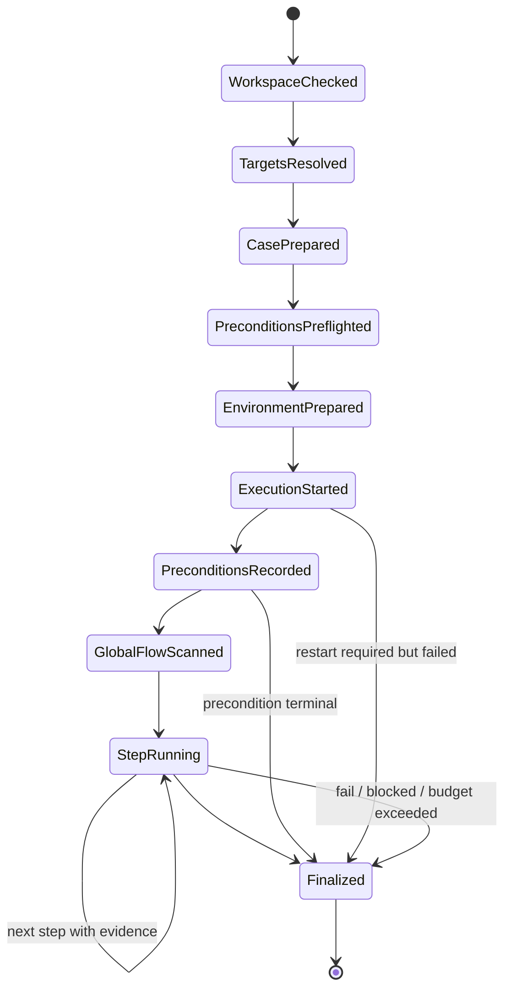
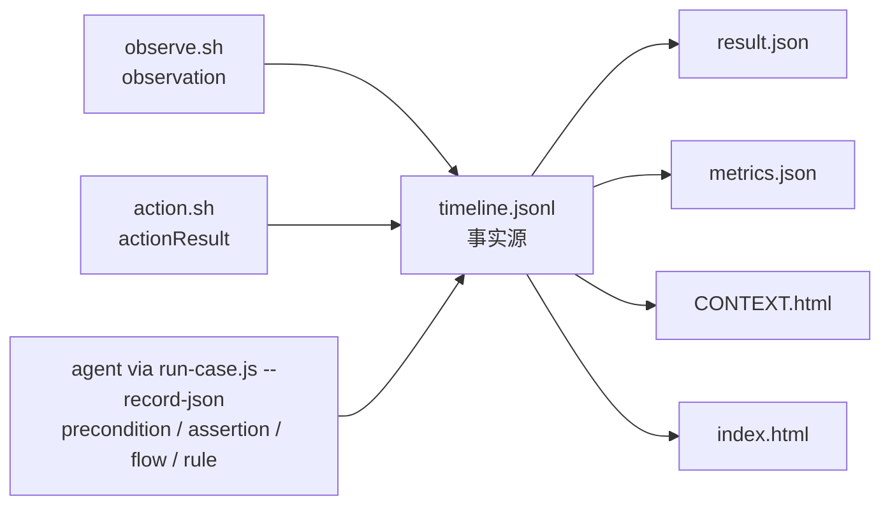
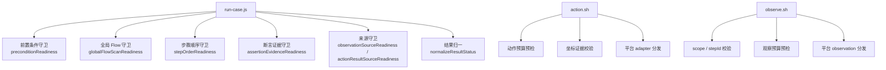
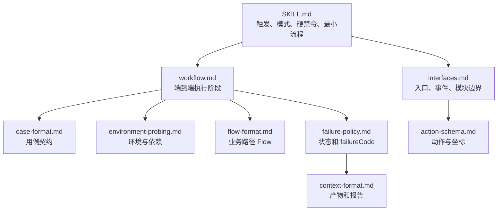

# mobile-ai-visual-test 架构图

本文档用于理解 skill 的整体设计，不作为 agent 执行时的唯一规则来源。执行规则以 `SKILL.md` 和 `references/` 为准，硬守卫以 `scripts/execution/run-case.js`、`scripts/action.sh`、`scripts/observe.sh` 为准。

## 总体架构

## 分层职责

职责边界：

| 层级 | 做什么 | 不做什么 |
| --- | --- | --- |
| Skill 协议层 | 约束 agent 怎么执行、怎么记录、不能做什么 | 不直接操作设备 |
| 稳定入口层 | 提供公开 CLI，封装预算、来源和平台分发 | 不承载业务判断 |
| 执行状态层 | 管理 execution、timeline、顺序、证据、结果归一 | 不理解截图语义 |
| 平台能力层 | 适配 Harmony、Android、iOS 的设备能力 | 不写 case 事实 |
| 原子能力层 | 执行最小设备动作或采集 | 不组合业务流程 |
| 产物层 | 保存事实、结果、统计和报告 | 不作为续跑指针 |

## 执行状态机

关键点：

- execution 从 `run-case.js --start` 开始。
- 每个 case 只有一个当前未收尾 execution。
- finalized 后 timeline 锁定。
- 批量执行必须一个 case finalized 后再开始下一个。

## 事实源

`timeline.jsonl` 是事实源。报告、结果和统计都是事实源的投影。

## 守卫位置

文档指导 agent 正确调用入口；入口守卫负责拒绝非法事实和非法流程。

## 文档职责

规则归属原则：

- 主说明只保留 agent 必须立刻遵守的硬规则。
- reference 文件只拥有自己的领域规则。
- 其他文件需要提及时只做短引用。
- 代码守卫是最终硬约束。

## 核心设计原则

- agent 做视觉理解、业务判断、Flow 选择和断言。
- 脚本做确定性操作、来源控制、预算控制、状态机和报告生成。
- 每个 case 都完整重跑，不从失败步骤续跑。
- 每个 case 都从第一步开始，不复用后续页面跳步。
- 每个步骤都需要当前 execution 内的证据。
- Flow 是参考路径，不是盲目回放脚本。
- 平台 adapter 只做能力适配，不做业务编排。
