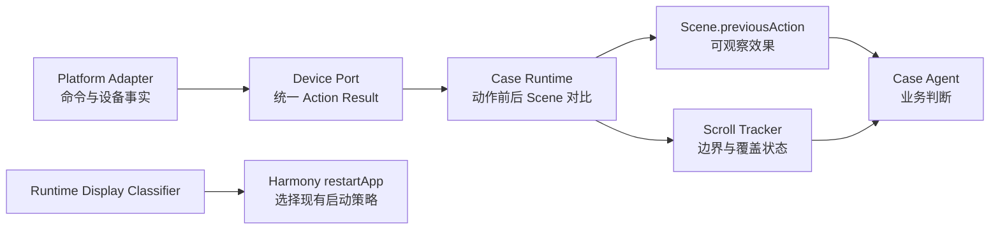

# MAVT0902 问题修复设计

> 设计日期：2026-09-07
>
> 输入：`docs/MAVT0902-issues-discussion-draft.md`
>
> 约束：不修改 `/Users/cm/WorkSpace/UITestWorkspace/MAVT0902`，不执行其中的用例；历史 execution 仅作为只读证据。

## 1. 目标与原则

本次修复覆盖四项问题：列表搜索提前结束、动作结果语义误导、横屏冷启动策略失配、长按参数和过程取证丢失。

设计遵循现有架构边界：

- Case Agent 继续负责目标选择、路径调整和业务结论。
- Case Runtime 只提供确定性的执行事实、观察事实和证据完整性校验。
- Device Port 统一平台差异，Platform Adapter 只报告它实际知道的底层事实。
- 不增加弹窗专用点击，不使用动态 Prompt，不写死设备型号，不设置固定滑动次数。
- 无法验证的事实必须表达为 `UNVERIFIED` 或 `UNKNOWN`，不能提升为成功。
- 新协议只服务新 execution；历史 execution 和 MAVT0902 证据不迁移、不回写。

## 2. 总体方案

四项修复不是完全独立的。Action Result 是其他动作能力的事实基础，列表覆盖需要依赖滑动后的可观察效果，长按也需要复用统一结果模型。



建议实施顺序：

1. Action Result v2 和动作前后观察闭环。
2. 长按参数透传与按住期间取证。
3. HarmonyOS 运行时显示形态判断。
4. 垂直列表覆盖跟踪和负向结论校验。
5. Reader、报告、接口文档和全量自动化测试同步收口。

## 3. 通用 Action Result 修复

### 3.1 当前问题

当前 HarmonyOS 的 `tap.sh` 在 HDC 命令正常退出后直接返回 `ok: true`，并把请求坐标原样写成 `executedPoint`。Case Runtime 随后把它映射成 `status: SUCCEEDED`。这实际只证明命令调用结束，既不能证明设备在该位置产生了真实触点，也不能证明界面或业务目标发生变化。

框架已有动作后 Scene 和截图比较能力，但当前返回给 Case Agent 的 `Scene.previousAction` 仍以单一成功状态为主，动作效果没有成为稳定、明确的协议字段。

### 3.2 新的分层结果

Adapter Action Result 升级为 v2，统一由 Device Port 校验并规范化：

```json
{
  "schemaVersion": 2,
  "type": "actionResult",
  "platform": "harmony",
  "action": "tap",
  "command": {
    "status": "ACCEPTED",
    "transport": "HDC_UITEST",
    "elapsedMs": 86
  },
  "deviceExecution": {
    "status": "UNVERIFIED",
    "verification": "REQUEST_ECHO",
    "dispatchedPoint": {"x": 1278, "y": 671},
    "actualTouchPoint": null
  }
}
```

Runtime 完成动作后观察，再组装面向 Case Agent 的结果：

```json
{
  "operationId": "action-0004",
  "lifecycle": {"status": "COMPLETED"},
  "command": {"status": "ACCEPTED"},
  "deviceExecution": {"status": "UNVERIFIED"},
  "observedEffect": {
    "status": "UNCHANGED",
    "beforeSceneRef": "scene-0003",
    "afterSceneRef": "scene-0004"
  }
}
```

字段语义：

| 层次 | 可选状态 | 含义 |
| --- | --- | --- |
| `lifecycle.status` | `COMPLETED`、`UNKNOWN` | Runtime 是否完成了事务记录和动作后观察 |
| `command.status` | `ACCEPTED`、`REJECTED`、`UNKNOWN` | 底层命令是否被正常调用；不是业务成功 |
| `deviceExecution.status` | `VERIFIED`、`UNVERIFIED`、`NOT_EXECUTED`、`FAILED` | 是否有平台级事实证明设备动作发生 |
| `observedEffect.status` | `CHANGED`、`UNCHANGED`、`UNKNOWN` | 动作前后界面是否发生可观察变化；不是预期是否达成 |

`CHANGED` 只表示界面发生变化，不能自动等同于点中了目标；`UNCHANGED` 也不自动等同于失败，例如等待、到达列表边界或无视觉反馈的动作都可能不改变页面。

### 3.3 动作空间证据

- Adapter 的 `executedPoint`、`executedFrom`、`executedTo` 改为 `dispatchedPoint`、`dispatchedFrom`、`dispatchedTo`。
- 新增独立 Action Spatial Evidence Service，统一校验截图坐标到命令坐标的转换，并为点击、长按、输入和滑动一次性生成不可变 JSON 与标注图。
- HDC 没有返回真实触点时，`actualTouchPoint` 固定为 `null`，`deviceExecution.status` 为 `UNVERIFIED`。
- `certainty=DISPATCH_ONLY` 时分别展示请求点和命令投递点，不宣称真实触点；平台确有反馈时使用 `DEVICE_CONFIRMED` 和独立的 `actual` 标记。
- 标注 SVG 自带操作前截图底图，事务与事件只保存 `spatialEvidenceRef`；Runtime、恢复、报告、看板和完整性校验通过同一 Reader/Projection 复用，不重复换算或绘制。
- `Scene.previousAction.spatialEvidence.annotatedScreenshot.attachment` 让 Case Agent 在正常动作响应中直接查看落点，无需额外设备操作或 Runtime 调用。
- 本轮不增加经验性偏移补偿，也不把视觉单点伪装为目标控件边界。

### 3.4 Runtime 事务和事件

- 保留 `actionCompleted` 事件名，但它只表示生命周期完成，移除依赖 `event.ok !== false` 的成功推断。
- `actionCompleted` 保存规范化后的 `command`、`deviceExecution`、`observedEffect` 和证据引用。
- Adapter 超时、进程中断或无法确定是否投递时，继续使用 `actionOutcomeUnknown`，并先观察、不自动重放。
- 明确的命令拒绝记录为已完成事实，不包装成业务成功；是否重试由 Agent 根据 Scene 决定。
- `technical-facts.js` 不再把任意 `actionCompleted` 当作可消除技术事实的“成功动作”，只接受明确可用的新 Scene、恢复成功或针对同一问题的可验证结果。

### 3.5 动作效果计算

动作效果在 Runtime 层基于动作前后 Scene 计算，而不是由 Adapter 猜测：

- 截图哈希不同，且证据可用：`CHANGED`。
- 截图哈希相同，且两次观察均稳定可用：`UNCHANGED`。
- 截图缺失、观察异常或比较条件不成立：`UNKNOWN`。
- 同时记录 App 前台状态、窗口、布局关键状态变化，作为补充事实，不用于推断业务目标。

`scene-service` 生成并持久化最终 Scene 前完成比较，使 `Scene.previousAction.observedEffect`、operation 文件和 `events.jsonl` 三处语义一致。

### 3.6 涉及模块

- `scripts/platform/adapters/{harmony,android,ios}`：输出 Action Result v2。
- `scripts/platform/device-port.js`：统一校验和规范化动作事实。
- `scripts/lib/action-spatial-evidence.js`：唯一负责空间事实校验、落盘、读取和投影。
- `scripts/case-runtime/action-service.js`、`scene-service.js`：组装动作前后结果并持久化。
- `scripts/lib/observation-consistency.js`、`technical-facts.js`：修正效果和技术事实消除语义。
- `scripts/report/execution-trace.js`、`execution-narrative.js`、`current-report.js`：不再展示笼统的“设备已完成操作”。

## 4. 长按修复

### 4.1 请求契约

视觉长按和控件长按统一生成同一种底层 Action：

```json
{
  "type": "longPress",
  "x": 554,
  "y": 2053,
  "durationMs": 5000
}
```

两种上层输入分别为：

```json
{"visual": {"gesture": "longPress", "point": [0.55, 0.92], "durationMs": 5000}}
```

```json
{"capabilityId": "scene-0001:longPress:element-id", "input": {"durationMs": 5000}}
```

修正规则：

- `visualAction()` 必须复制 `visual.durationMs`。
- `elementAction()` 必须读取 `input.durationMs`。
- Case Runtime 中 `longPress.durationMs` 为必填正整数，缺失或非法时在 Adapter 调用前返回 `REQUEST_INVALID`。
- 平台 Atom 不再提供掩盖上层错误的 `800 ms` 默认值；Adapter 仅执行已验证时长。
- `observationPolicy` 必须从 `action-service` 原样传入 Device Port，不能在中间重建请求时丢失。

### 4.2 按住期间取证

```json
{
  "operation": "act",
  "visual": {
    "gesture": "longPress",
    "point": [0.55, 0.92],
    "durationMs": 5000
  },
  "observationPolicy": {
    "duringActionAtMs": 4000
  }
}
```

中央契约校验：

- `duringActionAtMs` 只允许用于 `longPress`。
- 必须是正整数并满足 `20 <= duringActionAtMs < durationMs`。
- 请求过程截图但 Adapter 未返回有效图片时，动作结果不能报告完整完成，返回明确技术事实。

过程截图写入正式证据图，并在 Action Result 中返回：

```json
{
  "duringActionObservation": {
    "status": "CAPTURED",
    "requestedAtMs": 4000,
    "capturedAtMs": 4018,
    "screenshotRef": "screenshots/action-0004-during.png"
  }
}
```

`requestedDurationMs` 与命令耗时分别记录。若平台只能证明命令持续时间，字段使用 `commandElapsedMs`，不能命名为真实按压时长。

Harmony Atom 使用平台 `uinput -T -m x y moveX y -k keepMs smoothMs` 合成长按，其中 `moveX` 在目标点内向微移 1 像素，`smoothMs = min(durationMs, 1000)`，`keepMs = durationMs - smoothMs`。真机验证表明，持续产生 MOVE 能触发静止 `DOWN -> 等待 -> UP` 无法稳定触发的长按；该方案只依赖 HDC，不引入 SDK、Driver 或测试 HAP。HarmonyOS 支持的请求范围为 `1..61000 ms`。由于命令可能在设备侧异步执行，Adapter 必须等待请求时长届满后再返回，避免下一动作与尚未抬起的触摸重叠。结果中的 `command.elapsedMs` 只表示投递耗时，`timing.completionBarrierWaitMs` 和 `timing.adapterElapsedMs` 表示 Adapter 完成屏障，不得将其解释为设备已反馈真实触摸时长。

### 4.3 用例 006 的预期行为

- 请求 `durationMs: 5000`。
- 约 `4000 ms` 采集“松开发送”按住态。
- 松开后自动观察消息是否发送。
- Case Agent 根据过程 Scene 和释放后 Scene 判断业务预期，Runtime 不代判。

## 5. HarmonyOS 横屏重启修复

### 5.1 运行时显示形态

静态 `deviceFormFactor` 继续作为诊断信息保留，但不再决定 HarmonyOS 冷启动方向策略。每次 `restartApp` 在杀进程前读取有效显示宽高：

```text
aspectRatio = max(width, height) / min(width, height)
aspectRatio >= 1.70  -> PHONE_LIKE
aspectRatio < 1.70   -> TABLET_LIKE
```

阈值 `1.70` 在 `startup-display.js` 中集中定义并测试。它用于区分当前展开形态，不绑定 `triplefold`、`foldable` 或具体设备型号。当前证据中的 `2232 x 1008` 比例约为 `2.21`，会进入 `PHONE_LIKE`。

### 5.2 策略选择

| 运行时形态 | 启动策略 |
| --- | --- |
| `PHONE_LIKE` | 复用现有手机流程：启动前恢复竖屏并验证，启动后再次校验，必要时重试一次 |
| `TABLET_LIKE` | 保持当前方向启动，不执行竖屏归一化 |
| `UNKNOWN` | 在杀 App 前失败，保留现场并返回无法选择启动策略 |

读取显示状态必须前移到 `aa force-stop` 之前。这样在 DisplayManager 不可读时不会先破坏当前暖会话。

### 5.3 结果记录

`startupDisplay` 增加并固定以下诊断字段：

```json
{
  "staticDeviceFormFactor": "triplefold",
  "runtimeDisplay": {"width": 2232, "height": 1008, "aspectRatio": 2.2143},
  "runtimeDisplayClass": "PHONE_LIKE",
  "strategy": "NORMALIZE_PORTRAIT",
  "before": {"orientation": "landscape"},
  "afterNormalization": {"orientation": "portrait"},
  "afterLaunch": {"orientation": "portrait"},
  "status": "VERIFIED"
}
```

启动后仍不符合所选策略时，返回 `ORIENTATION_VERIFY_AFTER_START`，恢复流程进入明确技术失败；不能返回 `SKIPPED` 或成功。

### 5.4 契约调整

- HarmonyOS 默认策略的适用条件从静态 `appliesTo: ["phone"]` 迁移为运行时 `PHONE_LIKE`。
- `execution-environment.js` 不再要求 HarmonyOS 必须提供 `deviceFormFactor` 才能使用方向策略。
- Probe 只要能读取有效显示宽高，就声明可执行运行时方向策略。
- Android 和 iOS 保持现有 `preserve` 策略，不受这次分类逻辑影响。

## 6. 列表搜索覆盖修复

### 6.1 首期范围

首期只支持布局树可识别的单层垂直列表：

- 存在 `scrollable=true` 的垂直容器或明确 `List`/`Scroll` 节点。
- 列表项具有 bounds，并能从文本、角色、资源 ID 或可访问性 ID 形成稳定锚点。
- 横向列表、嵌套列表和纯截图列表暂不声明完整覆盖；统一返回 `trackingStatus: UNSUPPORTED` 或 `INSUFFICIENT_EVIDENCE`。

只读检查 MAVT0902 的 019、021 历史布局后，目标页均包含 `scrollable=true` 的 `List`、多个 `ListItem`、列表项 bounds 和作品名文本，因此属于首期可支持范围。

### 6.2 状态归属

新增确定性的 `scroll-context.js`，由 Scene Service 在观察完成后更新。状态绑定键包含：

- 当前 warm session `generation`。
- App 身份和页面上下文签名。
- 滚动容器身份、bounds 和轴向。
- 标签、筛选、排序等容器外稳定状态签名。

这比只绑定页面或只绑定列表节点更严格，能够区分“我的作品”的不同标签和筛选状态。

以下情况立即使旧覆盖状态失效：

- generation 变化或 App 恢复。
- 点击、输入、返回等非滚动动作改变了页面或列表上下文。
- 容器身份、bounds、标签/筛选状态发生变化。
- 列表项集合出现无法由连续滚动解释的突变。
- 连续观察无法建立可信锚点关系。

### 6.3 锚点与连续覆盖

列表项锚点不使用随 observation 变化的 `element.ref`，而使用经过脱敏和归一化的稳定指纹：资源/可访问性 ID、角色、可见文本摘要和子节点结构。重复卡片不能仅凭相同标题视为同一项；需要唯一指纹或相邻有序锚点共同确认。

一次滑动只有满足以下条件才计入连续覆盖：

- 命令状态不是 `REJECTED` 或 `UNKNOWN`。
- 动作前后识别到同一滚动容器。
- 相邻 Scene 至少共享一个高置信锚点，或共享一组顺序一致的中置信锚点。
- 锚点位移方向与请求滚动方向一致。
- 没有页面切换、列表突变或证据冲突。

若共享锚点不足，该次滑动仍可由 Agent使用，但覆盖状态降为 `GAPPED`，不能支持“全列表不存在”。

### 6.4 自适应滑动

Runtime 不固定 30% 重叠。它根据当前容器和完整可见列表项估算下一次滑动距离：

- 目标是移动到新的内容区域，同时至少保留一个完整、可识别锚点。
- 卡片越大，允许的移动距离越大；锚点稀疏或识别不稳定时自动缩短。
- 没有足够布局信息时保留现有通用滑动能力，但将覆盖可信度设为不足。
- 若某次移动造成覆盖断点，Runtime 不假装连续；Agent可反向回到已知位置后重新建立覆盖。

Agent仍决定向哪个方向搜索，Runtime只决定该方向上能保持证据连续性的手势参数。

### 6.5 边界置信度

边界采用三级状态：

| 状态 | 依据 | 能否支持不存在结论 |
| --- | --- | --- |
| `CONFIRMED` | 平台/布局有明确边界信号，或相同方向连续两次已接受滑动均无可见和锚点位移 | 是 |
| `PROBABLE` | 单次稳定无位移，或出现明确“到底了”等语义锚点但缺少第二证据 | 否 |
| `UNKNOWN` | 动作结果未知、观察不稳定或锚点不足 | 否 |

连续两次无位移只发生在边界确认阶段，不要求每页重复操作；它增加最多一次边界手势，换取对命令未生效和真实到边界的区分。若布局能提供明确边界，则不需要第二次手势。

### 6.6 Scene 协议

Scene 新增结构化字段，不拼接动态自然语言：

```json
{
  "scrollContexts": [
    {
      "id": "scroll-ctx-0001",
      "axis": "VERTICAL",
      "trackingStatus": "TRACKING",
      "reachedStart": "UNKNOWN",
      "reachedEnd": "CONFIRMED",
      "coverage": "CONTIGUOUS",
      "searchedAbove": false,
      "searchedBelow": true,
      "unexploredDirections": ["UP"],
      "absenceConclusionSupported": false,
      "evidenceRefs": ["scene-0001", "scene-0002", "scene-0003"]
    }
  ]
}
```

Agent 在每次普通响应中都能看到尚未搜索方向，不需要先 `finish` 再被驳回。

### 6.7 完成校验

CaseResult 的 check 增加可选 `evidenceBasis`：

```json
{
  "expectationRef": "E1",
  "status": "FAIL",
  "actual": "完整列表未发现目标作品",
  "evidenceBasis": {
    "type": "SEARCH_ABSENCE",
    "sceneRef": "scene-0011",
    "scrollContextRef": "scroll-ctx-0001"
  },
  "sceneRefs": ["scene-0001", "scene-0011"]
}
```

Case Agent 在首次用例理解中将这类验证点声明为 `SEARCH_EXISTENCE`。其 FAIL 结论必须声明 `SEARCH_ABSENCE`，Result Integrity 从 `sceneRef` 对应的不可变 Scene 校验 scroll context 属于当前 execution 和 generation，且同时满足：

- 起点两侧均连续覆盖，或已从一个 `CONFIRMED` 边界连续覆盖到另一个 `CONFIRMED` 边界。
- `coverage` 为 `CONTIGUOUS`。
- 没有失效、突变或未解决的证据冲突。
- `absenceConclusionSupported` 为 `true`。

校验失败返回 `RESULT_INCOMPLETE`，但这是残余兜底；主要纠错发生在 Agent 每次看到 `scrollContexts` 时。

Runtime 不解析 `actual` 的自然语言来猜测是否为负向结论，避免引入不稳定语义规则。

### 6.8 涉及模块

- `scripts/lib/layout-observation.js`：保留滚动容器、列表项及稳定锚点所需属性。
- 新增 `scripts/lib/scroll-context.js`：纯函数完成容器匹配、锚点对齐、边界和覆盖计算。
- `scripts/case-runtime/scene-service.js`：把 scroll context 写入 Scene 和事件。
- `scripts/case-runtime/capability-catalog.js`：为垂直滚动生成自适应手势。
- `scripts/case-runtime/contract.js`、`result-integrity.js`：校验 `SEARCH_ABSENCE` 引用。
- `prompts/case-agent.md`、`references/interfaces.md`：只增加固定字段说明。

## 7. 协议版本与兼容策略

这次修改会改变 Adapter Action Result、Scene、CaseResult 和 execution 证据语义，不能在旧 execution 上混用。

- Adapter Action Result 升级到 schema v2。
- Scene 升级到 schema v2。
- execution schema 从 v6 升级到 v7。
- Agent Contract implementation SHA 随代码变化更新。
- 未完成的旧 execution 按现有 closure 机制结束，新批次创建 v7 execution。
- 已完成报告继续由原静态产物读取，不迁移、不重算，也不修改 MAVT0902 历史数据。
- 所有生产者、Reader、Result Integrity 和 Report 必须在同一个变更中升级，避免半新半旧协议。

## 8. 测试方案

只运行框架自动化测试和静态夹具，不运行 MAVT0902 用例。

### 8.1 Action Result

- 三个平台 Adapter 的 v2 契约一致性。
- HDC 返回 0 时只得到 `command=ACCEPTED`、`deviceExecution=UNVERIFIED`。
- 请求坐标与投递坐标一致不再被描述为真实触点。
- 动作后截图相同、不同、缺失分别映射为 `UNCHANGED`、`CHANGED`、`UNKNOWN`。
- 超时/中断仍进入 `actionOutcomeUnknown` 且不自动重放。
- 报告不再显示无依据的“设备操作成功”。

### 8.2 长按

- 视觉路径和控件路径都传递 `durationMs: 5000`。
- 缺失、零、负数、小数时在 Adapter 前返回 `REQUEST_INVALID`。
- `duringActionAtMs` 超界或用于非长按时拒绝。
- 过程截图进入 operation、Scene 返回和 artifact manifest。
- HarmonyOS、Android、iOS Adapter 均接收相同时长契约。

### 8.3 横屏重启

- `2232 x 1008`、`1008 x 2232` 均判为 `PHONE_LIKE`。
- 典型平板比例判为 `TABLET_LIKE`。
- 临界值 `1.70`、缺失宽高、零值覆盖。
- `PHONE_LIKE` 横屏时先归一化再启动，启动后漂移会重试并验证。
- `TABLET_LIKE` 保持方向。
- DisplayManager 不可读时在 `force-stop` 前失败。
- 静态 `triplefold` 不再改变同一运行时尺寸的判断。

### 8.4 列表覆盖

- 从顶部到底部、从底部到顶部、从中间分别向两侧覆盖。
- 单次边界无位移只能得到 `PROBABLE`，双重证据得到 `CONFIRMED`。
- 相邻 Scene 有唯一锚点、重复标题的有序锚点、锚点缺失三种情况。
- 标签切换、列表增删、刷新、generation 变化会使旧 context 失效。
- 覆盖断点时 `absenceConclusionSupported=false`。
- `SEARCH_ABSENCE` 引用完整和不完整 context 时，finish 分别通过和返回 `RESULT_INCOMPLETE`。
- 横向、嵌套、纯视觉列表返回不支持，不伪报完整覆盖。

### 8.5 回归范围

- `case-runtime.test.js`
- `platform-contract.test.js`
- `action-spatial-evidence.test.js`
- `layout-observation.test.js`
- `knowledge-closure.test.js`
- `execution-trace.test.js`
- `execution-narrative.test.js`
- `report-reader.test.js`
- `publication-integrity.test.js`
- `architecture-boundaries.test.js`

## 9. 验收标准

- Agent 不再收到笼统的动作成功状态，能直接看到命令、设备执行、动作落点和界面效果四类事实。
- Agent、恢复、看板与报告读取同一 `spatialEvidenceRef`，不存在不同环节重复计算或标注漂移。
- 037/038 相同现场下，Runtime 至少明确返回“命令已接受、真实触点未验证、界面未变化”，不会误导 Agent继续认为点击成功。
- 006 的 5 秒长按完整传到底层，并产生有效的按住期间截图和释放后 Scene。
- 三折叠设备在 `2232 x 1008` 运行形态下走手机竖屏冷启动策略，且启动前后均验证方向。
- 019/021 从列表中部或底部开始时，Scene 明确暴露未覆盖方向；覆盖不完整时不支持全列表不存在结论。
- 不增加动态 Prompt、弹窗专用能力、设备型号白名单或固定滑动次数。
- MAVT0902 工作空间及历史证据保持不变。

## 10. 风险与后续项

- 纯视觉列表没有确定性锚点时，首期只能诚实返回证据不足；后续若引入 OCR/视觉特征服务，应作为新的可验证证据通道设计。
- 相同标题、相同日期的重复作品会降低单锚点可信度，因此实现必须支持有序锚点组，不能只比较文本。
- Action Result v2 影响三个平台和报告链路，必须原子升级，不能分平台长期共存。
- 运行时比例是当前认可的轻量策略；多窗口、分屏等场景可能需要后续把“有效显示区域”定义得更精确。
- 坐标是否存在设备注入偏移仍缺少真实触点证据，本轮只消除误导，不做偏移修正。

## 11. 实现状态

> 2026-09-07：四项修复及配套的 Runtime、Batch、报告闭环已按本文方案实现，execution 协议已升级到 v7；仅运行框架自动化测试和静态夹具，尚未进行真机验证，也未执行 MAVT0902 用例。

> 2026-09-08：HarmonyOS 长按已在真机 AI 精灵语音按钮上专项验证，`uinput -T -m ... -k ...` 能触发长按；因未录入语音，释放后界面无变化属于预期。本次仍未执行 MAVT0902 用例。

- Action Result v2 已在 HarmonyOS、Android、iOS Adapter 出口统一规范化，Runtime、坐标审计和报告已改为分层事实语义。
- 视觉与控件长按均强制透传 `durationMs`，过程截图策略已接入 Device Port 和证据完整性校验。
- HarmonyOS 重启已在 `force-stop` 前读取有效显示尺寸，并按 `PHONE_LIKE` 或 `TABLET_LIKE` 选择现有启动策略。
- 单层垂直列表已提供滚动上下文、自适应滑动距离、内容变化失效和 `SEARCH_ABSENCE` 完成校验。
- 同方向连续无进展才累计边界置信度；有效移动和方向切换会清除未完成 streak。
- 搜索覆盖引用已绑定不可变 Scene，不再依赖 `current-scene.json`。
- `act`、`knowledge`、`recover`、`finish` 已使用 `basedOnSceneId` 做前置 Scene 一致性校验；事务恢复改变可见事实时返回 `RECOVERY_APPLIED`，不会继续执行旧请求。
- Batch 已提供正式 `cancel` 语义和幂等取消，经资源释放与报告发布后进入 `BATCH_CANCELLED`；报告发布可从正式 execution 产物完整重建。
- Manifest 只纳入不可变 Scene、operation 和证据产物，排除 `current-scene.json` 等运行态文件；输入内容在 Adapter、Runtime 事务和报告链路分层脱敏。
- 已移除不再被当前入口使用的旧时间限制、知识上下文、源码行引用和 `timeline.jsonl` 推断路径，保留 Runtime 与报告共用的纯动作效果分类。
- `node scripts/self-test.js` 作为完整回归入口，包含本次新增的 `runtimeEnhancements` 定向测试。
