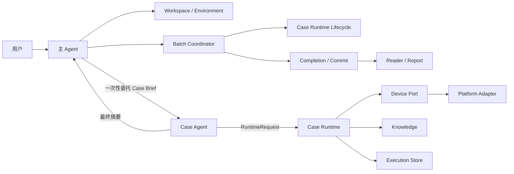
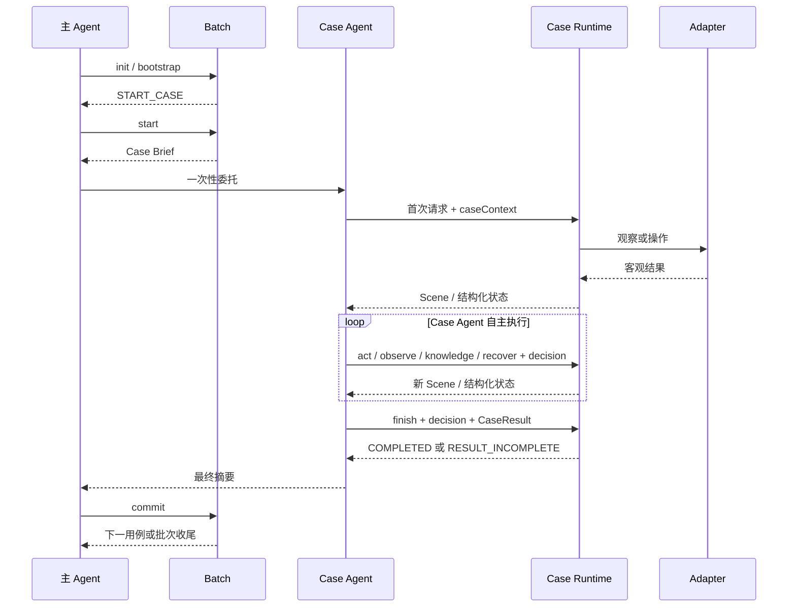

# mobile-ai-visual-test 当前架构

## 1. 设计目标

本 Skill 基于人工文本用例执行移动端黑盒视觉测试。架构围绕以下目标设计：

1. 一个 Case Agent 独立负责一个用例的理解、计划、操作、调查和结论。
2. 主 Agent 负责环境、授权、批次、委托、提交和报告，不进入单用例执行循环。
3. Case Agent 只接触一页角色 Prompt、Case Brief、当前 Scene 和一个 Runtime Client。
4. Runtime 自动处理平台参数、事务、证据、恢复和技术状态。
5. 批次内复用 App 暖状态，每个用例保持独立 Agent、execution、上下文和证据。
6. 运行事实与报告展示分离，报告可以从正式产物完整重建。
7. 所有组件只处理当前协议；其他格式的 execution 需要重新执行，已经生成的静态文件保持原样。

执行过程记录和详情报告的字段设计见 [`execution-traceability-design.md`](execution-traceability-design.md)。

## 2. 总体架构



架构中只有主 Agent 和 Case Agent 进行业务决策。Case Runtime、Batch、Adapter、Store 和 Report 都是确定性代码。

## 3. 角色与上下文

### 3.1 主 Agent

主 Agent 读取 `SKILL.md` 以及主流程需要的 references，完成：

1. 校验或初始化 Workspace，导入用例。
2. 探测环境并取得用户对平台、设备、App 和入口的确认。
3. 根据用户明确的执行范围创建单用例或批量执行请求。
4. 初始化 Batch 和暖会话。
5. 为当前用例创建 Case Runtime，并一次性委托独立 Case Agent。
6. 等待 Case Agent 完成，校验 execution 终态并提交结果。
7. 释放平台资源，发布单用例报告和批次看板。

主 Agent 持有宿主返回的 Agent 句柄。单用例执行期间，Case Agent 直接与 Case Runtime 交互；主 Agent 只等待终态。

### 3.2 Case Agent

Case Agent 只读取 `prompts/case-agent.md` 和 Case Brief。它负责：

1. 理解原始用例，识别前置条件、验证点、不确定项和初始计划。
2. 基于当前 Scene 选择操作并自主调整路径。
3. 在现有 Runtime 请求中提交简短的观察、结论、目的和期望结果。
4. 现场存在差异或判断不确定时查询知识，并复核候选是否适用；必要时恢复 App。
5. 为全部验证点形成 check，并提交 CaseResult。
6. 向主 Agent 返回最终摘要。

Case Agent 不读取主流程文档、Batch 状态、平台脚本、存储实现或报告实现。

### 3.3 公共资源

原始用例、目标 App 信息和必要的知识结果可以由两个角色使用。角色 Prompt、生命周期入口和实现依赖分别管理，具体清单由 `scripts/lib/agent-contract-manifest.js` 生成并由架构测试固定。

## 4. 执行生命周期



批次内同一时刻只有一个活跃用例。用例完成后保留 App 暖状态供下一个用例使用，但不共享 Case Agent 上下文和 execution 证据。

Agent 句柄丢失时，Batch 先 reconcile Runtime，再根据最新 Scene、用例理解、计划、未解决技术事实和待复核知识生成 continuation Brief。主 Agent 使用该 Brief 和同一 execution 创建 continuation Agent，不恢复旧动作意图，也不创建第二条业务执行链。

## 5. Case Runtime 接口

### 5.1 两个入口

- `scripts/case-runtime/lifecycle.js`：供 Batch 使用，负责 create、resume、reconcile、commit 和 completion 读取。
- `scripts/case-runtime/runtime-client.js`：Case Agent 的唯一入口，执行 `observe`、`act`、`knowledge`、`recover`、`finish` 和 `status`。

Case Brief 提供固定绝对 `runtime.command` 和固定 `runtime.requestPath`。Case Agent 将一个 RuntimeRequest JSON 写入该路径后原样执行命令，不拼装设备、App、平台或脚本参数。

### 5.2 Scene 与 Capability

`observe` 以及每次动作后的自动观察都会返回 Scene。Scene 包含：

- 稳定 `sceneId` 和暖会话 `generation`。
- 截图、尺寸、内容摘要和可选布局引用。
- 目标 App 状态、归一化控件、键盘与坐标信号。
- 基于该 Scene 生成的 Capability 列表。
- 前一个动作的分层客观结果：生命周期、命令接受状态、设备执行验证和前后 Scene 可观察效果。
- 可识别单层垂直列表的容器快照与滚动覆盖上下文。

Case Agent 优先选择当前 Capability。截图中的目标无法由控件树表达时，可提交归一化视觉坐标；Runtime 负责像素换算和平台调用，Action Spatial Evidence Service 负责一次性校验、保存并投影动作空间证据。

坐标动作只产生一份不可变事实源：`action-spatial-evidence/action-N.json`。同目录 PNG 已包含操作前截图底图和请求、投递、可选真实触点标记，可由 Agent 直接查看；Reader 继续兼容历史 execution 的 SVG。Runtime、事务恢复、事件 Reader、看板和报告共用同一 Reader/Projection，不在消费端重复换算或绘制。事务和事件只保存 `spatialEvidenceRef`，面向 Agent 的 `Scene.previousAction.spatialEvidence` 才展开语义字段及可查看附件。

`act`、`knowledge`、`recover` 和 `finish` 使用 `basedOnSceneId` 绑定作出判断时的 Scene。引用非当前 Scene 时返回 `SCENE_CHANGED` 和最新 Scene，不发送设备动作。

Runtime 对垂直列表使用共享锚点连接相邻观察，并维护起止边界、连续覆盖、未探索方向和自适应滑动距离；它不规定固定搜索方向或次数。同方向连续无进展才能提升边界置信度，有效移动或方向切换会清除未完成 streak。`SEARCH_EXISTENCE` 验证点形成 FAIL 时，`finish` 强制校验其引用的不可变 Scene 已确认两端且覆盖连续。

长按从视觉动作或控件能力统一映射为携带必填 `durationMs` 的底层 Action；可选 `duringActionAtMs` 在释放前采集过程截图并进入正式证据图。Adapter 不提供默认长按时长。

### 5.3 业务语义

首次请求携带 `caseContext`：

```json
{
  "summary": "验证设置保存后正确显示",
  "preconditions": ["用户已登录"],
  "expectations": [
    { "text": "设置入口可用", "verificationKind": "DIRECT_OBSERVATION" },
    { "text": "目标条目可在完整列表中找到", "verificationKind": "SEARCH_EXISTENCE" }
  ],
  "initialPlan": ["进入设置", "修改并保存", "检查结果"],
  "uncertainties": []
}
```

业务请求可携带 `decision`：

```json
{
  "observation": "当前页已显示设置入口",
  "conclusion": "可以开始验证",
  "purpose": "进入设置页",
  "expectedOutcome": "显示目标设置",
  "expectationRefs": ["E1"]
}
```

计划变化时在同一 decision 中增加 `planUpdate`。首次建立现场的 `observe` 只需有效 caseContext；之后主动发起的五类业务请求缺 decision、或初始计划为空时，Runtime 记录 `narrativeGap`，并继续处理可执行的设备请求。报告据此输出 `COMPLETE`、`PARTIAL` 或 `UNAVAILABLE`。这些语义字段不增加 Runtime 调用或设备动作。

知识候选评估同样附在下一次已有请求的 `decision.knowledgeReview` 中。Runtime 把查询和复核绑定到当前 execution、平台/App、Scene、用例理解版本及相关验证点；零候选自动闭合，不增加操作类型。

## 6. CaseResult 与运行状态

CaseResult 只表达 Case Agent 的业务结论：

```json
{
  "verdict": "PASS",
  "summary": "设置入口和保存结果均符合预期",
  "checks": [
    {
      "expectationRef": "E1",
      "status": "PASS",
      "actual": "设置入口可点击",
      "sceneRefs": ["scene-0002"],
      "knowledgeRefs": []
    }
  ],
  "uncertainties": []
}
```

Runtime 对 CaseResult 执行严格字段校验，并验证：

- 每个当前验证点恰好有一个 check。
- 整体 verdict 与 checks 一致。
- PASS/FAIL check 至少引用一个有效 Scene。
- Scene、事件、截图、布局和内容摘要形成一致证据图。
- 完整列表不存在结论引用当前 generation、两端已确认且连续覆盖的滚动上下文。
- 搜索型验证点的不存在结论引用不可变 Scene 中完整、连续的列表覆盖。
- 知识支持的检查只引用当前 execution 已冻结并评估为 `APPLICABLE` 的条目；直接 Scene 证据不强制查询知识。

验证点遗漏返回 `RESULT_INCOMPLETE`，Case Agent 可补充后再次 finish。Runtime 原样保存通过校验的 CaseResult；框架运行状态、耗时和完成绑定分别保存在 `execution.json`、`metrics.json` 和 `completion.json`。

## 7. 事件、事务与 Telemetry

`events.jsonl` 是 execution 的事实时间线，包含：

- `caseContextRecorded`、`agentDecisionRecorded`、`narrativeGap`。
- `sceneObserved`、`actionRequested`、`actionCompleted`、`actionOutcomeUnknown`。
- `knowledgeQueried`、`knowledgeReviewed`。
- `appRecovered`、`recoveryFailed`、`recoveryOutcomeUnknown`。
- `technicalIssue`、`timeBudgetExhausted`、`caseFinished`。

Runtime 自动生成事件 ID、operationId、Scene 关系、时间和 generation。Case Agent 只提交业务语义和操作请求。

技术事实写入时自动关联 decision、验证点、Scene 和 generation。后续明确结果、有效现场或恢复可以使瞬态事实失效；Result Integrity 与报告使用共享判定逻辑，避免结果归因和页面展示不一致。

动作、恢复和 finish 使用 execution 内部事务。设备调用前先持久化请求；结果未知时优先观察现场，不自动重放可能已经生效的动作。Runtime 恢复未完成事务后返回 `RECOVERY_APPLIED` 并停止本次旧请求，Agent 必须基于最新 Scene 重新判断。

`telemetry/invocations.jsonl` 记录 Runtime 请求次数、耗时、状态和格式错误；`telemetry/spans.jsonl` 记录 Adapter、截图、布局、稳定等待和恢复控制耗时。Metrics 从调用时间计算首次准备、步骤决策、结论整理和未归类间隔。Telemetry 不作为业务 verdict 的来源，这些间隔也不等同于纯模型思考时间。

单用例预算结束后，Runtime 停止新的设备动作并保持 `finish` 可用，使 Case Agent 能基于已有证据收口。

## 8. 产物闭环

正式 execution 产物包括：

```text
execution.json
binding.snapshot.json
case.snapshot.json
source.snapshot.md
events.jsonl
scenes/
screenshots/
layouts/
logs/
operations/
knowledge/
telemetry/
action-spatial-evidence/
result.json
metrics.json
artifact-manifest.json
completion.json
```

`runtime.json`、`runtime-request.json`、`current-scene.json`、锁文件和 `transactions/*.draft.json` 是运行期文件。正式判断引用 `scenes/` 下不可变 Scene；动作事务和 `actionCompleted` 事件通过 `spatialEvidenceRef` 引用同一动作空间证据。`artifact-manifest.json` 绑定正式证据集合的路径、大小和 SHA。报告发布失败时从这些正式产物幂等重建目标用例、平台和总览报告。

Narrative Projector 从事件投影用例理解、计划历史、业务步骤、知识调查、独立最终判断和验证点覆盖。Renderer 只消费 Reader 与 Projector 的 ViewModel，不回写 execution。

## 9. 模块与依赖

```text
scripts/
├── batch/                 # 批次、暖会话协调、commit 与 completion
├── case-runtime/          # Case Runtime 接口、服务、事务与 Store
├── case/                  # 用例导入
├── execution/contracts/   # 原始用例契约
├── lib/                   # 共享契约、证据、Reader 与运行控制
├── platform/
│   ├── device-port.js     # Runtime 到 Adapter 的端口
│   └── adapters/          # HarmonyOS / Android / iOS 实现
├── report/                # Narrative、Trace、详情页与看板
└── session/               # 暖会话状态
```

依赖方向：

1. Case Agent 只依赖 Runtime Client。
2. Batch 只依赖 Case Runtime Lifecycle，不调用内部业务 service。
3. Case Runtime 通过 Device Port 调用 Adapter，不依赖 Report。
4. Adapter 只处理设备能力，不读取 Batch、用例和 verdict。
5. Store 只处理事实与原子性，不产生业务结论。
6. Report 通过只读 Reader 使用 execution，不调用 Runtime 或 Adapter。
7. 修改报告不改变 Runtime 摘要；修改单个平台 Adapter 不改变其他平台摘要。

`scripts/tests/architecture-boundaries.test.js` 和 `scripts/build-agent-contract.js` 固定角色资源、入口和实现摘要边界。

## 10. 故障边界

- 产品表现与预期不一致：由 Case Agent 基于 Scene 判断并写入 checks。
- 证据不足或前置条件不成立：Case Agent 使用 INCONCLUSIVE 或 BLOCKED，并说明 uncertainties。
- 设备、App、Adapter 或存储异常：Runtime 返回结构化 `TECHNICAL`，保存技术事件和最后 Scene。
- Runtime 请求格式错误：返回 `REQUEST_INVALID` 和字段提示，同时写入 Telemetry。
- 完成态校验失败：Reader 不发布业务 Result，以独立技术状态展示失败原因。
- Runtime 或 Adapter 实现摘要变化：未完成 execution 通过 closure 结束，新批次创建新的 execution。
- 用户取消：Lifecycle 将活动 execution 写为 `CANCELLED`，Batch 经 `CANCELLING -> RELEASE_PLATFORM -> PUBLISH_REPORTS -> BATCH_CANCELLED` 收口；`teardown` 只释放资源。

技术异常不会被报告为产品 FAIL，业务 Result 也不会被框架运行状态覆盖。

## 11. 验证基线

自动化验证覆盖：

- Runtime 请求、CaseResult、Scene、Capability 和证据图契约。
- PASS、FAIL、INCONCLUSIVE、BLOCKED 结果及缺失验证点。
- action、recover、finish 中断恢复与未知结果处理。
- 理解、计划调整、每步决策、知识、恢复和 finish 的 Narrative 投影。
- 调用耗时、格式错误、暖状态 generation 和恢复次数。
- 批次串行、暖会话复用、completion、报告发布和增量刷新。
- HarmonyOS、Android、iOS Adapter 契约与输入、布局、坐标行为。
- 主 Agent、Case Agent、Runtime、Batch、Adapter 和 Report 的依赖边界。

真实设备用例作为独立验收，不属于无设备自动化回归。验收时重点检查 Runtime 调用格式错误、耗时分布、业务步骤完整性、验证点覆盖、证据关联和暖会话复用。
