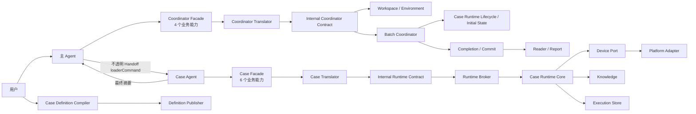
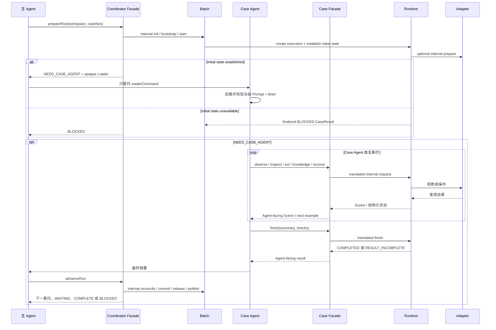

# mobile-ai-visual-test 当前架构

## 1. 设计目标

本 Skill 基于人工文本用例执行移动端黑盒视觉测试。架构围绕以下目标设计：

1. Authoring Plane 在生成用例时发布不可变 CaseDefinition；Execution Plane 从定义确定性投影 CaseSpec、InitialStateRequirement 和平台策略。
2. 主 Agent 负责环境、定义状态、授权、批次、委托和报告，不读取原始用例或进入单用例执行循环。
3. Case Agent 只接触一页角色 Prompt、派生 Case Brief、当前 Scene 和六个业务能力组成的 Agent-facing Facade。
4. Runtime 自动处理平台参数、事务、证据、恢复和技术状态。
5. 批次内复用 App 暖状态，每个用例保持独立 Agent、execution、上下文和证据。
6. 运行事实与报告展示分离，报告可以从正式产物完整重建。
7. 框架只解释当前格式；旧格式不迁移、不降级，按用例返回 `FORMAT_UNSUPPORTED`，不能阻断其他用例展示。

本文是当前架构的唯一事实来源。关键方案选择及原因简要记录在 [`design-decisions.md`](design-decisions.md)；实施计划和已被吸收的专项设计不再单独维护。

## 2. 总体架构



架构中只有主 Agent 和 Case Agent 进行业务决策。Case Runtime、Batch、Adapter、Store 和 Report 都是确定性代码。

## 3. 角色与上下文

### 3.1 主 Agent

主 Agent 读取 `SKILL.md`，普通执行只使用 `prepareRun`、`confirmRun`、`advanceRun`、`cancelRun`：

1. 用工作空间和用例编号调用 `prepareRun`。
2. 仅在返回 `NEED_USER_CONFIRMATION` 时取得用户对平台、设备、App 或执行授权的确认，并复制当前模板调用 `confirmRun`。
3. 对 `NEED_COMPILER` 或 `NEED_CASE_AGENT` 只转交不透明 Loader；完成或等待条件变化后调用 `advanceRun`。
4. 在 `COMPLETE` 或 `BLOCKED` 时报告终态；用户明确停止时调用 `cancelRun`。

Coordinator Facade 内部确定性完成 Workspace 校验、定义状态、环境探测、ExecutionRequest、Batch 初始化、暖会话、Runtime 创建、reconcile、commit、资源释放和报告发布。主 Agent 不选择或拼装这些内部命令。

缺少定义时，主 Agent 只把 `compilerHandoff.loaderCommand` 交给隔离的单用例 Compiler，不读取 `source.md`、候选定义或已发布定义正文。主 Agent 持有宿主返回的 Agent 句柄，但不读取 Handoff 正文；单用例执行期间只等待终态。

### 3.2 Case Agent

Case Agent 只通过经过完整性校验的 Handoff Loader 获得冻结 Case Prompt 和 Case Brief。Brief 提供 `observe`、`inspect`、`act`、`knowledge`、`recover`、`finish` 六个能力。它负责：

1. 读取原始用例、Frozen CaseSpec、已建立的初始状态和当前 Scene，自主制定计划；验证点和前置条件不可改写。
2. 基于当前 Scene 选择操作并自主调整路径。
3. 复制当前 Scene 或响应中的有效示例，只填写业务动作、目的、直接关联验证点、观察或结论。
4. 现场存在差异或判断不确定时查询知识，并复核候选是否适用；必要时恢复 App。
5. 为全部验证点形成 check，并提交 CaseResult。
6. 向主 Agent 返回最终摘要。

Case Agent 不读取主流程文档、Batch 状态、平台脚本、存储实现或报告实现。

### 3.3 公共资源

原始用例只由 Case Definition Compiler 和绑定 execution 的 Case Agent 读取。主 Agent 仅看到 case 元数据、定义引用和调度状态；角色 Prompt、生命周期入口和实现依赖分别管理。

### 3.4 Agent 能力契约

Agent-facing Facade 与内部严格契约是两层独立接口：

1. 主 Agent 的 `coordinatorFacade` 标记为 `AGENT_FACING`，最多四个业务能力；`coordinator-agent.js` 自动补齐 batch、definition、environment、request 和报告参数。完整 `coordinator-interface-contract.js` 标记为 `INTERNAL`，只供确定性代码和 Authoring 工具使用。
2. Case Definition Compiler 的 Loader 响应自动携带 `publisher.contract`，其 Schema、条件约束和示例由正式 CaseDefinition 约束投影。
3. Case Agent 的 `runtime` 标记为 `AGENT_FACING`，最多六个业务能力；Agent-facing Translator 注入 execution、当前 Scene、operation、decision 和候选绑定。完整 `runtime-operation-contract.js` 标记为 `INTERNAL`，仅供 Validator、Broker 和 Lifecycle 使用。

Prompt 只规定职责、能力使用时机、证据要求和复制当前示例的调用纪律，不复制请求 Schema。Facade 校验失败返回 `INPUT_INVALID` 和一次可直接使用的 `retryWith`；同一格式第二次失败返回 `AGENT_INPUT_STALLED`，禁止逐字段无限试错。Translator 之后仍由内部契约进行最终严格校验。角色之间不转发契约正文，主 Agent 不读取 Case Agent 的 Runtime 契约或 Compiler Candidate。

## 4. 执行生命周期



批次内同一时刻只有一个活跃用例。用例完成后保留 App 暖状态供下一个用例使用，但不共享 Case Agent 上下文和 execution 证据。

Agent 句柄丢失时，Batch 先 reconcile Runtime，再根据最新 Scene、用例理解、计划、未解决技术事实和待复核知识生成 continuation Handoff。每个 dispatch 持久化 claim/lease，并绑定独立 Runtime requestPath 与 sequence；同 token 重试幂等，新 continuation 替换旧 dispatch，旧 Runtime command 在读取请求前返回 `HANDOFF_REPLACED`，保证同一 execution 只有一个有效写入者。

## 5. Case Agent 与 Runtime 接口

### 5.1 生命周期与 Broker

- `scripts/case-runtime/agent-facing-client.js`：新 execution 的 Case Agent 唯一入口，只接受六个业务能力。
- `scripts/case-runtime/agent-facing-contract.js`：定义 Agent-facing 字段、能力卡、当前有效示例和 Scene 投影。
- `scripts/case-runtime/agent-facing-translator.js`：确定性解析 `actionRef`、注入当前 Scene 与 decision 外壳，并转换为内部请求。
- `scripts/case-runtime/runtime-operation-contract.js` 与 `runtime-client.js`：当前内部严格契约和内部入口，不向 Case Agent 交付。
- `scripts/case-runtime/lifecycle.js`：供 Batch 使用，负责 create、初始状态准备、resume、reconcile、commit 和 completion 读取。

Agent-facing 和 internal 各自只有一份字段契约，由确定性 Translator 连接。内部 operation、字段白名单和业务完整性仍由 `runtime-operation-contract.js`、Validator 与 Broker 共同强制；Lifecycle 不反向依赖 Broker。

Handoff 中冻结的 Case Brief 提供预绑定 transport：`runtime.requestPath` 和不带可变参数的 `runtime.command`。它们是 Loader 交付的调用通道，不是 Agent 要编写的业务请求字段。Case Agent 只复制当前 example 写入简化 JSON 并原样执行命令；execution、Scene、dispatch sequence 和 claim token 均由框架注入。Brief 从冻结快照、execution、Runtime 和 Current Scene 校验并派生，不保存为可变事实源，也不经过主 Agent 模型上下文。

### 5.2 Scene 与 Capability

`observe` 以及每次动作后的自动观察都会持久化完整 Scene，但默认只返回决策所需摘要：

- 稳定 `sceneId` 和包含 `sessionId`、`epoch`、`generation` 的 `warmSessionRef`。
- 截图、尺寸、内容摘要和可选布局引用。
- 目标 App 状态、键盘/遮罩信号、控件与 Capability 数量和少量标签。
- 前一个动作的分层客观结果：生命周期、命令接受状态、设备执行验证和前后 Scene 可观察效果。
- 可识别单层垂直列表的容器快照与滚动覆盖上下文。

完整控件、Capability 和布局仍保存在不可变 Scene 中；Case Agent 用 `inspect(channel=elements|capabilities|layout)` 只读查询，不触发新设备观察。Case Agent 优先选择当前 `scene.actions[]` 的控件动作；截图中的目标无法由控件树表达时，才使用 Scene 提供的 `visual:*` 动作示例，Runtime 负责像素换算和平台调用。

截图与控件树是并列证据通道。Case Agent 通过宿主视觉工具实际打开 Scene 截图，再用 `inspect(channel=visual)` 登记观察；Translator 将其转换为内部视觉检查。最终 check 引用的 Scene 必须存在对应视觉检查记录。系统弹窗、Toast、遮罩、键盘、动画、长按过程以及控件树缺失或冲突等现场不能只依赖控件树判断。视觉检查记录是 Agent 的可审计声明，当前共享宿主尚不能证明视觉工具调用本身。

坐标动作只产生一份不可变事实源：`action-spatial-evidence/action-N.json`。同目录 PNG 已包含操作前截图底图和请求、投递、可选真实触点标记，可由 Agent 直接查看。Runtime、事务恢复、当前 Execution Reader、看板和报告共用同一 Reader/Projection，不在消费端重复换算或绘制。事务和事件只保存 `spatialEvidenceRef`，面向 Agent 的 `Scene.previousAction.spatialEvidence` 才展开语义字段及可查看附件。

Facade 自动把 `act`、结构检查、`knowledge`、`recover` 和 `finish` 绑定到当前 Scene；Case Agent 不提交 `basedOnSceneId`。若调用期间 Scene 已变化，内部契约返回 `SCENE_CHANGED`，Facade 投影最新 Scene 且不发送旧设备动作；已实际查看的历史截图仍可登记。

Runtime 对垂直列表使用共享锚点连接相邻观察，并维护起止边界、连续覆盖、未探索方向和自适应滑动距离；它不规定固定搜索方向或次数。同方向连续无进展才能提升边界置信度，有效移动或方向切换会清除未完成 streak。`SEARCH_EXISTENCE` 验证点形成 FAIL 时，`finish` 强制校验其引用的不可变 Scene 已确认两端且覆盖连续。

长按从视觉动作或控件能力统一映射为携带必填 `durationMs` 的底层 Action；可选 `duringActionAtMs` 在释放前采集过程截图并进入正式证据图。Adapter 不提供默认长按时长。

### 5.3 业务语义

Authoring Plane 先发布带原文引用和 `initialStateIntent` 的不可变 CaseDefinition。ExecutionRequest 只接收 `definitionRef`，确定性投影并冻结 `case-definition.snapshot.json` 与 `case-spec.snapshot.json`：

```json
{
  "schemaVersion": 1,
  "specId": "case-spec-...",
  "summary": "验证设置保存后正确显示",
  "preconditions": ["用户已登录"],
  "expectations": [
    { "id": "E1", "text": "设置入口可用", "verificationKind": "DIRECT_OBSERVATION", "sourceEvidence": [{ "quote": "设置入口可用" }] },
    { "id": "E2", "text": "目标条目可在完整列表中找到", "verificationKind": "SEARCH_EXISTENCE", "sourceEvidence": [{ "quote": "目标条目可在完整列表中找到" }] }
  ],
  "ambiguities": [],
  "sourceSha": "source-...",
  "specSha": "case-spec-..."
}
```

Runtime 在 execution 创建时用 CaseSpec 写入首个 `caseContextRecorded` 事件。Case Agent 不重复提交验证点；`act` 只填写当前动作示例中的 `actionRef`、`purpose`、必要 input 和直接关联的 `expectationRefs`。Translator 把这些业务字段转换为内部 operation 与 decision，自动绑定当前 Scene。Agent 不填写 assessment、planUpdate、operation 或任何框架标识。

知识查询和候选评估统一使用 Agent-facing `knowledge`。查询响应直接返回当前候选对应的 `nextCall.example`；Agent 只填写适用性与理由，Translator 生成内部 review 结构并绑定 execution、平台/App、Scene 和相关验证点。零候选由 Runtime 自动闭合。

知识查询在顺利且证据充分的路径上可选；当实际结果与预期不符、截图和控件树无法解释现场、操作失败或无进展、无法决定下一步，或者准备形成 FAIL、INCONCLUSIVE 及缺少有效 Runtime 技术事实的 BLOCKED 时必须执行。知识只提供待评估的解释和规则，不替代 Scene 事实，也不直接决定 verdict。

## 6. CaseResult 与运行状态

Case Agent 通过 `finish` 提交业务结论。当前 `scene.finish.example` 已按 Frozen CaseSpec 预填全部验证点；Agent 只填写 summary、每个 check 的状态、实际结果和证据。Translator 计算整体 verdict、解析 `current` Scene 引用，并生成内部 CaseResult：

```json
{
  "verdict": "PASS",
  "summary": "设置入口和保存结果均符合预期",
  "checks": [
    {
      "expectationRef": "E1",
      "status": "PASS",
      "actual": "设置入口可点击",
      "sceneRefs": ["scene-0002"],
      "knowledgeRefs": []
    }
  ],
  "uncertainties": []
}
```

Runtime 对 CaseResult 执行严格字段校验，并验证：

- 每个当前验证点恰好有一个 check。
- 整体 verdict 与 checks 一致。
- PASS/FAIL check 至少引用一个有效 Scene。
- Scene、事件、截图、布局和内容摘要形成一致证据图。
- 每个最终 check 引用的 Scene 都有对应视觉检查记录。
- 完整列表不存在结论引用当前 generation、两端已确认且连续覆盖的滚动上下文。
- 搜索型验证点的不存在结论引用不可变 Scene 中完整、连续的列表覆盖。
- 知识支持的检查只引用当前 execution 已冻结并评估为 `APPLICABLE` 的条目；直接 Scene 证据不强制查询知识。

验证点遗漏返回 `RESULT_INCOMPLETE`，Case Agent 只按 `missing` 补充后再次 finish。Runtime 原样保存通过校验的内部 CaseResult；框架运行状态、耗时和完成绑定分别保存在 `execution.json`、`metrics.json` 和 `completion.json`。

## 7. 事件、事务与 Telemetry

`events.jsonl` 是 execution 的事实时间线，包含：

- `caseContextRecorded`（首条来自 Frozen CaseSpec）、`agentDecisionRecorded`、`narrativeGap`。
- `sceneObserved`、`actionRequested`、`actionCompleted`、`actionOutcomeUnknown`。
- `appPreparationRequested`、`appPreparationCompleted`、`appPreparationFailed`、`appPreparationOutcomeUnknown`。
- `knowledgeQueried`、`knowledgeReviewed`。
- `appRecovered`、`recoveryFailed`、`recoveryOutcomeUnknown`。
- `technicalIssue`、`timeBudgetExhausted`、`caseFinished`。

Runtime 自动生成事件 ID、operationId、Scene 关系、时间和 generation。Case Agent 只提交 Facade 示例允许的业务语义和操作请求。

技术事实写入时自动关联 decision、验证点、Scene 和 generation。后续明确结果、有效现场或恢复可以使瞬态事实失效；Result Integrity 与报告使用共享判定逻辑，避免结果归因和页面展示不一致。

动作、恢复和 finish 使用 execution 内部事务。设备调用前先持久化请求；结果未知时优先观察现场，不自动重放可能已经生效的动作。Runtime 恢复未完成事务后返回 `RECOVERY_APPLIED` 并停止本次旧请求，Agent 必须基于最新 Scene 重新判断。

`telemetry/invocations.jsonl` 记录 Runtime 请求次数、耗时、状态和格式错误；`telemetry/spans.jsonl` 记录 Adapter、截图、布局、稳定等待和恢复控制耗时。Metrics 从调用时间计算首次准备、步骤决策、结论整理和未归类间隔。Telemetry 不作为业务 verdict 的来源，这些间隔也不等同于纯模型思考时间。

单用例预算结束后，Runtime 停止新的设备动作并保持 `finish` 可用，使 Case Agent 能基于已有证据收口。

## 8. 产物闭环

正式 execution 产物包括：

```text
execution.json
binding.snapshot.json
case.snapshot.json
case-definition.snapshot.json
case-spec.snapshot.json
validation-profile.snapshot.json
source.snapshot.md
events.jsonl
scenes/
screenshots/
layouts/
logs/
operations/
knowledge/
telemetry/
action-spatial-evidence/
result.json
metrics.json
artifact-manifest.json
completion.json
```

当前 Execution schema 为 11，并把 ValidationProfile、CaseDefinition 和跨文件语义绑定纳入 Manifest/Completion。Reader 只接受这一格式；其他 schema 返回 `FORMAT_UNSUPPORTED`，旧目录不迁移、不删除。`runtime.json`、`runtime-request.json`、`current-scene.json`、锁文件和事务草稿是运行期文件，不参与已完成结果解释。

版本号只属于可独立落盘、跨进程或供框架外读取的正式数据根，例如 Workspace、CaseDefinition、ExecutionRequest、Batch、Execution Bundle 和平台 Driver 响应。Broker、Case Brief、Agent-facing Facade、Coordinator 临时状态、输入纠错状态和 Completion 子产物不维护独立数字版本；它们通过 `type`、严格字段、hash、父级 Manifest 或 `protocolSha` 识别当前结构。

Narrative Projector 从事件投影用例理解、计划历史、业务步骤、知识调查、独立最终判断和验证点覆盖。Renderer 只消费 Reader 与 Projector 的 ViewModel，不回写 execution。

看板总览只展示用例总耗时、开始时间和结束时间；协调准备、初始态、交接、Agent、Runtime、Adapter 与报告发布延迟只在用例详情的结果概览展示。两处共用同一 timing projection，时间使用等宽数字且不换行。详情执行过程的步骤列表和右侧检查器保持同高并分别滚动；每一步只展示当时关联的 expectation target，最终 checks 独立展示。

## 9. 模块与依赖

```text
scripts/
├── batch/                 # facade 及 initialization/dispatch/completion/finalization/reconcile services
├── coordinator/           # 主 Agent Facade 契约、确定性编排与状态存储
├── coordinator-agent.js   # 主 Agent 普通执行唯一入口
├── case-runtime/          # Case Facade/Translator、内部 Lifecycle/Broker/Core、事务与 Store
├── case/                  # 用例导入与 CaseDefinition 发布存储
├── execution/contracts/   # Case、CaseDefinition、CaseSpec 与 ValidationProfile 契约
├── lib/                   # 共享契约、证据、Reader 与运行控制
├── platform/
│   ├── device-port.js     # Runtime 到 Adapter 的端口
│   └── adapters/          # HarmonyOS / Android / iOS 实现
├── report/                # Narrative、Trace、详情页与看板
└── session/               # 暖会话状态
```

依赖方向：

1. 主 Agent 只依赖 Coordinator Facade；Coordinator Translator 才能调用内部 Workspace、Environment、ExecutionRequest 和 Batch 接口。
2. Case Agent 只依赖 Case Facade；Case Translator 才能生成内部 RuntimeRequest，Broker 拒绝未列入 allowlist 的 operation。
3. Batch 只依赖 Case Runtime Lifecycle，不调用内部业务 service。
4. Case Runtime 通过 Device Port 调用 Adapter，不依赖 Report。
5. Adapter 只处理设备能力，不读取 Batch、用例和 verdict。
6. Store 只处理事实与原子性，不产生业务结论。
7. Report 通过版本化只读 Reader 使用 execution，不调用 Runtime、Adapter 或会回写 `case.json` 的编号修复逻辑。
8. 修改报告不改变 Runtime 摘要；修改单个平台 Adapter 不改变其他平台摘要。

iOS Adapter 的 `ios-driver.js` 只负责编排 CLI command 与 Appium 调用顺序；输入框发现、整串输入 fallback 和效果核验位于 `input-service.js`，W3C touch action、滑动/长按参数和视觉坐标执行位于 `pointer-actions.js`。报告中的原始用例 Markdown 安全渲染位于 `source-markdown.js`，详情页和用例索引复用同一纯 renderer。

`scripts/tests/agent-capability-contract.test.js` 固定 Agent-facing 能力数量、示例字段预算和 internal 分类；`scripts/tests/architecture-boundaries.test.js` 与 `scripts/build-agent-contract.js` 固定角色资源、入口和实现摘要边界。

## 10. 故障边界

- 产品表现与预期不一致：由 Case Agent 基于 Scene 判断并写入 checks。
- 证据不足或前置条件不成立：Case Agent 使用 INCONCLUSIVE 或 BLOCKED，并说明 uncertainties。
- 设备、App、Adapter 或存储异常：Runtime 返回结构化 `TECHNICAL`，保存技术事件和最后 Scene。
- Agent-facing 请求格式错误：第一次返回 `INPUT_INVALID` 和完整 `retryWith`，同一格式第二次返回 `AGENT_INPUT_STALLED`；Translator 之后的内部契约错误返回 `REQUEST_INVALID` 并写入 Telemetry。
- 完成态校验失败：Reader 不发布业务 Result，以独立技术状态展示失败原因。
- Runtime 或 Adapter 实现摘要变化：未完成 execution 通过 closure 结束，新批次创建新的 execution。
- 正常完成：最后一个 execution 完成后，CLI reconcile 自动 commit，并依次执行内部 `SETTLE_EXECUTIONS -> RELEASE_PLATFORM -> PUBLISH_REPORTS`，返回 `BATCH_COMPLETE`。
- 用户取消：Lifecycle 将活动 execution 写为 `CANCELLED`，CLI reconcile 自动完成三段收尾并返回 `BATCH_CANCELLED`；`teardown` 只释放资源。
- 批次级阻塞：Batch 先终止活动 execution 并进入 `BLOCKING`，CLI reconcile 自动完成三段收尾并返回 `BATCH_BLOCKED`；已完成、取消、阻塞和跳过的目标均保留在批次状态与报告中。
- Runtime reconcile 错误：只有锁竞争属于 `RETRYABLE`，最多重试三次；存储/事务损坏和其他执行错误分别归类为 `FATAL_BATCH`、`FATAL_EXECUTION` 并进入阻塞收口。

### 10.1 Bootstrap、身份与隔离

`appProvisioning` 只描述 App 来源。执行请求另行冻结 batch 级 `bootstrapPolicy`：默认 `KEEP_EXISTING`；执行配置选择 `REINSTALL_FROZEN` 时必须同时包含 `UNINSTALL_TARGET_APP` 和 `INSTALL_FROZEN_ARTIFACT`。用户下达执行指令后不再追加授权交互，Batch 在调用 Adapter 前只复核策略、制品和设备条件。

每个 target 另行冻结 `initialStateRequirement`、由 ExecutionRequest 自动派生的内部 `preparationPolicy`，以及二者与 provisioning 共同生成的 InitialStatePreflight。requirement 表达业务起点，policy 记录平台实际副作用，Preflight 证明当前平台组合可执行。用例执行指令覆盖其前置状态准备，不再要求单独授权文本。用例原文的卸载重装映射为 `FRESH_INSTALL`，Android、HarmonyOS 以 `CLEAR_APP_DATA` 等效实现且不依赖安装资产，iOS 以 `REINSTALL_APP` 实现并要求冻结安装资产。Lifecycle 在 Agent 委托前执行准备，实际准备失败由框架直接形成 BLOCKED execution。

制品登记把 CLI 的 `appId/version/build` 作为 expected identity；能够解析 APK、HAP/APP 或 iOS `.app` 时保存提取工具、版本和实际 identity，不能解析时明确记录 `UNAVAILABLE`。任何实际重装都必须在安装后由 Adapter 返回 `installedIdentity`，并与冻结期望完全一致，否则以 `APP_ARTIFACT_IDENTITY_MISMATCH` 阻止暖会话 READY。

Case Brief 只公开原文、Frozen CaseSpec、初始状态结果、目标摘要、六个 Agent-facing 能力和预绑定 transport。完整 Runtime operation allowlist 与内部请求结构不进入 Case Agent 上下文。协议隔离不是操作系统级安全沙箱，共享 Shell/文件系统环境下仍不能宣称强能力隔离。安全边界还需宿主工具权限、独立进程和文件系统访问控制。

技术异常不会被报告为产品 FAIL，业务 Result 也不会被框架运行状态覆盖。

## 11. 验证基线

自动化验证覆盖：

- Runtime 请求、CaseResult、Scene、Capability 和证据图契约。
- PASS、FAIL、INCONCLUSIVE、BLOCKED 结果及缺失验证点。
- action、recover、finish 中断恢复与未知结果处理。
- InitialStateRequirement/Preflight、委托前自动准备、准备失败自动 BLOCKED、bootstrap 独立授权、制品登记/安装后身份核验、暖会话轮换及破坏性操作不重放。
- reconcile 有限重试、自动 commit，以及 completed/cancelled/blocked 三类统一报告收口。
- 理解、计划调整、每步决策、知识、恢复和 finish 的 Narrative 投影。
- 调用耗时、格式错误、暖状态 generation 和恢复次数。
- 主 Agent 不超过四个、Case Agent 不超过六个活跃能力，Agent-facing 示例不泄漏内部 ID、路径绑定、token、sequence、hash、operation 或 decision 外壳。
- 批次串行、暖会话复用、completion、报告发布和增量刷新。
- HarmonyOS、Android、iOS Adapter 契约与输入、布局、坐标行为。
- 主 Agent、Case Agent、Runtime Broker/Core、Batch State Repository、Adapter 和 Report 的依赖边界。

真实设备用例作为独立验收，不属于无设备自动化回归。验收时重点检查 Runtime 调用格式错误、耗时分布、业务步骤完整性、验证点覆盖、证据关联和暖会话复用。
