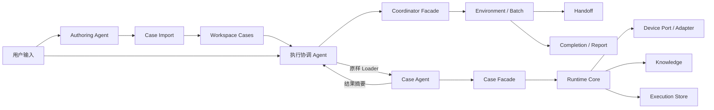
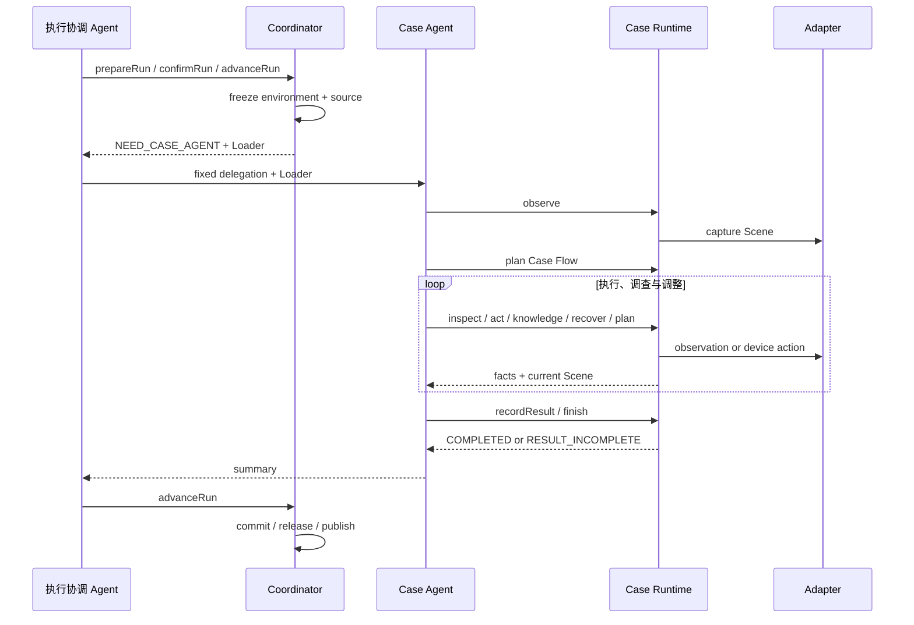

# mobile-ai-visual-test 当前架构

本文描述当前系统如何工作，是架构事实来源。长期选择及原因记录在 [`design-decisions.md`](design-decisions.md)；Agent 实际调用签名、参数和错误恢复以 `references/` 下生成的按需文档为准。

## 1. 目标与边界

本 Skill 从任意可读取来源生成逻辑用例，并执行 HarmonyOS、Android 和 iOS 黑盒视觉测试。架构遵循以下边界：

1. Authoring Agent 阅读完整输入并判断用例边界，文件、Sheet、表格行或章节不直接等于一条用例。
2. 执行协调 Agent 只负责编排、授权、批次级恢复和汇报，不理解已生成用例的业务内容。
3. Case Agent 是 execution 内唯一业务理解者，负责形成和修订 Case Flow、操作设备及判断结果。
4. Facade 向 Agent 提供少量语义能力，Translator 和 Runtime 处理绑定、事务、证据与状态机。
5. 截图、控件树、知识和动作落点是并列调查能力；框架返回事实，不代替 Agent 作业务判断。
6. 新 execution 只写当前格式；历史数据不迁移、不补写，也不参与新 execution 的继续执行。

## 2. 组件与职责



### 2.1 Authoring Agent

Authoring Agent 使用适合来源格式的工具完整读取输入，自主形成一条或多条逻辑用例。`import-cases.js` 只校验 draft、分配稳定身份并持久化原始内容，不实现业务拆分规则。

### 2.2 执行协调 Agent

正常执行只面对四个 Coordinator 能力：

- `prepareRun`：选择工作空间和用例。
- `confirmRun`：确认平台、设备、App 和执行授权。
- `advanceRun`：推进或恢复初始化、委托、提交、释放和报告发布。
- `cancelRun`：响应用户明确取消。

执行协调 Agent 不读取原始用例、Handoff 正文、Case Prompt、Case Flow、Scene、截图、控件树或知识调查正文。它只把 `NEED_CASE_AGENT` 返回的固定委托文本和原样 Loader 交给不继承其上下文的新 Case Agent，并持有真实 Agent 句柄。

### 2.3 Case Agent

Case Agent 从 Handoff 获得 execution 写入所有权、原始用例、环境摘要、当前 Scene、已有 Case Flow、Case Prompt 和预绑定 Runtime Client。正常业务执行只面对九个业务能力和一个统一资源读取能力：

- `observe`、`inspect`、`plan`、`runPlan`、`recordResult`
- `act`、`knowledge`、`recover`、`finish`
- `read`：按 Runtime 返回的 typed ref 读取完整资源

Case Agent 自己理解用例、制定和调整 Case Flow、调查现场、形成检查结果并收口，不把业务判断交回执行协调 Agent 审批。

### 2.4 确定性框架

Coordinator 管理 run 与 Batch；Handoff 绑定 execution、dispatch 和写入者；Runtime 管理 Scene、Case Flow、动作、证据、结果与事务；Adapter 只负责平台事实和设备操作；Report 只读 execution 并生成派生产物。

## 3. 通信与生命周期



### 3.1 Agent-facing 协议

Coordinator 与 Case Runtime 对 Agent 使用同一请求外壳 `{operation,input}` 和同一响应外壳 `{protocol,status,operation,result,resources,data?,error?}`。`result` 只放业务状态、标识和计数等简单事实；当前操作的主复杂结果完整放入 `data`；其他复杂数据只发布带类型、作用域和完整性信息的资源描述，由 Agent 将原样 `ref` 交回同一绑定 Facade 的 `read(ref)` 读取。

资源正文不因体积被截断或抽样，同一响应也不重复内联主资源和关联资源。资源引用是不透明且不可变的能力凭据，不能从文件路径、领域 ID 或文字拼接，也不能跨 Coordinator 与 Case Runtime 作用域使用。资源语义类型与内容格式分离；例如三端统一发布 `layout`，但通过 `mediaType` 区分 JSON 与 XML，Agent 仍只调用 `read(ref)`。`read` 只读取已发布资源，不改变业务状态；execution 完成后仍可读取已发布资源。

公开请求、响应投影、资源目录和错误码由各 Facade 的 Agent-facing contract 定义，`references/coordinator.md`、`references/case-runtime.md` 及其子页由契约生成，是 Agent 调用签名和恢复方式的事实来源。Facade 负责把公开操作翻译为内部命令并投影响应；Runtime Core 不根据 Agent 可能需要什么来裁剪数据，也不推测下一步操作。

Handoff 是一次性身份与启动绑定，不是业务预处理结果。Loader 原样携带 claim token；dispatch 使用 `PREPARED / CONSUMED / REPLACED` 和 sequence 绑定唯一 execution，不使用超时租约。Coordinator 只依据持久化状态判断是否等待结果，不虚构宿主 Agent 的运行状态。

初始化步骤持久化在 Coordinator run 中，命令中断后从首个缺失步骤恢复。业务推进必须匹配 Batch 冻结的实现、协议、目标与环境；`status`、`cancel`、终态收尾和所有权明确的资源释放使用维护读取，不因当前 Skill 实现摘要变化而失去清理能力。

## 4. 核心业务模型

### 4.1 Case Flow

Case Flow 同时表达用例理解与执行导航，由 `ACTION / DECISION / CHECK / END` 节点、条件边、`uncertainties`、`revision` 和修订理由组成。首次 `plan` 创建 revision 1 并冻结为 Baseline Flow；后续提交完整快照形成最新 Working Flow 并说明调整理由。报告固定展示 Baseline Flow 及其检查点，同时用事件轨迹和修订信息呈现实际执行，不用 Working Flow 覆盖或弱化原始用例语义。

Baseline 中的 CHECK 始终需要处置；最终 Working Flow 中仍活跃的补充 CHECK 也需要处置。未进入适用分支的 `CONDITIONAL` CHECK 可记为 `NOT_APPLICABLE`；Agent 可将检查点记为 `WAIVED`，但必须提交独立理由，且不能用豁免代替恢复、掩盖已确认的失败或绕过证据不足。Runtime 校验图结构、引用、revision、状态适用性、证据和结果闭环，不理解自然语言条件、不判断豁免理由是否充分，也不审批业务计划。事件绑定当时的 Case Flow revision、节点和选择边，因此报告可以还原执行过程中实际采用的理解。

### 4.2 Scene 与调查能力

Scene 是设备现场事实，不是计划或结论。`observe` 显式采集 Scene，`act` 执行一个动作后自动采集新 Scene。内部 Scene 完整保存截图、布局、控件、动作能力、系统信号、滚动上下文和上一动作事实。

Agent-facing Scene 提供紧凑摘要和关联资源引用；Case Agent 将返回的 `layoutRef` 或 `elementSetRef` 原样交给 `read(ref)` 读取完整结构，用 `inspect(mode="visual")` 登记实际看到的图片事实，用 `inspect(mode="action")` 登记动作落点事实。纯视觉内容、系统弹窗、Toast、遮罩、键盘、动画、长按过程及证据冲突不能仅依赖控件树判断。

`runPlan` 用于童锁等短时交互窗口：Case Agent 一次提交由动作、等待、采集、确定性定位、技术检查和证据检查点组成的有界命令序列，Runtime 在计划内部连续执行，避免每个步骤都等待一次 Agent 决策。定位只解析已声明的元素、点或区域，技术检查只验证采集可用、元素状态、前台状态或引用存在等确定性事实；它们不识别业务目标，也不产生业务 CHECK 结论。Agent 读取计划证据后仍须自行判断并通过 `recordResult` 记录结果。

坐标动作保存请求坐标、实际投递坐标、可选设备触点、坐标换算、标注截图和整屏像素比较。Runtime 只陈述投递和画面事实，不判断 Agent 是否选对目标或动作是否达到业务预期。

### 4.3 结果

Case Agent 通过 `recordResult` 增量记录 CHECK status：`PASS / FAIL / INCONCLUSIVE / BLOCKED / NOT_APPLICABLE / WAIVED`。Runtime 维护追加式 ledger，并在检查点语义变化时使旧判断失效；它只校验证据引用、状态适用性和闭环，不代替 Agent 作业务判断。

正常 `finish` 只提交摘要和可选不确定项，Runtime 从 ledger 组装 checks，并按 `FAIL > BLOCKED > INCONCLUSIVE > PASS` 聚合 verdict；`NOT_APPLICABLE` 和 `WAIVED` 不参与降级。用例级 `NOT_RUN` 只通过独立 finish 模式形成且不包含 CHECK，用于必要执行条件无法在当前权限和能力内建立、没有安全继续路径并且尚未进入相应验证的情况。技术异常不得报告为产品 FAIL，结果未知的动作或破坏性准备不得自动重放。

## 5. 执行隔离与资源所有权

批次内同一时刻只有一个活跃用例。用例之间可以复用 App 暖状态，但不共享 Case Agent 上下文、Case Flow 或 execution 证据。

不同平台的 Batch 可以在同一工作空间并行；Run 将确认后的完整环境冻结到自身状态、ExecutionRequest 和 Batch，不跟随工作空间根默认环境变化。同一平台的设备、Appium/WDA 和其他真实资源由 Platform Runtime 所有权层保护，同平台多设备并行尚未开放。

Execution 创建锁只保护同一 case + platform 的 ID 分配和原子创建。工作空间首页、用例原文页和平台报告属于共享派生产物，通过工作空间级报告发布锁执行完整的“重新读取、生成、发布”事务；报告锁不包围设备操作。

iOS Appium Session 是可替换的 Batch 资源，Execution 只保存 `sessionRef`。明确的 session 失效可在统一锁内重建并重试一次 observation；动作发出后的 session 错误只记录结果未知。只有身份、进程组和终态归属均可验证的托管资源才允许自动回收。

## 6. 初始状态与恢复

ExecutionRequest 默认保持目标 App 现状。Case Agent 根据原文和现场通过 `recover.targetState` 请求平台等价状态准备：Android、HarmonyOS 清理目标 App 数据；iOS 从工作空间 `app-packages/ios` 中解析唯一匹配包并完成卸载重装。包缺失、无效、身份不符或冲突必须在卸载前失败。

Facade 和 Runtime 是首选路径，不是异常处置的排他边界。Agent 可以在职责和授权范围内使用日志、Shell 或平台原生工具，但必须遵守以下约束：

- 不直接编辑 Batch、Execution、Result、Scene、证据或报告。
- 不处置活动批次或归属不明的资源。
- 不超出已确认目标 App 和平台的授权范围。
- 框架外动作通过 `recover.externalAction` 留下声明，但不作为业务证据。
- 处置后回到 `observe`、`recover` 或 `advanceRun`，由框架重新核验并持久化事实。

Agent-facing 错误响应区分输入、领域和技术问题，返回稳定错误码、已知事实、`retryable` 和 `documentationRef`。恢复说明按角色、方法或错误分组放在 `references/`，Agent 只在准备调用或发生对应错误时读取。

## 7. 持久化与报告

新 execution 的正式产物包括：

```text
execution.json
binding.snapshot.json
case.snapshot.json
validation-profile.snapshot.json
source.snapshot.md
events.jsonl
scenes/
screenshots/
layouts/
logs/
operations/
knowledge/
telemetry/
action-spatial-evidence/
result.json
metrics.json
artifact-manifest.json
completion.json
```

运行期状态、锁和事务草稿不属于最终证据。Case Runtime 请求通过 stdin 或绑定 MCP 工具进入，不使用一次性请求文件。Completion 与 Artifact Manifest 绑定当前 execution 所需的快照、证据、结果和协议摘要。

Execution 收口、平台资源释放、Batch 业务终态和报告发布是独立事实。报告失败不会把已完成 Batch 改回等待态；只有冻结目标的报告全部成功、没有报告错误且链接有效，发布状态才能成为 `PUBLISHED`。

Narrative Projector 从当前 execution 事件生成步骤、Case Flow revision、分支与检查结果，Renderer 只消费 ViewModel，不回写 execution。

报告主体是本地静态产物；用例流程图在对应页面首次展示时从固定版本 CDN 按需加载 Mermaid，并校验 Subresource Integrity。网络不可用或加载失败只影响流程图渲染，结构化流程和其他报告内容仍可使用。

## 8. 版本与兼容边界

当前唯一支持的 Execution schema 为 14。Runtime、Batch、Reader 和 Report 都只处理 schema 14；旧工作空间目录和原始用例仍可创建 schema 14 的新 Run，历史 execution 保持原样并明确显示为不支持、需要重跑。

协议摘要按角色和模块分组。修改报告不改变 Runtime 摘要，修改单个平台 Adapter 不改变其他平台。schema 标识只属于独立持久化根或真实跨进程协议，内部模块不维护并行版本。

## 9. 代码边界

```text
scripts/
├── coordinator/           # Coordinator Facade、run 状态与编排
├── coordinator-agent.js   # 执行协调 Agent 正常入口
├── batch/                 # 初始化、派发、提交、收尾与 reconcile
├── case/                  # 原始用例导入
├── case-runtime/          # Case Facade、Case Flow、Runtime、事务与 Store
├── execution/contracts/   # Case 与 ValidationProfile 契约
├── lib/                   # 共享契约、证据、Reader 与运行控制
├── platform/              # Device Port 与三平台 Adapter
├── report/                # Narrative、详情与看板
└── session/               # 暖会话与 iOS 动态 Session
```

依赖方向保持单向：执行协调 Agent 只依赖 Coordinator Facade；Case Agent 只依赖 Case Facade；Batch 只依赖 Case Runtime Lifecycle；Runtime 通过 Device Port 调用 Adapter 且不依赖 Report；Report 只读 execution；Adapter 不读取用例或 verdict。
