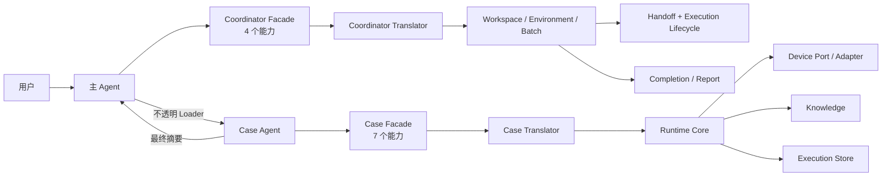
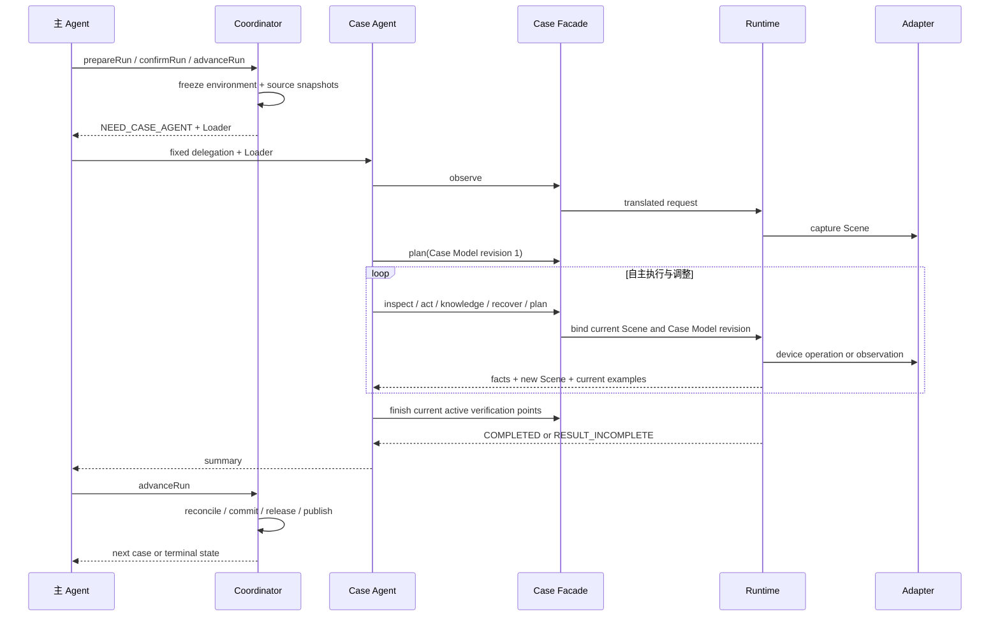

# mobile-ai-visual-test 当前架构

## 1. 设计目标

本 Skill 基于任意非空文本用例执行移动端黑盒视觉测试，核心目标是：

1. 主 Agent 只负责编排、授权、批次级技术恢复和汇报，不理解单个用例。
2. Case Agent 是唯一业务理解者，自主形成并修订验证点和执行计划。
3. Agent-facing 接口保持简单，确定性框架处理绑定、事务、证据和状态机。
4. 截图、控件树、知识库和动作落点事实都是 Case Agent 可主动选择的调查能力。
5. 框架能力是正常首选路径，但异常时不限制 Agent 使用环境中的其他工具解决问题。
6. 原始用例、设备事实和所有业务 revision 追加保存，报告可还原当时现场。
7. 新 Runtime 只写当前格式；历史 execution 不迁移、不补写，按单条 execution 隔离显示。

本文是当前架构的事实来源。长期决策及原因记录在 [`design-decisions.md`](design-decisions.md)。

## 2. 总体架构



主 Agent 和 Case Agent 负责判断；Facade、Translator、Runtime、Adapter、Store 与 Report 是确定性代码。

## 3. 角色与通信

### 3.1 主 Agent

主 Agent 读取 `SKILL.md`，正常执行只面对：

- `prepareRun`：选择 Workspace 和用例编号。
- `confirmRun`：复制当前模板确认平台、设备、App 和执行授权。
- `advanceRun`：恢复初始化、取得委托、提交 execution 或完成报告发布。
- `cancelRun`：在用户明确要求时取消运行。

Coordinator 响应为 `NEED_USER_CONFIRMATION`、`NEED_CASE_AGENT`、`WAITING`、`TECHNICAL`、`COMPLETE` 或 `BLOCKED`。主 Agent 不调用内部 Batch、ExecutionRequest、环境或报告命令拼装流程。

主 Agent 不读取原始用例、Handoff 正文、Case Prompt、Case Model、Scene、截图、控件树或知识调查正文。它只把 `NEED_CASE_AGENT` 返回的固定委托文本和原样 Loader 交给一个不继承主 Agent 上下文的新 Case Agent，并持有真实 Agent 句柄。

Coordinator 只知道 Handoff 是 `PREPARED` 还是 `CONSUMED`，以及 execution 是否有持久化结果；它不虚构宿主 Agent 运行状态。`WAIT_EXECUTION_RESULT` 只表示等待结果，已有活跃写入者时不重复委托。

### 3.2 Case Agent

Case Agent 通过 Handoff 直接得到：

- execution 绑定与写入所有权。
- 原始用例 `case.source`。
- 平台、App 和已授权初始状态摘要。
- 当前 Scene 和已有 Case Model；首次启动时 Case Model 为空。
- Case Prompt 与预绑定 Runtime Client。
- `observe`、`inspect`、`plan`、`act`、`knowledge`、`recover`、`finish` 七个能力。

Case Agent 自己阅读用例、观察设备、形成验证点、执行、调查和 finish。它不把业务理解交回主 Agent 审批。

### 3.3 Handoff

Handoff 是启动包和身份绑定，不是业务预处理结果或工具沙箱。它用 token、sequence 和 claim/lease 绑定唯一 execution，防止旧 Agent 或错误用例写入。新 continuation 会替换旧 dispatch，旧 Runtime command 返回 `HANDOFF_REPLACED`。

Handoff 完成后，Case Agent 与 Runtime 通过预绑定 Client 通信；Agent 间消息只负责实时协调，持久化 execution 才是结果事实源。

## 4. 执行生命周期



批次内同一时刻只有一个活跃用例。用例之间可以复用 App 暖状态，但不共享 Case Agent 上下文、Case Model 或 execution 证据。

初始化步骤持久化在 Coordinator run 中；命令中断后 `advanceRun` 从首个缺失步骤恢复，不重复已经完成的初始化。Execution 收口、平台释放、Batch 业务终态与报告发布是独立事实，报告失败不会把已完成批次改回等待态。

## 5. Case Model

Case Model 是 Case Agent 对本次 execution 的当前理解，包括：

- `understanding`
- `preconditions`
- `verificationPoints`
- `items`
- `uncertainties`
- `revision` 和 `reason`

首次 `plan` 生成 revision 1，不要求理由。后续 `plan` 提交完整新快照并要求非空理由。继续存在的验证点保留原 `E` 引用；新增点不填引用，由 Runtime 单调分配；新版本省略的引用视为取消且永不复用。

框架只校验结构、引用和结果闭环，不判断调整是否忠于原文。每个版本写为 `caseModelRevised` 事件；当前模型从事件投影，不维护 Agent 可直接编辑的第二份状态文件。

动作、视觉检查、动作落点检查、知识查询、恢复和 finish 自动记录调用时的 `caseModelRevision`。报告用当时 revision 的验证点文本解释每一步，不用最终版本覆盖历史现场。

## 6. Scene、视觉与动作事实

Scene 是真实设备现场，不是计划或业务结论。`observe` 显式采集 Scene，`act` 后自动采集新 Scene。Scene 包含截图、布局与控件摘要、App/系统信号、可用动作、滚动上下文以及上一动作事实。

完整结构保存在不可变 Scene 中，Case Agent 用 `inspect(channel=elements|capabilities|layout)` 按需读取。截图与控件树并列；纯视觉内容、系统弹窗、Toast、遮罩、键盘、动画、长按过程及证据冲突必须实际打开图片并用 `inspect(channel=visual)` 登记。

坐标动作使用一份不可变 `action-spatial-evidence/action-N.json`，Agent-facing 投影只返回客观事实：

- `requested`：Agent 请求的坐标或轨迹。
- `dispatched`：Adapter 实际下发的坐标或轨迹。
- `deviceActual`：仅平台明确提供的真实触点；否则为 null。
- `coordinateTransform`：坐标换算是否一致，不代表业务目标命中。
- `annotatedScreenshot.tool=view_image` 和绝对 `path`：在操作前截图上标记落点或轨迹。
- `screenComparison=IDENTICAL|DIFFERENT|UNAVAILABLE`：操作前后整屏像素事实，不代表操作有效。

Case Agent 怀疑点错、滑错或操作无效果时查看标注图，再用 `inspect(channel=action)` 登记看到的事实。Runtime 写入 `actionSpatialInspected`，但不判断 observation 是否意味着成功或失败。

未可靠识别横向滚动容器时，Capability Catalog 不生成整屏 `screen:swipeLeft/right`；Case Agent 可根据截图使用 `visual:swipe`。识别到容器及 bounds 时，横滑轨迹绑定容器中心。

## 7. Agent-facing 与内部契约

Agent-facing 能力卡提供用途、必填字段、字段来源和当前有效 example。Agent 复制 example 写入一次性 `runtime.requestPath`，再原样执行无可变参数的 `runtime.command`。请求消费后删除，下次调用重新创建。

Translator 注入 execution、dispatch、当前 Scene、内部 operation 和 decision 外壳，再交给严格 Runtime 契约。第一次格式错误返回 `INPUT_INVALID + retryWith`；同类错误第二次返回 `AGENT_INPUT_STALLED`，避免逐字段猜测。

内部 operation、完整 Schema、token、sequence、路径和平台参数不进入 Prompt。简单 Agent-facing 接口降低调用负担，严格内部契约仍保护事务、证据和写入所有权。

## 8. 技术异常与逃生口

Facade 和 Runtime 是首选路径，不是异常场景的权限边界。技术响应按需附加：

```text
technicalContext = scope + code + summary + logRefs + resourceFacts + resume
```

`scope=COORDINATOR` 由主 Agent 处理批次、共享设备、资源锁、Appium/WDA 与平台服务；`scope=EXECUTION` 由 Case Agent 处理当前 App、session、Scene 和动作异常。字段只描述已知事实，不猜根因，也不阻止 Agent 使用 Shell、日志和平台原生工具。

异常处置必须遵守：

- 不直接编辑 Batch、Execution、Result、Scene、事件、证据或报告。
- 不处置活动批次或归属不明的资源。
- execution 授权只开放已确认目标 App 的平台等价状态准备；工作区 `app-packages/ios` 中的包只授权按需重装该 App。技术排障仍不得擅自卸载、清数据、改签名或扩大环境权限。
- 框架外动作通过 `recover.externalAction` 记录为声明，固定 `evidence=false`。
- 处置后回到 `observe`、`recover` 或 `advanceRun`，由框架核验并持久化。

技术异常不能报告为产品 FAIL；操作结果未知时不自动重放可能已生效的动作。

## 9. 初始状态与平台资源

ExecutionRequest 的默认初始状态仍为 `KEEP_EXISTING`，因此不会主动清理；同时冻结仅限目标 App 的平台等价 preparation policy。Case Agent 根据原文和现场通过 `recover.targetState` 请求状态：Android、HarmonyOS 清数据，iOS 从 `app-packages/ios` 解析唯一匹配包并在事务中冻结后重装。iOS 真机通过 `devicectl`、模拟器通过 `simctl` 查询三态安装事实，WDA `app_state` 不参与卸载和安装成功判定。包缺失、无效、身份不符或冲突均在卸载前以 `APP_INITIAL_STATE_UNAVAILABLE` 和具体诊断返回。

App Provisioning 描述环境或准备事务实际使用的 App 来源，Bootstrap Policy 只描述显式批次级物理安装。任何实际重装都校验冻结制品及安装后 identity。明确失败允许一次受控重试；连续失败要求 Agent 先实际处置并用 `recover.externalAction` 登记，随后重试原目标状态，成功后才解除 preparation 门禁。未知结果的清数据、重装和动作均不重放。

iOS Appium Session 是 Batch runtime 的可替换资源，Execution 只保存 `sessionRef`。observe 对明确 `invalid session id` 可在统一锁内重建并重试一次；action 发出后的 Session 错误只记录结果未知。Runtime 只回收身份、进程组和终态批次归属都可验证的托管资源。

## 10. 结果、事件与报告

`finish.example` 根据当前 ACTIVE 验证点生成。每个验证点必须恰好有一个 check；PASS/FAIL 引用真实且完成视觉登记的 Scene。搜索“不存在”结论必须引用已确认边界和连续覆盖的滚动上下文。最终 `result.json` 自动写入当前 `caseModelRevision`。

主要事件包括：

- `caseModelRevised`、`agentDecisionRecorded`、`narrativeGap`
- `sceneObserved`、`visualInspected`、`actionSpatialInspected`
- `actionRequested`、`actionCompleted`、`actionOutcomeUnknown`
- `knowledgeQueried`、`knowledgeReviewed`
- `appPreparationRequested`、`appPreparationCompleted`、`appRecovered`
- `externalActionDeclared`、`technicalIssue`、`timeBudgetExhausted`、`caseFinished`

动作、恢复和 finish 使用 execution 内事务。Telemetry 记录调用与 Adapter 耗时，不作为 verdict 来源。单用例预算结束后停止新设备动作，但仍允许检查已有现场和 finish。

Narrative Projector 从事件投影初始理解、当前理解、修订理由、当时验证点、业务步骤与最终 checks。Renderer 只消费 ViewModel，不回写 execution。

看板总览只展示总耗时和起止时间；细分耗时位于用例详情的结果概览。详情左侧步骤列表与右侧检查区域等高并独立滚动；每一步只显示当时关联的验证点，最终结果独立展示。

## 11. 产物与读取边界

新 execution 的正式产物包括：

```text
execution.json
binding.snapshot.json
case.snapshot.json
validation-profile.snapshot.json
source.snapshot.md
events.jsonl
scenes/
screenshots/
layouts/
logs/
operations/
knowledge/
telemetry/
action-spatial-evidence/
result.json
metrics.json
artifact-manifest.json
completion.json
```

`runtime.json`、Agent 请求文件、`current-scene.json`、锁和事务草稿是运行期文件。正式 Manifest 与 Completion 只绑定当前所需的快照、证据、结果和协议摘要，不再要求 CaseDefinition 或 CaseSpec。

当前 Execution schema 为 11。新 Runtime 不提供旧格式继续执行或迁移分支；历史目录不修改、不删除。报告选择器按可发布状态和完成时间选择最新 execution，旧取消记录不能覆盖较新的已发布结果。无法由当前 Reader 解释的单条旧 execution 显示需要重跑，不影响其他用例或平台。

## 12. 模块与依赖

```text
scripts/
├── coordinator/           # 主 Agent Facade、编排和 run 状态
├── coordinator-agent.js   # 主 Agent 正常执行入口
├── batch/                 # initialization/dispatch/completion/finalization/reconcile
├── case/                  # 原始用例导入
├── case-runtime/          # Case Facade、Case Model、Runtime、事务和 Store
├── execution/contracts/   # Case 与 ValidationProfile 契约
├── lib/                   # 共享契约、证据、Reader 与运行控制
├── platform/              # Device Port 与三平台 Adapter
├── report/                # Narrative、Trace、详情与看板
└── session/               # 暖会话及 iOS 动态 Session
```

依赖方向：主 Agent只依赖 Coordinator Facade；Case Agent 只依赖 Case Facade；Batch 只依赖 Case Runtime Lifecycle；Runtime 通过 Device Port 调用 Adapter 且不依赖 Report；Report 只读 execution；Adapter 不读取用例和 verdict。

协议摘要按角色和模块分组，修改报告不改变 Runtime 摘要，修改单个平台 Adapter 不改变其他平台。版本号只属于独立持久化根或真实跨进程协议，内部模块不各自维护版本号。
