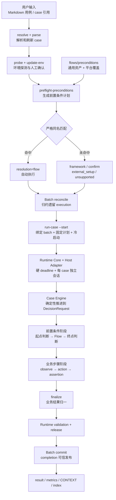
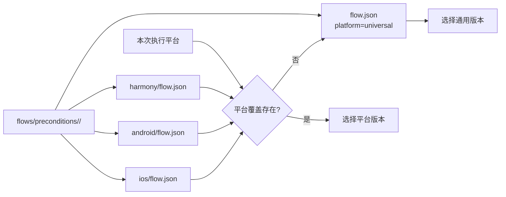
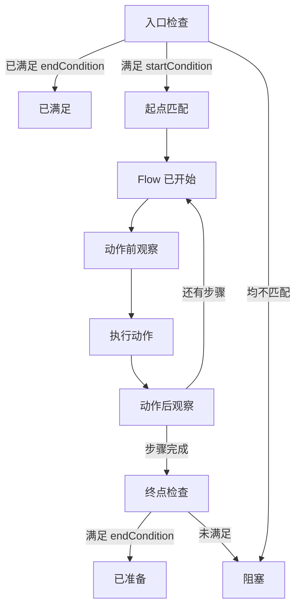
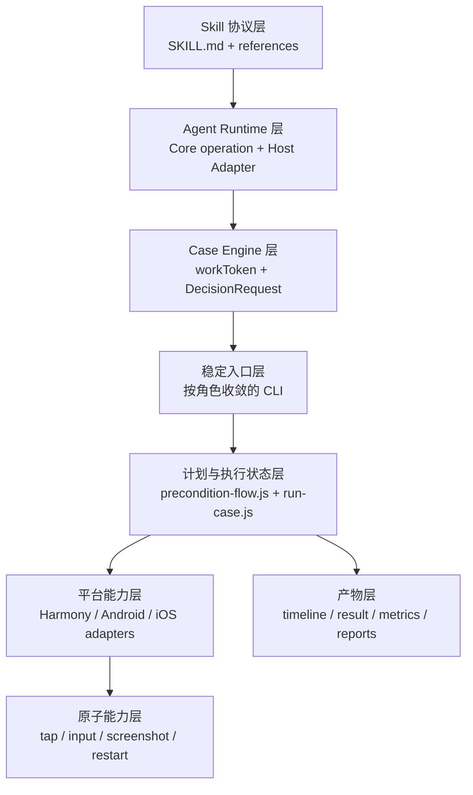
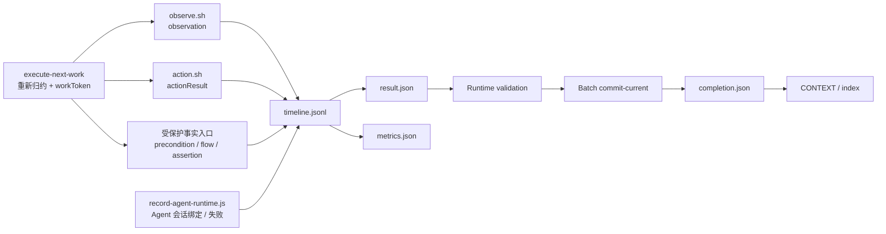

# mobile-ai-visual-test 架构图

本文用于理解整体设计。agent 执行协议以 `SKILL.md` 和 `references/` 为准，硬守卫以 `scripts/execution/run-case.js`、`scripts/action.sh`、`scripts/observe.sh` 为准。

## 总体架构

## Flow 目录和选择

通用版本不增加 `universal/` 目录层。Flow `name` 是唯一匹配键，前置条件文本只清理首尾空白后与其严格全等。

## 前置条件执行状态机

关键约束：

- `entry-check` 在任何 Flow 动作前执行；终点已满足则不重复操作。
- 起点不匹配时不尝试探索或纠偏，直接 `PRECONDITION_FLOW_START_MISMATCH`。
- 每个 Flow step 强制 `before observation -> action -> after observation`。
- Flow observation 必须获得截图、布局或有效前台事实；失败 observation 只保留审计记录，不能作为证据。
- Flow action 在平台执行前严格对照 execution 冻结计划，类型或已定义参数不一致时不触发设备动作。
- Flow 完成后必须重新观察终点；动作成功不等于前置条件达成。
- Flow observation/action 使用独立 `precondition-flow` scope，不绑定 case `stepId`。

## 分层职责

| 层级 | 职责 |
| --- | --- |
| Skill 协议层 | 约束执行顺序、Flow 边界和禁止行为 |
| Agent Runtime 层 | 为每个 case 创建无父会话历史的独立 Agent，并只返回结构化结果 |
| Case Engine 层 | 连续推进确定性工作，只把必须看图的单次决定交给 Agent |
| 稳定入口层 | 暴露公开 CLI，封装来源、预算和平台分发 |
| 计划与执行状态层 | 加载资产、严格匹配、固定计划、校验状态机和归一结果 |
| 平台能力层 | 适配设备能力，不做业务判断、不写 case 事实 |
| 原子能力层 | 执行最小动作或采集，不组合业务流程 |
| 产物层 | 保存可审计事实、结果、统计和报告 |

## 事实源和守卫

主要硬守卫：

- `preconditionPlanSha` 防止 preflight 与执行之间资产漂移。
- `protocolSha` 冻结角色规范，`implementationSha` 冻结实际运行脚本，二者贯穿 request、BOUND、Runtime 和结果。
- 启动阶段只有 `executionStart`、`environmentProbe` 和 `scope=execution-bootstrap` 的 restartApp 可以早于 BOUND；所有 Case Engine 事实都要求先绑定 Runtime。
- provider 由 Runtime Core 规范化并写入 requestSha，子 Agent 和 Host Adapter 不能覆盖。
- `workToken` 绑定当前 execution、timeline 位置和 NextWork，拒绝过期或伪造决定。
- 前置条件按 case 顺序写入，全部通过或准备完成后才能进入步骤。
- Flow 事件必须绑定计划中的 `preconditionId`、`flowId` 和合法 `flowStepId`。
- 同一时间只能有一个活动 Flow；起点、步骤前后和终点都要求对应 observation/action 证据。
- Flow 终态不可逆，必须紧接同一前置条件终态；finalize 拒绝活动或悬空 Flow。
- 步骤顺序、assertion evidence 和 observation/action 来源继续由原守卫校验。
- 报告重算当前计划哈希；Flow 资产变化后隐藏旧结果。

## 设计边界

- Flow 当前只服务于前置条件；未来即使增加步骤 Flow，也通过 `usage` 和 scope 使用独立协议。
- skill 不提供 Flow 录制能力；Flow 是受版本控制的静态资产。
- 业务步骤不扫描、不匹配、不执行 Flow。
- 前置条件 Flow 完成只证明执行起点已准备好，不能作为业务步骤通过证据。
- agent 做视觉理解和条件判断；脚本做匹配、状态机、预算、来源控制和报告。
- Agent Runtime 负责会话隔离、硬超时、中断、释放和结果验证，不访问设备 adapter，也不决定业务结果。
- Batch Runtime 不接收调用方提供的验证对象，只从绑定的 Runtime 和 execution 产物生成 completion 并提交当前 case。
- Batch Runtime 在开始时只做一次恢复归约：先判断批次终态和精确所有权；多未完成 execution 判损坏，同 batch 恢复，其他 batch 禁止接管，过期 Runtime 释放，纯启动事实的孤立 execution 由框架收尾。
