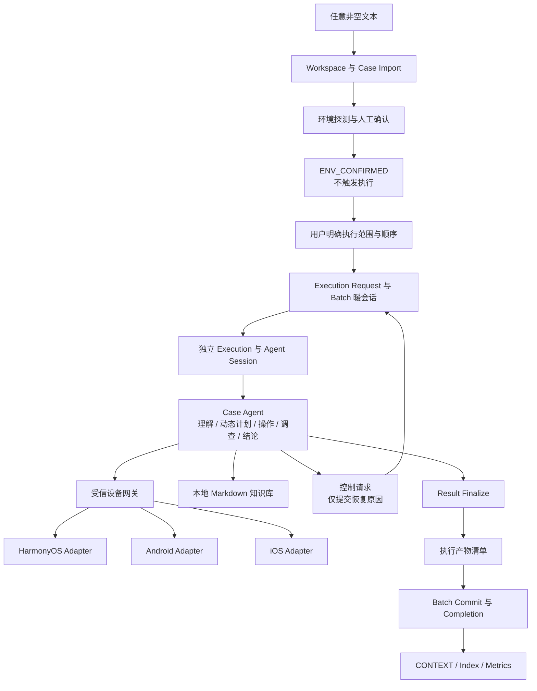
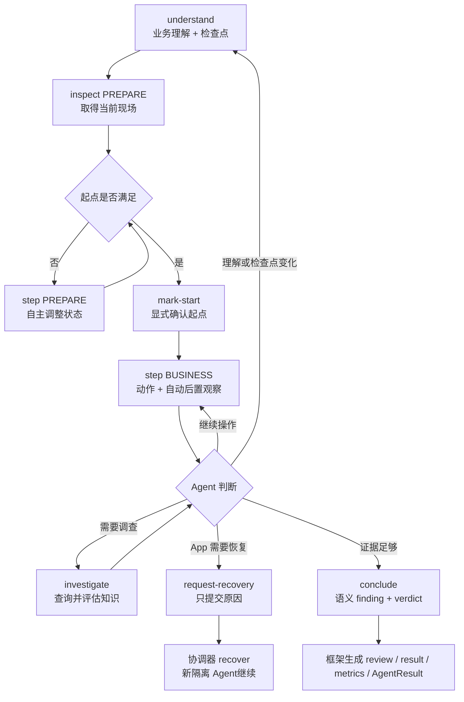

# mobile-ai-visual-test 架构

本文描述正式切换后的当前架构。Agent 执行语义以 `SKILL.md` 和其 requiredResources 为准，准确命令与 Schema 以 execution 冻结的 `agent/contract.json` 为准；脚本负责客观边界、事实固化和产物发布，不决定业务路径或 verdict。

## 核心原则

1. 任意非空文本都可以成为用例输入，框架不校验写法和格式质量。
2. Case Agent 自主理解原文、维护动态检查点、选择操作、调查异常并形成结论。
3. 同批次 App 暖状态复用，每个 case 保持独立 execution、逻辑 session 和证据。
4. 疑似异常先复核现场并查询本地知识；知识候选由 Agent 判断是否适用。
5. 唯一通用执行预算是单 case 30 分钟；动作授权、目标绑定和证据来源由脚本强校验。
6. 环境确认不等于执行授权；只有用户后续明确给出单用例或有序批量范围，系统才创建执行请求。
7. 执行请求之后全程无人值守；case 问题收敛为结果，批次级问题自动停批，Agent 不等待用户。
8. 正式执行只有一条主链，历史产物只读，不存在旧协议、Flow 或 profile 开关。

## 总体架构



## 模块职责

| 模块 | 主要入口 | 职责 |
| --- | --- | --- |
| 工作空间与输入 | `scripts/workspace.js`、`scripts/import-case.js` | 校验空目录或既有工作空间；初始化时用正式 renderer 生成零数据看板；保存原文和稳定 case 身份；仅拒绝空文本 |
| 环境探测 | `scripts/probe-env.sh`、`scripts/prepare-env.sh` | 探测平台能力并准备客观依赖；不读取业务用例 |
| 运行控制 | `scripts/environment.js`、`scripts/execution-request.js` | 分离环境确认与执行授权；冻结确认、执行模式、有序 target 快照、双角色协议、实现摘要和无人值守策略 |
| 批次协调 | `scripts/batch.js`、`scripts/batch/core.js` | 消费显式执行请求；一次 bootstrap；串行 case；自动恢复内部事务；消费控制请求；completion 发布 |
| 内部恢复 | `scripts/batch/internal-recovery.js` | 从冻结草稿恢复 step、operation、turn 和知识查询；不要求 Case Agent维护事务 ID |
| Execution Core | `scripts/execution/core.js` | 生命周期、阶段、30 分钟时限、事实事件、证据和 finalize |
| Agent Facade | `scripts/agent/understand.js`、`inspect.js`、`step.js`、`mark-start.js`、`request-recovery.js`、`investigate.js`、`conclude.js` | 接收语义决策；自动展开 revision、活动检查点、授权、事务、动作后观察、控制请求、复核和结果 |
| 产物完整性 | `scripts/lib/execution-artifact-manifest.js`、`completion-contract.js` | 冻结报告依赖产物的路径、大小和 SHA；completion 绑定清单，报告读取前验真 |
| 动态契约 | `scripts/lib/*-contract.js` | 从实现常量生成 execution 级 Agent 契约快照；确定性校验 revision、引用、授权、结果和实现摘要 |
| 知识查询 | `scripts/knowledge.js`、Agent Facade 内部查询模块 | 请求前校验知识库；执行中返回 Skill/Workspace Markdown 候选并冻结内容摘要；不自动改变 verdict |
| 平台适配 | `scripts/platform/adapters/` | 截图、控件树、前台检测和原子动作；不形成业务判断 |
| 报告读取 | `scripts/lib/execution-reader.js`、`scripts/report/report-service.js`、`scripts/report/current-*.js` | 按 schema 读取历史/当前产物并独立渲染；一次工作区级 `render-index` 重建所有根概览、平台详情和首页并校验链接 |

## 用例执行



计划是可修订检查点集合，不是固定点击序列。Agent 可以增删、合并、拆分或重排检查点，实际动作可以多于或少于计划；脚本只要求修订可追溯且不静默改变原文目标。

## 暖会话与恢复

```mermaid
sequenceDiagram
  participant U as User
  participant C as Coordinator
  participant B as Batch
  participant A as Case Agent
  participant G as Device Gateway
  U->>C: confirm environment
  C-->>U: ENV_CONFIRMED; no execution
  U->>C: execute one case / ordered batch
  C->>C: freeze UNATTENDED execution request
  C->>B: init + bootstrap
  B->>G: cold start once
  loop 串行处理 case
    C->>B: start
    B-->>C: isolated request/session
    C->>A: execute one case
    A->>G: inspect/step through semantic Facade
    opt 原文明示或客观技术故障
      A-->>C: frozen control request
      C->>B: recover
      B->>G: controlled restart
      B-->>A: generation/request rebound
    end
    A-->>C: finalized result
    C->>B: commit
  end
```

普通 case 切换不重启 App。新 case 必须重新观察当前现场并建立自己的起点；首次 `case-business` 操作要求绑定当前 understanding revision 的可用 `case-prepare` observation，understanding 修订后重新建立。`case-prepare` 只是生命周期标记，不限制 Agent 为建立起点而执行的动作。受控 recovery 递增 generation，同步重绑定 execution、Runtime 和当前 Agent request，旧 request 按 generation 归档；恢复前证据仅用于审计，不能授权动作或支撑当前结论。同一 case 的逻辑 session 不变。执行开始后不存在 `WAITING_FOR_USER`：case 级歧义或外部条件缺失分别收敛为 INCONCLUSIVE/BLOCKED 并继续，设备或批次状态不可恢复时自动停批并报告。

暖会话探测失败会通过统一停批入口写入 failureCode、reason、stoppedAt、当前 case/execution、generation、探测摘要和稳定事件；进程重启后不需要依赖上一次 CLI 响应恢复失败原因。

## 原子提交与恢复

运行控制使用小型 JSON 草稿实现幂等事务，不引入数据库或外部队列：

| 事务 | 草稿 | 权威提交与恢复 |
| --- | --- | --- |
| 执行请求 | `execution-request.draft.json` | 先冻结输入与协议，再幂等创建 target 快照，最后发布 request；中断后不重读实时用例 |
| 用例导入 | `case-import.draft.json` | 冻结原文与 case contract，一致替换 source/case 并重建派生报告 |
| Batch 初始化 | `batch-init.draft.json` | 一致提交 batch contract、初始状态和 `batchInitialized` 事件 |
| Batch Bootstrap | `bootstrap.draft.json` | 设备启动结果只取得一次；先提交 warm session 状态，再按稳定 eventId 补事件，失败状态也能继续收口 |
| Case 启动 | `case-start.draft.json` | 固定 execution/session/event，补齐 execution、Runtime、Agent request 与 batch 状态 |
| 语义 Step | `agent/steps/<stepId>.draft.json` | 冻结 Agent 意图与展开后的 action；由协调器自动恢复；时限后取消未发送动作或关闭观察缺口 |
| 内部 Agent Turn | `agent/turns/<turnId>.draft.json` | Facade 原子提交 understanding、plan 和判断事实；Case Agent 不维护 turnId/revision/factId |
| 设备操作 | `agent/operation-<id>.draft.json` | 冻结请求和适配器结果；按状态提交结果、标记结果不确定或根据已完成 timeline 重建 operation 记录，不自动重放动作 |
| 知识查询 | `agent/knowledge-query-<id>.draft.json` | 冻结标准化 query、候选和完整内容；补齐内容快照与 timeline 后清理草稿，恢复时不重读实时知识库 |
| Phase 迁移 | `phase.draft.json` | `execution.json` 是权威阶段，timeline 缺失时用稳定 eventId 补写 |
| App 恢复 | `recovery.draft.json` | adapter 结果只执行一次；batch 状态已提交后补写 incident/recovery 事件 |
| Agent 控制请求 | `agent/control-request.json` | Agent 只写原因；框架绑定 execution、活动检查点和当前证据；协调器恢复成功后清理 |
| 时限停止 | timeline `timeLimitReached` | 禁止新设备调用，确定性关闭全部草稿并记录操作后观察缺口，再进入 CONCLUDE |
| Finalize | `finalization.draft.json` | 幂等生成 result、metrics 与最终事件；入口可先收口 verdictReview 和阶段，不重复形成业务结论 |
| Case 发布 | `case-commit.draft.json` | 补齐 completion、batch state 和稳定 `caseCommitted` 事件；finalized 后不再依赖在线设备探测 |
| 产物封存 | `artifact-manifest.json` | 绑定原文、理解、计划、timeline、操作记录、知识和设备证据；报告读取时逐项验真 |
| 报告发布 | `report-publication.draft.json` | 内容文件逐个原子替换，最后提交带 SHA 的 metadata；不一致时从 execution 重渲染 |

`batch reconcile` 优先处理批次与发布草稿，然后自动收口 Agent 内部事务；Case Agent只看到 `frameworkRecoveryPending`，不读取内部恢复 ID。恢复沿用同一 execution 和冻结请求，不重新决策业务路径。控制请求返回 `RECOVER_APP`，协调器完成受控恢复后使用更新后的 request 创建新隔离 Agent。

## 事实与守卫

- 执行请求先在 `request-targets/` 冻结每个 target 的 source/case；execution 再复制自己的 snapshot，并绑定 target、batch、双角色协议、implementationSha 和 contractSha。
- Case Agent request 绑定 `agent/contract.json` 的路径与摘要；契约包含准确命令、完整字段、枚举、条件规则和可运行示例，Agent 无需读取实现代码。
- environment confirmation 与 execution request 分别冻结；batch、execution 和 Agent request 必须绑定同一 `executionRequestSha` 及 `UNATTENDED` 策略。
- observation/actionResult 只能由专用设备入口生成，均须确认冻结 platform、device 和 App；Agent turn 不能伪造设备事实。
- Case Agent 只提交语义对象；Facade 是 understanding、plan、checkpointFinding、knowledgeAssessment 和 verdictReview 的唯一转换边界，自动生成 revision、摘要和事实 ID。
- 动作由 Facade 自动绑定当前 execution、understanding/plan revision、checkpoint/start condition 和 observation；这些字段不由 Agent 手工维护，也不构成业务副作用门禁。
- 改变现场的动作必须引用当前暖会话代次的可用 observation；坐标动作还必须引用该 observation 同次采集的 layout、visual 或 pixel 产物。框架不判断业务副作用，Agent 可自主执行必要的起点恢复与调查动作。
- 状态变更动作完成后，设备网关默认缓冲 500ms 再启动 POST_ACTION observation；`MAVT_POST_ACTION_SETTLE_MS=0..5000` 可调整，配置值冻结在 step 草稿并写入操作 timing，恢复不会重放动作或改变等待值。
- 动作后的守卫通常只能由与该动作关联且可用的新 observation 清除；达到时限且禁止新设备调用时，由 `timeLimitReached` 如实记录当前观察不可得并解除流程死锁，verdictReview 通过 `observationUnavailable` 显式承认缺口，结论被限制为证据不足。其他最终复核仍必须引用最后一次动作、结果不确定或 recovery 之后的最新可用观察。
- 每个 requirement 独立闭合 evidence、适用 knowledge 或未决/阻塞原因，用例级结论不能替代逐 requirement 依据。
- PASS/FAIL 必须先以当前 understanding 和暖会话代次显式建立起点。PASS 必须完成当前计划全部检查点；观察型检查点可复用建立起点的当前观察，要求动作的检查点必须具备动作及动作后观察。FAIL 可在当前观察或相关产品事故形成充分负向证据后提前结束，不要求执行后续检查点；技术事故只能支持 BLOCKED。产品事故是否与 requirement 相关由 Agent 判断，脚本不全局否决 PASS。准备/业务 scope 只用于报告归类。
- FAIL、INCONCLUSIVE 和业务 BLOCKED 前必须完成原文复核、重新观察、知识查询和剩余不确定性记录；直接证据 PASS 和纯技术 BLOCKED 不强制查询。
- verdictReview 必须绑定当前 understanding revision、当前 plan revision 与 `planSha`，并精确覆盖当前全部 requirement；任一绑定过期都必须重新复核。
- 达到 30 分钟后停止新的设备操作，但仍允许基于已有事实进入 CONCLUDE。
- AgentResult 校验 request、双角色协议、实现、session、result、metrics 和哈希；completion 由 framework 发布并绑定 AgentResult 与执行产物清单 SHA。报告区分活动执行、收尾待恢复、待发布、已发布和历史 execution。
- `implementationSha` 覆盖 Agent、Batch、Case、Execution、运行时 lib、平台公共入口及当前平台 adapter；纯报告、历史读取和展示模块不参与执行实现摘要。
- 报告使用独立 `rendererSha`，覆盖报告 service、renderer manifest、报告入口及其只读依赖，并写入 `report-metadata.json`；重渲染不会改变 execution 的 `implementationSha`。
- Agent 入口调用与结构化错误写入 `agent/attempts.jsonl`；metrics 区分 Agent 决策间隔、协议活动时间、设备适配器工作时间和阶段耗时，这些诊断事实不参与业务 verdict。

## 产物结构

```text
<workspace>/
  workspace.json
  environment-confirmation.json
  knowledge/
  cases/<case>/
    case-import.draft.json
    source.md
    case.json
    CONTEXT.md
    CONTEXT.html
    report-metadata.json
    platforms/<platform>/
      executions/<execution>/
        source.snapshot.md
        execution.json
        phase.draft.json
        finalization.draft.json
        understanding.json
        plan.json
        timeline.jsonl
        knowledge/<contentSha>.md
        result.json
        metrics.json
        artifact-manifest.json
        completion.json
        agent/
          contract.json
          request.json
          runtime.json
          result.json
          control-request.json
          attempts.jsonl
          steps/<stepId>.draft.json
          steps/<stepId>.json
          turns/<turnId>.draft.json
          turns/<turnId>.json
          operation-<id>.draft.json
          knowledge-query-<id>.draft.json
          operation-<id>.json
        screenshots/
        layouts/
        logs/
      CONTEXT.md
      CONTEXT.html
      report-metadata.json
  runs/<batch>/
    request-targets/<order-caseKey>/
      source.snapshot.md
      case.snapshot.json
    execution-request.json
    contract.json
    batch.json
    events.jsonl
    batch-init.draft.json
    bootstrap.draft.json
    case-start.draft.json
    case-commit.draft.json
    recovery.draft.json
  report-metadata.json
  index.html
```

## 当前平台状态

- HarmonyOS：2026-08-18 设备基线验证过当时的正式主链；当前实现已通过自动化门禁，最近改动仍需补充新的真机回归。
- Android：适配实现保留，当前无在线设备，待补正式验证。
- iOS：适配实现保留，WDA 在当前 Xcode/设备组合启动失败，待补正式验证。

## 文档边界

- 当前架构以本文为准；执行语义以 `../SKILL.md` 及其 requiredResources 为准，准确接口契约以每个 execution 的 `agent/contract.json` 为准。
- HarmonyOS 历史设备基线见 `harmony-post-cutover-validation-2026-08-18.md`，不代表当前 implementation 已完成真机验收。
- `archive/` 只保存重构决策、实施过程和切换前验收记录，不作为当前操作或接口依据。
