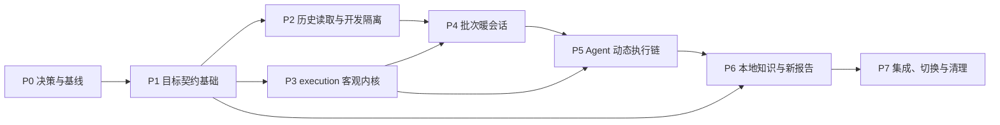

# Agent 驱动的移动端 AI 视觉测试实施执行计划

> **历史归档：** 本计划已于 2026-08-18 完成，仅用于实施追溯。当前状态以 `../architecture.md` 和 `../harmony-post-cutover-validation-2026-08-18.md` 为准。

> 开发执行稿 · 2026-08-12 · 更新于 2026-08-18
> 本文承接《技术实现方案》，用于拆分开发任务、安排依赖顺序、定义阶段门禁和跟踪交付。本文不替代架构设计，也不表示相关代码已经完成。

## 执行原则

以下原则约束整个重构过程：

1. **按分层重构实施，不全量推倒重写。** 三端 adapter、环境绑定、Agent Runtime、证据存储和可信发布机制优先复用；固定用例契约、业务归约器和逐用例冷启动链路重点替换。
2. **契约先于生产者，历史读取先于当前产物。** 先定义并测试 schema，再让报告支持按 schema 读取历史产物，最后才允许目标运行时写入当前产物。
3. **每个交付单元都必须可独立合并。** 每完成一个任务，仓库都应保持可运行、现有回归测试通过，并能明确回滚到上一个稳定点。
4. **正式执行只有一条主链路。** 开发期的新模块不接入用户可选入口；正式切换后不保留现有业务执行核心，历史 execution 仅只读兼容。
5. **暖会话和 Agent 执行链只分开开发，不分开对外启用。** 现有固定步骤引擎不得在生产路径中运行于跨用例暖状态。
6. **先抽离客观能力，再移除旧业务状态机。** `run-case.js` 中的生命周期、证据、执行计时和发布逻辑先模块化，旧 reducer 和断言归约最后下线。
7. **Agent 自由度通过 eval 验证，脚本边界通过确定性测试验证。** 不用固定点击路径评估 Agent，也不用 Agent 行为测试替代参数、安全、执行时限和证据单测。
8. **不为迁移引入新的强制依赖。** 测试继续使用 Node.js 内置模块和现有 Shell 能力；本地知识使用 Markdown 和文件检索。
9. **切换与删除是同一发布动作。** 正式切换必须同时接管入口、更新 Skill 指令并删除现有业务执行核心；回退通过完整代码版本回退完成。
10. **所有任务以完成条件收口。** “代码已写”不算完成；契约、测试、文档、兼容和回滚条件必须同时满足。

## 1. 交付目标与边界

### 1.1 最终交付状态

完成本计划后，主链路应具备以下能力：

- 任意非空可读取文本都能创建 case 和 execution，不做格式或内容质量门禁；空文件和纯空白输入在前置环节报错。
- Case Agent 读取完整原文，生成可修订的 understanding 和 plan。
- 同批次默认只启动一次 App，每个新用例重新观察并建立起点。
- Agent 自主决定观察、动作、计划调整、知识调查和最终 verdict。
- 脚本只校验环境、动作契约、授权引用、单用例执行时限、证据和产物绑定。
- 本地知识无需外部服务即可查询，并保留适用性判断和版本摘要。
- 当前报告展示原文、起点、计划修订、知识、证据和结论依据。
- 历史结果继续可读；正式切换后不提供旧执行入口，必要时整体回退代码版本。
- 当前目录为空时自动初始化测试工作空间；非空时必须具有有效 `workspace.json`，普通项目目录不会被自动接管。

### 1.2 不在本计划中的工作

- 不重写 HarmonyOS、Android、iOS 平台 adapter 和 atoms。
- 不建设服务端、数据库、向量检索或模型调用服务。
- 不建设知识录入后台或 Flow 可视化编辑器。
- 不追求同一用例每次选择完全相同的物理操作路径。
- 不在重构中顺带解决与目标架构无关的历史代码风格问题。

## 2. 总体阶段与关键路径



| 阶段 | 目标 | 主要产物 | 阶段门禁 |
| --- | --- | --- | --- |
| P0 | 固定决策、测试基线和回滚样本 | 决策记录、现有实现特征测试、样例产物 | 当前主链路行为可复现 |
| P1 | 建立不依赖运行时的目标纯契约 | case、sourceRef、understanding、plan、event、result 合约 | 所有正反例单测通过 |
| P2 | 报告先支持历史读取，再建立开发隔离 | schema reader、目标 fixture 和测试入口门禁 | 目标产物不会误入现有正式执行链，历史报告不回归 |
| P3 | 从 `run-case.js` 抽出客观内核 | execution、证据、执行计时、finalize 模块 | 目标核心不依赖固定 step/Flow 归约 |
| P4 | 建立批次暖会话和受控恢复 | warmSession、generation、batch bootstrap/recovery | 多用例仅启动一次 App |
| P5 | 接通 Agent 动态执行 | Agent contract、事实提交、计划授权、Skill 指令 | 目标链路不调用唯一 NextWork |
| P6 | 增加知识调查和当前报告 | query、assessment、metrics、CONTEXT/index | 知识支持结论可审计 |
| P7 | 当前平台验证、原子切换和现有核心删除 | eval 结果、切换发布、清理提交 | HarmonyOS 切换门禁通过且可整体版本回退；其他平台保留待验证状态 |

### 2.1 对外切换约束

P1-P6 可以逐步开发和合并，但目标模块只能由单元测试、fixture、模拟 adapter 和内部测试入口调用，正式行为保持不变。只有以下条件同时满足，才允许在 P7 原子切换正式主链路：

1. 暖会话、独立 Agent session、动态计划、当前结果和报告已形成完整闭环。
2. 当前交付范围内 HarmonyOS 基础动作回归通过；Android、iOS 不作已验证声明。
3. 行为 eval 覆盖计划错误、路径变化、暖状态切换、知识适用与真实 FAIL。
4. 历史与当前 schema 的报告读取通过。
5. 活动批次处理、原子发布和完整代码版本回退完成演练。

## 3. 实施前决策门禁

D-01 至 D-07 已全部确认，均作为后续任务的固定验收输入；实施中如需改变结论，必须重新发起设计评审，不能以局部实现便利替代已确认决策。

| 决策 ID | 决策项 | 确认结论 | 影响范围 |
| --- | --- | --- | --- |
| D-01 | 批次首次启动策略 | **已确认：每个新批次固定冷启动一次；批次内保持暖会话；意外退出按客观证据执行一次受控恢复** | batch bootstrap、recovery、指标 |
| D-02 | 正式切换策略 | **已确认：选择方案 A；正式切换时同步删除现有业务执行核心，不保留用户可选并行协议；新文件使用中性命名** | manifest、切换发布、清理与回退 |
| D-03 | 知识库可信语义 | **已确认：准入即可信；框架不做可信度分级，只判断场景适用性；来源仅用于追溯** | knowledge、assessment、`KNOWLEDGE_SUPPORTED` |
| D-04 | 单用例执行时限 | **已确认：只保留 30 分钟硬时限；其他次数不限制；到时停止新设备操作但允许完成结论** | elapsed-time guard、eval |
| D-05 | 空文本处理 | **已确认：空文件或纯空白输入前置返回 `CASE_INPUT_EMPTY`，不创建 case、execution、Agent session 或报告** | parser、preflight |
| D-06 | 导航 Flow 处理 | **已确认：不保留 Flow 机制；有效导航信息按需迁入知识库；实际观察确认目标状态；正式切换时删除全部 Flow 执行能力** | knowledge、清理 |
| D-07 | 工作空间入口 | **已确认：当前目录只允许为空目录或有效既有工作空间；不向上查找、不按目录形状认领；外部用例通过显式路径导入** | workspace、input、Codex 操作流程 |

## 4. 任务拆分

任务编号同时表示推荐实施顺序。标记“可并行”的任务仍需满足列出的前置依赖。

### P0：决策、基线与测试骨架

#### T-001 固化实施决策

| 项目 | 内容 |
| --- | --- |
| 目标 | 记录已确认的 D-01 至 D-07，并写入实现任务的验收输入 |
| 涉及文件 | 本执行计划、技术实现方案；不修改运行时代码 |
| 前置依赖 | 无 |
| 具体动作 | 固化 D-01 的批次冷启动和意外退出规则、D-02 的原子切换与完整版本回退规则、D-03 的准入即可信规则、D-04 的单一时间硬约束、D-05 的空文本前置错误、D-06 的 Flow 退出和导航知识迁移规则、D-07 的工作空间入口边界 |
| 测试 | 不适用 |
| 完成条件 | D-01 至 D-07 的确认结论均已准确写入技术实现方案、执行计划和对应任务验收条件 |
| 回滚点 | 不适用 |

#### T-002 冻结现有实现特征基线

| 项目 | 内容 |
| --- | --- |
| 目标 | 在重构前固定当前输入、启动、NextWork、finalize、completion 和报告行为 |
| 涉及文件 | `scripts/self-test.js`，必要时增加 `scripts/tests/fixtures/historical/` |
| 前置依赖 | T-001 |
| 具体动作 | 补齐零步骤拒绝、逐 case restart、固定步骤 PASS、Runtime 绑定、批次恢复、可信 completion 和历史报告样例 |
| 测试 | `node scripts/self-test.js` |
| 完成条件 | 当前代码完整跑通；现有关键行为均有正反例断言；失败输出可定位到具体场景 |
| 回滚点 | 仅增加测试和 fixture，可单独回退 |

#### T-003 拆分自测结构

| 项目 | 内容 |
| --- | --- |
| 目标 | 降低单个 `self-test.js` 对后续并行开发的冲突 |
| 涉及文件 | `scripts/self-test.js`、新增 `scripts/tests/helpers.js`、`scripts/tests/*.test.js` |
| 前置依赖 | T-002 |
| 具体动作 | 抽出公共临时工作空间、命令执行、PNG、timeline 和 fixture helper；按 contract、execution、runtime、batch、report、platform 分组 |
| 测试 | `node scripts/self-test.js` 仍作为唯一总入口并顺序执行全部 suite |
| 完成条件 | 测试语义不变；单 suite 可独立执行；不引入测试框架依赖 |
| 回滚点 | 保留原总入口，拆分可整体回退 |

#### T-004 建立三端能力基准

| 项目 | 内容 |
| --- | --- |
| 目标 | 保护不在本次重写范围内的平台能力 |
| 涉及文件 | `scripts/tests/platform-contract.test.js`、现有 adapter 自测 fixture |
| 前置依赖 | T-003 |
| 具体动作 | 固定 probe/action/observe 统一字段、输入模式、坐标证据、restart 返回和未知参数拒绝 |
| 测试 | 使用 adapter 模拟命令；真机项留到 T-703 |
| 完成条件 | HarmonyOS、Android、iOS 的公共动作契约均有基准测试 |
| 回滚点 | 仅测试变更 |

**P0 出口：** `node scripts/self-test.js` 全绿；现有行为和平台边界都有可复现基线；D-01 至 D-07 已确认。

### P1：目标纯契约基础

#### T-101 定义 case contract

| 项目 | 内容 |
| --- | --- |
| 目标 | 将 case 从固定业务步骤契约收缩为原始输入身份契约 |
| 涉及文件 | 新增 `scripts/execution/contracts/case-contract.js`、`references/case-format.md`；开发期不接入正式入口 |
| 前置依赖 | P0 |
| 具体动作 | 定义明确的 `schemaVersion`、identity、sourceSha 和 importSource；当前产物不写入现有 parser 的步骤字段 |
| 测试 | 正常文本、模糊非空文本、空文件、纯空白、BOM 后空白、历史 case、非法 identity、未知 schema |
| 完成条件 | 当前合约与历史 schema 可明确分派；当前合约不要求 steps/preconditions/globalRules |
| 回滚点 | 模块尚无正式生产者，可单独删除 |

#### T-102 实现 source reference 合约

| 项目 | 内容 |
| --- | --- |
| 目标 | 让 Agent 的原文依据可被机器验证但不被脚本解释语义 |
| 涉及文件 | 新增 `scripts/lib/source-reference.js` |
| 前置依赖 | T-101 |
| 具体动作 | 校验 `sourceSha + lineStart + lineEnd + quote`；处理换行、空行、越界和摘要不一致 |
| 测试 | 精确引用、多行引用、错误行号、错误摘录、错误 sourceSha |
| 完成条件 | 所有引用能绑定 `source.snapshot.md`；错误引用不写入事实 |
| 回滚点 | 独立纯模块 |

#### T-103 定义 understanding 合约

| 项目 | 内容 |
| --- | --- |
| 目标 | 保存 Agent 对目标、起点和 requirements 的版本化理解 |
| 涉及文件 | 新增 `scripts/lib/understanding-contract.js` |
| 前置依赖 | T-102 |
| 具体动作 | 定义 revision、basis、sourceRefs、uncertainties；校验 revision 单调递增和 requirement 去向说明 |
| 测试 | 首版、修订、重复 ID、悬空 sourceRef、静默删除 requirement |
| 完成条件 | 脚本只检查结构与来源，不评价理解是否正确 |
| 回滚点 | 独立纯模块 |

#### T-104 定义动态计划合约

| 项目 | 内容 |
| --- | --- |
| 目标 | 支持检查点增加、删除、合并、拆分和重排 |
| 涉及文件 | 新增 `scripts/lib/plan-contract.js` |
| 前置依赖 | T-103 |
| 具体动作 | 定义 revision、reason、checkpoints、requirementRefs、requiredAction 和状态；生成稳定 planSha |
| 测试 | 合法修订、旧 revision、重复 checkpoint、悬空 requirement、空计划 |
| 完成条件 | 计划变化不触发业务失败；非法引用和过期 revision 被拒绝 |
| 回滚点 | 独立纯模块 |

#### T-105 定义 timeline 事件合约

| 项目 | 内容 |
| --- | --- |
| 目标 | 明确目标生命周期、Agent、知识和客观事实事件边界 |
| 涉及文件 | 新增 `scripts/execution/contracts/execution-event-contract.js`、`references/interfaces.md` |
| 前置依赖 | T-103、T-104 |
| 具体动作 | 定义 `phaseChanged`、`caseUnderstood`、`planRevised`、`checkpointFinding`、`knowledgeQuery`、`knowledgeAssessment`、`verdictReview`、`result` |
| 测试 | 每类事件正反例、写入方、execution 绑定、阶段作用域 |
| 完成条件 | 当前事件不要求 stepId 顺序；历史事件保持只读兼容 |
| 回滚点 | 模块尚未接入正式主链路 |

#### T-106 定义 result 与 metrics 合约

| 项目 | 内容 |
| --- | --- |
| 目标 | 分离业务 verdict 和技术 executionStatus |
| 涉及文件 | 新增 `scripts/execution/contracts/result-contract.js`、`references/result-contract.md` |
| 前置依赖 | T-103、T-105 |
| 具体动作 | 定义 verdict、executionStatus、verdictBasis、requirementFindings、uncertainties、technicalFailureCode 和引用规则 |
| 测试 | DIRECT_EVIDENCE、KNOWLEDGE_SUPPORTED、FAIL、INCONCLUSIVE、BLOCKED、跨 execution 引用 |
| 完成条件 | 脚本只校验证据与引用完整性，不按 checkpoint 数量重算 verdict |
| 回滚点 | 独立纯模块 |

#### T-107 定义 completion 兼容合约

| 项目 | 内容 |
| --- | --- |
| 目标 | 让可信发布按 schema 支持历史 status 和当前 verdict/executionStatus |
| 涉及文件 | `scripts/lib/completion-contract.js`、`scripts/lib/execution-completion.js` |
| 前置依赖 | T-106 |
| 具体动作 | completion 增加 schema 分派；继续绑定 result、metrics、validation 和实现摘要 |
| 测试 | 历史 completion 不变；当前产物正常发布、哈希漂移、schema 错配、Runtime 未释放 |
| 完成条件 | completion reader 能根据 schema 明确选择校验器，禁止猜测 |
| 回滚点 | 历史 reader 保持原实现 |

**P1 出口：** 所有目标合约都是纯模块且具备正反例；尚未改变正式行为；现有自测保持全绿。

### P2：历史读取与开发隔离

#### T-201 抽出 execution reader

| 项目 | 内容 |
| --- | --- |
| 目标 | 在写入当前产物前，让报告和 index 具备明确的 schema reader 入口 |
| 涉及文件 | 新增 `scripts/lib/execution-reader.js`，调整 `scripts/lib/common.js`、`scripts/report/` |
| 前置依赖 | P1 |
| 具体动作 | 按 execution/result schema 分派；统一返回展示模型；保留 completion 可信校验 |
| 测试 | 历史 fixture、当前 fixture、混合工作空间、未知 schema、损坏 completion |
| 完成条件 | renderer 不直接散落读取 `steps/status/failedStep` 等版本字段 |
| 回滚点 | 原 reader 保留到新 reader 完成替换 |

#### T-202 建立当前报告最小视图

| 项目 | 内容 |
| --- | --- |
| 目标 | 在完整当前报告前，先保证目标产物可安全展示 |
| 涉及文件 | `scripts/lib/common.js`、`scripts/report/render-context.js`、`scripts/report/render-index.js` |
| 前置依赖 | T-201 |
| 具体动作 | 展示原文、verdict、executionStatus、summary 和 uncertainties；未知字段安全转义 |
| 测试 | 当前 PASS/FAIL/INCONCLUSIVE/BLOCKED；中文、长文本、HTML 注入字符 |
| 完成条件 | 当前 fixture 可生成 CONTEXT 和 index；历史 golden 不变化 |
| 回滚点 | reader 分派可临时关闭当前展示 |

#### T-203 改造 case 导入为宽松模式

| 项目 | 内容 |
| --- | --- |
| 目标 | 任意非空可读取文本都能生成当前 case contract 和 `source.md`，空文本在写入前结束 |
| 涉及文件 | `scripts/case/parse-case.js`、`scripts/lib/common.js` 中 parser 边界、`scripts/parse-case.js` |
| 前置依赖 | T-101、T-201 |
| 具体动作 | 在测试专用入口中只做路径、读取、非空检查和身份处理，标题提供文件名回退；空文件或去除 BOM 后仅含空白时返回 `CASE_INPUT_EMPTY`，不写 case 目录；不将步骤解析字段写入当前 case 文件，正式入口暂不改变 |
| 测试 | 无标题、无步骤、表格、自由文本、模糊非空文本、空文件、纯空白、BOM 后空白、刷新、重复导入、不可读文件 |
| 完成条件 | 当前导入只因客观不可执行输入失败，不再因 `CASE_STEPS_REQUIRED`、输入值缺失或规则表格式拒绝；空文本无残留 case/execution 目录；正式入口行为暂不改变 |
| 回滚点 | 测试专用入口与模块可单独移除 |

#### T-204 建立当前报告 fixture

| 项目 | 内容 |
| --- | --- |
| 目标 | 在运行时写入当前产物前，为 schema reader 提供稳定测试样本 |
| 涉及文件 | `scripts/tests/fixtures/current/`、report reader 测试 |
| 前置依赖 | T-102、T-106、T-107、T-202 |
| 具体动作 | 手工构造经过合约校验的 source snapshot、understanding、plan、timeline、result、metrics 和 completion fixture |
| 测试 | PASS、FAIL、INCONCLUSIVE、BLOCKED、损坏引用、未知 schema、与历史产物混合工作空间 |
| 完成条件 | fixture 只服务 reader/renderer 测试，不作为临时运行时 writer |
| 回滚点 | 仅测试资产 |

#### T-205 建立目标模块测试入口

| 项目 | 内容 |
| --- | --- |
| 目标 | 让目标模块可被自动化验证，同时不形成用户可选的第二条执行路径 |
| 涉及文件 | `scripts/tests/helpers.js`、测试专用 runner、模拟 adapter |
| 前置依赖 | T-101、T-203 |
| 具体动作 | 测试 runner 直接调用纯模块并写入临时工作空间；禁止修改正式 CLI 参数和 manifest，禁止目标半成品处理真实批次 |
| 测试 | 测试 root 隔离、真实 workspace 拒绝、未完成 writer、未知 schema |
| 完成条件 | 目标输入和报告可在测试环境验证，但正式运行仍只有现有入口 |
| 回滚点 | 仅测试基础设施 |

#### T-206 收紧工作空间入口

| 项目 | 内容 |
| --- | --- |
| 目标 | 将当前目录稳定定义为测试工作空间根目录，避免误写普通项目或猜测输出位置 |
| 涉及文件 | 新增 `scripts/lib/workspace.js`，调整 `scripts/lib/common.js`、`resolve-execution-targets.js`、初始化和报告入口 |
| 前置依赖 | T-203、D-07 |
| 具体动作 | 空目录原子创建 `workspace.json`、`cases/`、`knowledge/`、`runs/` 和 `index.html`；非空目录只接受合法 marker；删除 `hasWorkspaceShape()` 自动认领和 `flows/` 初始化；输入路径与工作空间根目录分离 |
| 测试 | 空目录、仅 `.DS_Store`、合法 marker、损坏 JSON、错误 type、未知 schema、无 marker 普通目录、伪造目录形状、父目录存在 marker、绝对/相对外部用例路径、初始化中断重入 |
| 完成条件 | 不会向上查找、切换目录或自动认领非空目录；`WORKSPACE_INVALID` 前无文件变更；外部用例可导入且产物只写工作空间 |
| 回滚点 | 正式入口切换前保留现有 workspace helper，由目标测试入口验证新模块 |

**P2 出口：** 报告按 schema 支持历史与当前 fixture；任意非空文本可在测试环境导入和展示，空文本稳定返回前置错误；工作空间入口只接受空目录或有效 marker；没有新增用户可选执行协议，也不创建半成品正式运行时。

### P3：execution 客观内核

#### T-301 抽出 execution 生命周期模块

| 项目 | 内容 |
| --- | --- |
| 目标 | 从近三千行 `run-case.js` 中分离版本无关的 execution 创建、读取、锁定和恢复 |
| 涉及文件 | 新增 `scripts/lib/execution-lifecycle.js`，调整 `scripts/execution/run-case.js` |
| 前置依赖 | P1、T-003 |
| 具体动作 | 抽出 ID 分配、目录创建、execution state、原文快照、finalization draft 和原子锁定；保持 CLI 不变 |
| 测试 | start 中断、原文执行中变化、快照摘要漂移、finalize 中断、重复 finalize、孤立 execution、活动 execution 冲突 |
| 完成条件 | 现有行为逐项等价；新模块不包含 step、assertion 或 Flow 语义 |
| 回滚点 | 一次纯重构提交，出问题整体回退 |

#### T-302 抽出证据与产物校验模块

| 项目 | 内容 |
| --- | --- |
| 目标 | 复用 observation 来源、artifact path、PNG/SHA 和跨 execution 引用守卫 |
| 涉及文件 | 新增/整合 `scripts/lib/execution-evidence.js`、现有 `image-evidence.js` |
| 前置依赖 | T-301 |
| 具体动作 | 移出 artifact、截图绑定、证据存在性和 source 写入方检查；开发期保留现有 assertion adapter |
| 测试 | 文件缺失、路径穿越、截图损坏、SHA 漂移、跨 execution 引用 |
| 完成条件 | 当前 result 可以直接复用证据校验，不依赖 step assertion |
| 回滚点 | 纯抽取提交 |

#### T-303 抽出执行计时与客观指标模块

| 项目 | 内容 |
| --- | --- |
| 目标 | 将单用例计时约束和非限制性指标从业务归约中分离 |
| 涉及文件 | 新增 `scripts/lib/execution-time-limit.js`、调整 metrics 构建 |
| 前置依赖 | T-301 |
| 具体动作 | 从 execution 创建成功开始计算 30 分钟；到时拒绝新的 observe/action，但继续允许读取已有产物、提交 Agent 事实和 CONCLUDE；动作、观察、准备、知识查询和主动反思只计数 |
| 测试 | 起止时间、临界时刻设备操作、到时后 CONCLUDE、已有充分证据的 PASS/FAIL、各类次数不触发拒绝 |
| 完成条件 | 只有时间能停止新设备操作；次数指标不形成阈值；时限触发不自动生成或改写 verdict |
| 回滚点 | 开发期保留现有 budget adapter |

#### T-304 实现目标阶段与事实提交

| 项目 | 内容 |
| --- | --- |
| 目标 | 支持 UNDERSTAND、ESTABLISH_START、EXECUTE、INVESTIGATE、CONCLUDE、FINALIZED |
| 涉及文件 | `scripts/execution/run-case.js`、`scripts/commit-agent-turn.js`、T-105 合约模块 |
| 前置依赖 | T-301、T-302、T-303 |
| 具体动作 | 在目标核心增加 record/commit 能力；校验阶段、写入方、execution 绑定和 revision；不生成 NextWork |
| 测试 | 合法转换、非法跳转、过期 revision、finalized 后写入、Runtime BOUND 前写入 |
| 完成条件 | Agent 可以提交理解、计划和 finding；脚本不决定下一个业务动作 |
| 回滚点 | 仅测试入口开放目标能力 |

#### T-305 实现目标 finalize

| 项目 | 内容 |
| --- | --- |
| 目标 | 用当前 result 契约替代逐步骤 assertion PASS 归约 |
| 涉及文件 | `scripts/execution/run-case.js`、`scripts/execution/contracts/result-contract.js`、completion 模块 |
| 前置依赖 | T-304、T-106、T-107 |
| 具体动作 | 校验 requirement findings、证据、knowledge assessment、verdictReview 和未关闭操作；构建当前 metrics |
| 测试 | 四种 verdict、知识支持 PASS、FAIL 缺原文依据、PASS 缺业务证据、达到 30 分钟时限后 CONCLUDE |
| 完成条件 | 目标 finalize 不调用 `passReadiness`、`stepOrderReadiness` 或 `normalizeResultStatus` |
| 回滚点 | 正式切换前现有 finalize 保持原样 |

#### T-306 收敛 execution Core 边界

| 项目 | 内容 |
| --- | --- |
| 目标 | 让顶层入口只负责参数解析，并将目标业务能力收敛到可原子接管的 Core |
| 涉及文件 | `scripts/run-case.js`、`scripts/execution/run-case.js`、新增目标 Core 文件 |
| 前置依赖 | T-305 |
| 具体动作 | 目标 Core 通过测试 runner 调用；正式 CLI 在切换前仍调用现有核心，切换提交中直接改接目标 Core |
| 测试 | 目标命令矩阵、未知参数、错误 schema、跨实现继续执行 |
| 完成条件 | 目标 Core 不依赖协议选择参数；CLI 接管点清晰且可在单个提交中切换 |
| 回滚点 | 正式入口尚未切换 |

**P3 出口：** 目标 execution 可在测试环境独立创建、提交事实、受执行时限约束、校验证据并 finalize；业务路径不由 reducer 决定；现有全量回归通过。

### P4：批次暖会话与用例边界

#### T-401 建立 batch 实现绑定

| 项目 | 内容 |
| --- | --- |
| 目标 | 批次初始化时冻结当前合约与实现摘要，禁止跨代码版本续写 |
| 涉及文件 | `scripts/batch-runtime.js`、`build-agent-contract.js`、batch contract |
| 前置依赖 | P2、P3 |
| 具体动作 | contract、batch、operation 和 completion 全链路绑定 `contractSha` 与 `implementationSha` |
| 测试 | 缺摘要、未知 schema、执行中实现变化、completion 摘要错配 |
| 完成条件 | reconcile 和 commit 不允许不同实现继续写入同一批次 |
| 回滚点 | 目标 batch 尚未接入正式入口 |

#### T-402 实现 warm-session 合约

| 项目 | 内容 |
| --- | --- |
| 目标 | 保存批次级 App 会话状态而不保存用例业务上下文 |
| 涉及文件 | 新增 `scripts/lib/warm-session-contract.js`、`batch-runtime.js` |
| 前置依赖 | T-401 |
| 具体动作 | 定义 INITIALIZING、READY、DEGRADED、CLOSED、generation、binding、appStartCount、recoveryCount |
| 测试 | 合法状态转换、设备/App 绑定变化、generation 回退、关闭后复用 |
| 完成条件 | warmSession 只包含客观环境信息，不包含上一用例 plan、timeline 或 verdict |
| 回滚点 | 目标 batch 专用字段 |

#### T-403 实现批次 bootstrap

| 项目 | 内容 |
| --- | --- |
| 目标 | 将 App 启动从每个 execution 移到批次级一次执行 |
| 涉及文件 | `batch-runtime.js`、`action.sh` 新 scope、平台 restart 复用 |
| 前置依赖 | T-402、D-01 |
| 具体动作 | 无论 App 当前是否在前台，每个新批次都执行一次 restartApp；记录 batchBootstrap 和 generation=1；冷启动不清除应用数据 |
| 测试 | App 已在前台、未启动、启动失败、方向策略失败、重复 bootstrap、同批次恢复不重复 bootstrap |
| 完成条件 | 目标 `run-case --start` 不调用 `restartAppForExecution` |
| 回滚点 | 仅测试批次启用；正式行为尚未改变 |

#### T-404 实现用例准备作用域

| 项目 | 内容 |
| --- | --- |
| 目标 | 分隔起点建立事实和业务执行证据 |
| 涉及文件 | `observe.sh`、`action.sh`、`action-contract.js`、timeline/report reader |
| 前置依赖 | T-403、T-304 |
| 具体动作 | 增加 `case-prepare` 与 `case-business` scope；准备动作绑定 startConditionId 和 understanding revision |
| 测试 | 准备证据不能支撑 business finding；跨阶段 scope、悬空 startCondition、准备副作用拒绝 |
| 完成条件 | 每个新 execution 的第一条 observation 属于自己；不会读取上一用例证据 |
| 回滚点 | 目标 scope 尚未正式启用 |

#### T-405 实现受控 App recovery

| 项目 | 内容 |
| --- | --- |
| 目标 | 仅在原文明确要求或 App 意外退出、无响应、会话失效等客观技术故障时允许批次内重启 |
| 涉及文件 | `batch-runtime.js recover-app`、warm-session contract、action scope |
| 前置依赖 | T-403、T-404 |
| 具体动作 | 采集进程、前台应用、日志、最后动作和退出时间；分类产品崩溃、外部杀进程和原因未知；校验 triggerType、sourceRefs/evidenceRefs、当前 execution 和 D-01 恢复次数；成功后 generation+1 |
| 测试 | 原文冷启动、明确产品崩溃、系统杀进程、原因未知、无依据找页面、超过允许恢复次数、恢复失败、同一检查点再次退出、幂等重入 |
| 完成条件 | Agent 不能直接提交 `restartApp`；每次恢复有客观审计链；恢复后不自动重放输入、提交、发布、删除、支付等结果不确定动作 |
| 回滚点 | recovery 命令尚未接入正式入口 |

#### T-406 改造批次 reconcile

| 项目 | 内容 |
| --- | --- |
| 目标 | 同时恢复 execution、Agent Runtime 和 warmSession |
| 涉及文件 | `batch-runtime.js reconcile-current`、agent-runtime 绑定检查 |
| 前置依赖 | T-405 |
| 具体动作 | 探测遗留 execution；释放旧 Agent session；复核 App/设备绑定；明确 START/RESUME/DEGRADED/BLOCKED 结果 |
| 测试 | 中断于 bootstrap、用例中、finalize、release、recovery；多活动 execution 损坏 |
| 完成条件 | 不把旧 Agent 对话交给下一用例；无法证明暖会话有效时不盲目继续 |
| 回滚点 | 正式 reconcile 保持原行为 |

#### T-407 验证多用例暖会话

| 项目 | 内容 |
| --- | --- |
| 目标 | 用模拟 adapter 证明 App 只启动一次且用例证据隔离 |
| 涉及文件 | `scripts/tests/warm-session.test.js` |
| 前置依赖 | T-406 |
| 具体动作 | 构造三个串行 case；第二个直接复用，第三个少量转换；验证 session、execution、generation 和证据路径 |
| 测试 | 正常批次、用例 BLOCKED 后继续/终止、受控 recovery |
| 完成条件 | `appStartCount=1`，每 case 独立 execution 和 Agent request，零跨用例 evidenceRef |
| 回滚点 | 仅测试 |

**P4 出口：** 目标模拟批次具备暖会话、用例准备分区和受控恢复；正式入口仍未切换。

### P5：Agent 动态执行链

#### T-501 更新 SkillContract manifest

| 项目 | 内容 |
| --- | --- |
| 目标 | 为目标 case Agent 提供正确 resources 和入口白名单 |
| 涉及文件 | `scripts/lib/agent-contract-manifest.js`、`build-agent-contract.js` |
| 前置依赖 | P3、P4 |
| 具体动作 | 构建一份目标 manifest；移除 `execute-next-work.js`，加入 observe/action/commit/query/result 入口；正式切换前只供测试 runner 使用 |
| 测试 | contractSha、implementationSha、资源缺失、正式 manifest 未提前改变 |
| 完成条件 | 目标 Agent 无法调用 batch、restart 或内部 adapter 入口 |
| 回滚点 | 目标 manifest 尚未正式发布 |

#### T-502 升级 CaseAgentRequest/Result

| 项目 | 内容 |
| --- | --- |
| 目标 | 将原文、计划目录、知识根和暖会话 generation 绑定到独立 Agent session |
| 涉及文件 | `agent-runtime-contract.js`、`build-case-agent-request.js`、`build-case-agent-result.js`、validator |
| 前置依赖 | T-501、T-106、T-402 |
| 具体动作 | 定义当前 schema；移除 preconditionPlan/preconditionInputs；增加 sourcePath/sourceSha、contractSha、knowledgeRoots、warmGeneration、开始时间与截止时间 |
| 测试 | requestSha、跨 batch/case/execution、generation 漂移、禁止嵌入历史对话/timeline/screenshots |
| 完成条件 | 新 Agent 只获得本 case 原文和允许资源，不包含上一用例业务内容 |
| 回滚点 | 正式 request/result validator 尚未切换 |

#### T-503 实现 plan authorization

| 项目 | 内容 |
| --- | --- |
| 目标 | 替换固定 `stepId + intentSha` 授权 |
| 涉及文件 | 新增 `scripts/lib/plan-authorization.js`，调整 `action.sh`、`action-contract.js` |
| 前置依赖 | T-104、T-404、T-502 |
| 具体动作 | 绑定 executionId、phase、understandingRevision、planRevision、checkpointId/startConditionId、purpose 和 requirementRefs |
| 测试 | 合法业务动作、过期 plan、跨 checkpoint、跨 execution、准备阶段副作用、业务敏感动作原文引用 |
| 完成条件 | 脚本验证引用存在和版本有效，不用关键词决定业务授权充分性 |
| 回滚点 | 现有 step-intent 保留到原子切换阶段 |

#### T-504 扩展 Agent turn 提交入口

| 项目 | 内容 |
| --- | --- |
| 目标 | 支持 Agent 原子提交理解、计划、finding、知识评估和 verdictReview |
| 涉及文件 | `commit-agent-turn.js`、当前 event contract、execution Core |
| 前置依赖 | T-304、T-503 |
| 具体动作 | 设计单事实或关联事实的幂等 turnId；失败不留下半个 plan revision |
| 测试 | 重放、并发旧 revision、写入中断、非法引用、finalized 后提交 |
| 完成条件 | 每轮提交可重入且 append-only；正式 observation/action 仍只能由专用脚本写入 |
| 回滚点 | 目标测试入口专用 |

#### T-505 接通 Agent 自主行动循环

| 项目 | 内容 |
| --- | --- |
| 目标 | 让 case Agent 自主选择下一次观察、动作、修订、调查或结论 |
| 涉及文件 | Agent execution reference、SkillContract 入口、Runtime request/result |
| 前置依赖 | T-502、T-503、T-504、T-305 |
| 具体动作 | 移除目标链路对 NextWork token 的依赖；每次正式调用后读取客观结果和剩余时间；脚本只返回拒绝/事实/信号 |
| 测试 | 多一步、少一步、零操作检查点、计划错误、动作参数修正、执行时限收口 |
| 完成条件 | 目标全流程不调用 `execution-reducer.js` 或 `execute-next-work.js` |
| 回滚点 | 正式入口尚未切换 |

#### T-506 编写 Agent 指令资料

| 项目 | 内容 |
| --- | --- |
| 目标 | 将已评审职责转成简洁、无冲突、可按需加载的 Skill 指令 |
| 涉及文件 | 新增 `references/agent-execution.md`，修改 `workflow.md`、`interfaces.md`、`action-schema.md`、`failure-policy.md` |
| 前置依赖 | T-505 的接口稳定 |
| 具体动作 | 写理解、起点、动态计划、异常调查、结论流程；删除目标路径中的固定 step/Flow/NextWork 描述 |
| 测试 | build-agent-contract contractSha；静态扫描冲突术语；行为 eval 使用测试 runner 的目标 contract |
| 完成条件 | 每项详细规则只有一个权威 reference；SKILL.md 尚不默认切换 |
| 回滚点 | 正式 resources 继续由现有 manifest 读取 |

**P5 出口：** 目标 Case Agent 能在模拟设备上完整理解、建立起点、动态执行、修订计划并形成结果；无固定 NextWork 和逐步骤 PASS 依赖。

### P6：本地知识、报告与指标

#### T-601 定义知识目录和条目规则

| 项目 | 内容 |
| --- | --- |
| 目标 | 建立 Skill/Workspace 两级 Markdown 知识源 |
| 涉及文件 | 新增 `references/knowledge.md`、可选 `knowledge/` 示例条目 |
| 前置依赖 | D-03、P1 |
| 具体动作 | 定义条目 ID、适用范围、现象、结论、追溯信息、有效期和冲突处理；明确准入即可信，Markdown 为唯一事实源 |
| 测试 | 条目缺字段、重复 ID、过期、路径逃逸、同 ID 内容变化 |
| 完成条件 | 框架不存在可信度等级、来源白名单或可信评分；追溯信息和适用范围可审计；不依赖 YAML/数据库/向量服务 |
| 回滚点 | 独立资料能力 |

#### T-602 实现知识候选检索

| 项目 | 内容 |
| --- | --- |
| 目标 | 用 Node.js 标准库返回候选条目和内容摘要 |
| 涉及文件 | 新增 `scripts/lib/knowledge-query.js`、`scripts/query-knowledge.js` |
| 前置依赖 | T-601 |
| 具体动作 | 扫描两个 root；按 App、平台、版本、页面、操作、现象、关键词排序；返回条目 ID、摘要和片段 |
| 测试 | 无命中、多命中、中文、版本范围、过期、冲突、非法 root、大文件上限 |
| 完成条件 | 分数只用于排序；查询结果不自动声明适用或改变 verdict |
| 回滚点 | 新入口可从 manifest 移除 |

#### T-603 接通知识审计事件

| 项目 | 内容 |
| --- | --- |
| 目标 | 保存每次查询、候选版本和 Agent 适用性判断 |
| 涉及文件 | `commit-agent-turn.js`、当前 event/result contract |
| 前置依赖 | T-602、T-504 |
| 具体动作 | 写 knowledgeQuery 和 assessment；绑定条目 ID/contentSha；支持 APPLICABLE、NOT_APPLICABLE、CONFLICTING、INSUFFICIENT |
| 测试 | 零命中、过期条目、内容更新、冲突条目、伪造 assessment |
| 完成条件 | 历史结果不因知识文件后来变化而改变依据 |
| 回滚点 | 无知识时 Agent 仍可输出非知识支持结果 |

#### T-604 强制疑似失败调查门禁

| 项目 | 内容 |
| --- | --- |
| 目标 | 确保 FAIL、INCONCLUSIVE 和业务相关 BLOCKED 前执行复核与知识查询 |
| 涉及文件 | 当前 result validator、Agent execution reference |
| 前置依赖 | T-603 |
| 具体动作 | verdictReview 引用原文核对、恢复尝试、knowledgeQuery 和剩余不确定性；零命中为有效结果 |
| 测试 | FAIL 无 review、无查询、无恢复说明；技术性环境 BLOCKED 例外 |
| 完成条件 | 计划错误或 assumed requirement 无法单独形成 FAIL |
| 回滚点 | 门禁为当前 result contract 的一部分 |

#### T-605 完成单平台当前报告

| 项目 | 内容 |
| --- | --- |
| 目标 | 完整展示执行依据和动态过程 |
| 涉及文件 | `scripts/lib/common.js` 或新 renderer、`scripts/report/render-context.js` |
| 前置依赖 | T-202、T-603、T-604 |
| 具体动作 | 展示原文、understanding、起点策略、计划 revision、findings、动作证据、知识评估、verdictReview、warm generation |
| 测试 | 四种 verdict、长计划、多次修订、知识冲突、无截图、历史 execution |
| 完成条件 | 报告不以固定步骤表作为当前主视图；所有引用可点击且属于当前 execution |
| 回滚点 | 历史 renderer 保留 |

#### T-606 完成 index 和当前 metrics

| 项目 | 内容 |
| --- | --- |
| 目标 | 用新指标替代固定步骤通过率 |
| 涉及文件 | metrics builder、`render-index.js`、completion state aggregation |
| 前置依赖 | T-605 |
| 具体动作 | 统计 verdict、verdictBasis、准备策略、计划修订、知识查询、暖会话复用、恢复和执行时限停止 |
| 测试 | 历史与当前产物混合、多平台聚合、损坏 completion、重复 commit 幂等 |
| 完成条件 | index 能区分 DIRECT_EVIDENCE 和 KNOWLEDGE_SUPPORTED；不把 INCONCLUSIVE 当 FAIL |
| 回滚点 | 历史聚合字段保持只读兼容 |

#### T-607 迁移 Flow 有效导航信息

| 项目 | 内容 |
| --- | --- |
| 目标 | 将已有 Flow 中有价值的导航信息转换为 Agent 可查询的知识，而不保留固定动作执行语义 |
| 涉及文件 | 各测试工作空间的 `<workspace>/flows/preconditions/`、目标 `knowledge/` 条目；Skill 仓库当前没有内置 Flow 数据 |
| 前置依赖 | T-601、D-06 |
| 具体动作 | 逐条提取页面特征、适用范围、导航入口、可行路径和恢复建议；不迁移固定点击序列、动作预算、状态机和专用失败码 |
| 测试 | 知识条目格式、追溯信息、平台/版本范围、冲突检查；知识命中后仍要求当前 observation 验证目标页面 |
| 完成条件 | 有价值信息已迁移；知识不能直接证明页面已到达；目标实现不加载、匹配或执行 Flow |
| 回滚点 | 正式原子切换前保留原 Flow 文件只用于迁移核对，不接入目标执行链 |

**P6 出口：** 疑似失败能够查询并审计知识；当前报告和 index 完整；历史报告仍可读取。

### P7：集成、切换与清理

> 截至 2026-08-18：T-701 至 T-708 已完成，Agent 主链已完成原子切换、HarmonyOS 切换后正式入口验证和最终文档收口。Android 因无在线设备、iOS 因 WDA 在 Xcode 26.6 / iPadOS 15.4.1 上以 `xcodebuild code 70` 启动失败，均延后验证，不得表述为已通过。

#### T-701 建立 Agent 行为 eval 集

**状态：已完成。** 已建立 10 个不固定点击序列的行为场景，并纳入 `node scripts/self-test.js eval`。

| 项目 | 内容 |
| --- | --- |
| 目标 | 验证 Agent 是否真正具备动态理解和调整能力 |
| 涉及文件 | `scripts/tests/evals/` 下的输入、预期约束和运行说明；不固定点击序列 |
| 前置依赖 | P5、P6 |
| 具体动作 | 覆盖目标页直达、多一步、少一步、错误计划、暖状态深页、知识适用/不适用、模糊输入、真实缺陷、执行时限停止 |
| 测试 | 离线 fixture + 可用平台真机运行 |
| 完成条件 | 每个场景定义必须行为、禁止行为和结论依据，不要求完全相同路径 |
| 回滚点 | eval 资产独立 |

#### T-702 执行模拟批次集成测试

**状态：已完成。** 已覆盖四用例暖批次、Runtime/operation/finalization 中断恢复、知识调查、报告读取和证据隔离，并增加真实设备网关模拟测试。

| 项目 | 内容 |
| --- | --- |
| 目标 | 在无真机情况下覆盖完整批次、Runtime、execution、knowledge 和 report 闭环 |
| 涉及文件 | `scripts/tests/agent-integration.test.js`、模拟 adapter |
| 前置依赖 | T-701 |
| 具体动作 | 多 case 串行、进程中断恢复、Runtime 超时、非法动作修正、completion 幂等、历史与当前产物混合读取 |
| 测试 | 纳入 `node scripts/self-test.js` |
| 完成条件 | 全部自动化集成场景稳定通过，无悬空 execution/session |
| 回滚点 | 不影响正式入口 |

#### T-703 执行当前交付平台真机回归

**状态：当前阶段已完成。** HarmonyOS 已通过真实 Agent `observe.js` / `action.js` 链路；Android 因无在线设备延后，iOS 因 WDA 构建失败延后。后续补充平台验证时，仍不得以平台 adapter 的直接 smoke 代替目标 Agent 入口验收。

| 项目 | 内容 |
| --- | --- |
| 目标 | 当前阶段验证目标执行核心未破坏 HarmonyOS 实际能力；Android、iOS 保留实现状态但不作已验证声明 |
| 涉及文件 | 测试工作空间和验收记录，不在 adapter 中做无关改造 |
| 前置依赖 | T-702、T-004 |
| 具体动作 | HarmonyOS 执行真实 Agent 入口冒烟；完整动态执行、知识命中、FAIL、BLOCKED 和受控 recovery 在 T-704 前向验证中覆盖；Android、iOS 缺口单独记录并延后验证 |
| 测试 | 当前阶段使用 HarmonyOS 真机目标入口，检查截图、layout、foreground 和目标绑定；后续平台按相同标准补验 |
| 完成条件 | HarmonyOS 真实目标链路通过；Android、iOS 延后项、原因和未验证口径记录清楚 |
| 回滚点 | 发现平台缺口时不执行正式切换，不扩大 adapter 修改面 |

#### T-704 执行切换前前向验证

**状态：已完成。** 2026-08-18 已使用隔离测试工作空间和 HarmonyOS 真机完成 4-case 暖批次及自动化失败路径回归，门禁结论为通过。验收记录见 `harmony-forward-validation-2026-08-18.md`。该结果属于切换前代表性场景验证，不替代 T-707 的切换后正式入口验证。

| 项目 | 内容 |
| --- | --- |
| 目标 | 在隔离测试工作空间中使用代表性场景和真实设备观察目标核心的稳定性与成本；正式业务用例验证不在本次门禁结论内 |
| 涉及文件 | 测试 runner、独立测试工作空间和验收记录；不新增正式 CLI 参数 |
| 前置依赖 | T-703 当前 HarmonyOS 交付范围通过；Android、iOS 延后验证不阻塞本阶段 |
| 具体动作 | 运行代表性批次；审查计划修订、起点动作、知识命中、verdictBasis、单用例耗时和冷启动例外 |
| 测试 | 与人工预期和原用例对照，不以点击路径一致率作为指标 |
| 完成条件 | HarmonyOS 范围内无安全越界、无结果丢失、无跨用例证据污染；主要 eval 达标；结论不得外推为 Android、iOS 已验证 |
| 回滚点 | 停止测试 runner，不影响正式批次 |

T-704 的代表性验证矩阵如下。业务结论由 Case Agent 根据原文和实时 observation 形成，runner 不预置点击路径或 verdict：

| 场景 | 验证重点 | 执行方式 | 安全边界 |
| --- | --- | --- | --- |
| 直接证据 | 当前页面已满足要求时不制造多余动作 | 真机暖批次首个 case | 只观察 |
| 计划修订与起点转换 | 初始计划或上个 case 留存页面不适用时，按现场增减操作并修订计划 | 同一暖批次后续 case | 仅导航、返回、等待等低风险动作 |
| 知识适用与不适用 | 异常候选必须由 Agent 结合平台、页面和现象判断适用性；知识不能替代当前 observation | 真机 observation + 隔离工作空间知识 | 不以候选命中自动改写 verdict |
| FAIL / INCONCLUSIVE | 当前证据不满足或证据不足时完成原文复核、重新观察、知识查询和 verdictReview | 无破坏性业务动作的受控用例 | 不为制造失败执行支付、删除、发布等动作 |
| BLOCKED 与恢复 | 网关技术失败、进程中断、App 退出后的不确定动作与受控恢复 | 自动化故障注入；必要时使用显式冷启动要求 | 不在真机上制造不可逆故障，不自动重放不确定动作 |
| 产物隔离 | 暖会话只复用 App 状态，每个 case 的 session、证据、result、completion 独立 | 批次结束后审计报告和 index | 禁止跨 case evidenceRef 和并行 execution |

本次验收同时发现并修复了两项门禁问题：目标 App 前台状态无法确认时，observation 曾被错误标记为可用；一处 execution Core 测试依赖系统当前日期。修复后重新创建 execution，禁止跨 implementation 续写，并通过全量自测。

#### T-705 准备原子切换发布

**状态：已完成。** 已冻结机器可读切换清单和可重复执行的准备门禁；该清单随后由 T-706 执行并通过 switched 门禁。

| 项目 | 内容 |
| --- | --- |
| 目标 | 把入口接管、Skill 指令更新和现有业务核心删除组织为一个不可拆分的发布单元 |
| 涉及文件 | `scripts/release/cutover-plan.json`、`scripts/release/verify-cutover.js`、`scripts/tests/cutover-readiness.test.js`、`scripts/self-test.js`，以及待在 T-706 原子修改的 `SKILL.md`、manifest 和 references |
| 前置依赖 | T-704 通过切换门禁 |
| 具体动作 | 冻结目标资源和白名单入口、9 个改写项、40 个删除项、9 组保留能力；固定停止新批次、活动 execution 清零、切换后验证和完整版本回退顺序 |
| 测试 | 切换前准备门禁和 `node scripts/self-test.js cutover`；三平台候选 contract 的资源、入口和摘要均现场生成并核对 |
| 完成条件 | 候选 contract 不暴露 NextWork、preflight 或 Flow；发布单元没有用户可选并行模式；删除与入口接管被同一清单约束；新路径使用中性命名 |
| 回滚点 | 当前只增加准备清单和门禁，丢弃该发布单元不会改变正式执行行为 |

T-706 必须严格按以下顺序执行，任一步失败都不得把半切换状态作为可用版本：

1. **冻结入口：** 停止创建新批次，读取当前工作空间中的 batch 和 execution；旧实现创建的活动 execution 必须在旧实现下完成，或被明确终止并留下终态，不能跨 implementation 续写。
2. **确认清零：** 活动 execution、未释放 Agent session 和未完成设备 operation 均为零；否则停止发布。
3. **执行单个发布单元：** 在同一次代码变更中重写 `SKILL.md`、让目标 manifest 成为默认且唯一 contract、接管正式入口，并删除清单中的旧状态机、NextWork 和 Flow 执行能力。
4. **执行切换后门禁：** 运行 `node scripts/release/verify-cutover.js --state switched`、全量 `node scripts/self-test.js`、Skill 静态检查、死引用扫描和 HarmonyOS 正式入口冒烟。
5. **允许新批次：** 只有上述门禁全部通过后才允许创建新批次；切换后总是创建新 batch，不恢复切换前的活动 execution。
6. **整体回退：** 数据损坏、安全越界、正式入口不可用、候选 contract 漂移或历史报告不可读时，回退完整代码版本和整套 Skill 资料；回退后同样创建新 batch，不在当前版本临时恢复旧入口或增加协议开关。

`scripts/release/cutover-plan.json` 是 T-705/T-706 的机器可读边界。删除项、保留项或正式白名单如需变化，必须先更新该清单和准备门禁，再执行原子切换，不能在 T-706 中临时扩大范围。

#### T-706 执行原子切换与现有核心删除

**状态：已完成。** `SKILL.md`、默认 manifest、正式 workspace/case/batch/Agent CLI 已同时接管；固定 NextWork、逐步骤执行核心、旧 Runtime/Batch CLI 和 Flow 加载/匹配/执行能力已删除。正式 contract 不接受 profile 参数。

| 项目 | 内容 |
| --- | --- |
| 目标 | 在同一正式发布中让目标核心成为唯一入口并删除现有业务执行核心 |
| 涉及文件 | `SKILL.md`、manifest、正式入口、`execute-next-work.js`、`execution-reducer.js`、`preflight-preconditions.js`、`scripts/lib/precondition-flow.js`、`scripts/flow/`、Flow 作用域/事件/失败码、`step-intent`、`references/flow-format.md` 及冲突 references |
| 前置依赖 | T-705、D-02 |
| 具体动作 | 停止新批次；等待或明确终止活动 execution；接管正式入口；删除现有执行入口、状态机、Flow 加载/匹配/执行能力和 manifest 资源；仅为历史报告保留只读 display formatter 与 failureCode 展示 |
| 测试 | `node scripts/release/verify-cutover.js --state switched`、13 组全量 self-test、Skill 静态检查、历史/当前报告、正式 workspace/import/batch init 冒烟和死引用扫描；切换后 HarmonyOS 真机运行归入 T-707 |
| 完成条件 | 新 execution 只有一条目标主链路；历史 execution 只能读取；仓库不存在旧业务执行入口、Flow 新执行能力或用户可选协议参数 |
| 回滚点 | 回退整个代码版本、`SKILL.md` 和 manifest；不得在当前版本中临时恢复旧入口 |

#### T-707 执行切换后验证与回退判定

**状态：当前 HarmonyOS 范围已完成。** 正式空工作空间初始化、非结构化输入导入、batch init、设备离线时的客观 `BLOCKED/BATCH_BOOTSTRAP_FAILED`，以及 HarmonyOS 模拟器上的切换后正式暖批次均已验证。最终 2-case 批次使用两个独立 session，普通 case 不重启，原文明示恢复时 generation `1 -> 2`、PID `26455 -> 3172`，结果均为 `PASS / DIRECT_EVIDENCE`。验收记录见 `docs/harmony-post-cutover-validation-2026-08-18.md`。

| 项目 | 内容 |
| --- | --- |
| 目标 | 在唯一主链路上线后快速验证关键能力，并按客观门槛决定继续或完整版本回退 |
| 涉及文件 | metrics、执行记录、问题清单和发布记录 |
| 前置依赖 | T-706 完成 |
| 具体动作 | 执行代表性批次并观察 Runtime、单用例耗时、起点成本、知识支持结论、恢复和人工复核；出现数据损坏、安全越界或主链路不可用时立即整体回退 |
| 测试 | 正式入口冒烟、HarmonyOS 2-case 暖批次、显式 recovery、历史/当前报告读取和回退门槛复核；Android、iOS 延后 |
| 完成条件 | 关键场景无阻断问题；问题均有明确修复或接受结论；无需恢复并行旧入口 |
| 回滚点 | 完整代码版本回退；回退后新建批次，不跨版本续写 execution |

#### T-708 最终文档与架构收口

**状态：已完成。** `docs/architecture.md` 已按当前唯一主链重写，安装说明已移除旧入口，旧 Flow 资产交付指南已删除；正式 references 与 manifest resources 不再引用已删除执行模块。

| 项目 | 内容 |
| --- | --- |
| 目标 | 让仓库文档与最终实现一致 |
| 涉及文件 | `docs/architecture.md`、最终 references、技术实现方案状态说明 |
| 前置依赖 | T-707 |
| 具体动作 | 更新最终架构图、入口、产物和边界；删除短跳转之外的冲突说明 |
| 测试 | manifest resources 全部存在；无 reference 死链；关键词扫描无旧主流程描述 |
| 完成条件 | `SKILL.md` 简洁，详细规则按需加载且没有双重权威来源 |
| 回滚点 | 文档随最终代码版本回退 |

**P7 出口：** Agent 驱动核心是唯一正式执行链；当前阶段 HarmonyOS 和行为 eval 通过，Android、iOS 保持明确待验证状态；历史产物只读兼容；架构与代码一致。

## 5. 依赖与并行策略

### 5.1 关键路径

不可跳过的主路径是：

```text
T-001 → T-002 → T-101 → T-102/T-103/T-104
      → T-105/T-106 → T-201/T-206/T-301
      → T-305 → T-401/T-403/T-404
      → T-502/T-503/T-505
      → T-603/T-604/T-605
      → T-702/T-703/T-704 → T-705
```

### 5.2 可并行工作流

| 工作流 | 可并行任务 | 合流点 |
| --- | --- | --- |
| 测试基础 | T-003、T-004 | P0 出口 |
| 契约 | T-102、T-103、T-104；T-106 可在 T-103 后并行 | T-105/T-107 |
| Reader 与 Core | T-201/T-202 和 T-301/T-302/T-303 | T-305、T-401 |
| 暖会话与 Agent contract | T-402/T-403 和 T-501/T-502 的纯合约部分 | T-503/T-505 |
| 知识与报告 | T-601/T-602 和当前报告骨架 | T-603/T-605 |
| Eval 资产 | T-701 可在 P5 接口稳定后提前准备 | T-702 |

并行任务不得同时大范围修改 `scripts/lib/common.js`、`run-case.js` 或 `batch-runtime.js`。这些高冲突文件应由对应阶段的集成人统一收口，其他任务优先新增纯模块和测试。

## 6. 建议合并单元

任务可以按以下合并单元组织。一个单元完成后再进入下一个，不要求一个任务对应一个提交。

| 合并单元 | 包含任务 | 合并要求 |
| --- | --- | --- |
| M-01 基线 | T-001 至 T-004 | 仅测试和决策，不改行为 |
| M-02 目标合约 | T-101 至 T-107 | 纯模块，现有回归全绿 |
| M-03 schema reader | T-201、T-202 | 历史与当前 fixture 报告通过 |
| M-04 输入与工作空间 | T-203 至 T-206 | 测试环境可导入和展示；工作空间边界通过测试；正式 writer 尚不启用 |
| M-05 execution 抽取 | T-301 至 T-303 | 纯重构，现有行为等价 |
| M-06 目标 Core | T-304 至 T-306 | 测试环境可独立 finalize |
| M-07 暖会话 | T-401 至 T-407 | 模拟多 case 通过 |
| M-08 Agent contract | T-501 至 T-504 | 测试 manifest 与正式入口隔离 |
| M-09 Agent loop | T-505、T-506 | 无 NextWork 依赖 |
| M-10 知识 | T-601 至 T-604 | 查询与 assessment 可审计 |
| M-11 报告 | T-605 至 T-607 | 历史与当前展示完整 |
| M-12 集成 | T-701 至 T-704 | 自动化、HarmonyOS 真机和前向试运行通过；Android、iOS 验证延后且不作通过声明 |
| M-13 原子切换 | T-705、T-706 | 入口接管与现有执行核心删除同步完成 |
| M-14 验证收口 | T-707、T-708 | 线上验证、整体回退门槛和最终文档收口 |

## 7. 测试矩阵

### 7.1 每次合并必跑

```bash
node scripts/self-test.js
```

测试拆分后仍保留这一个稳定总入口。任何合并单元不得要求开发者记忆多组基础命令。

### 7.2 阶段测试

| 测试层 | 覆盖内容 | 主要阶段 |
| --- | --- | --- |
| 合约单测 | schema、revision、引用、授权、result、completion | P1-P3 |
| Characterization | 现有输入、冷启动、NextWork、finalize、报告 | P0-P6 |
| 模拟集成 | batch、Runtime、execution、knowledge、report | P4-P7 |
| 历史兼容 | 历史 completion、CONTEXT、index、failureCode | P2-P7 |
| 行为 eval | 动态计划、错误计划修正、知识适用、结论依据 | P5-P7 |
| 平台真机回归 | 当前阶段覆盖 HarmonyOS 的 probe、observe、action、输入、前台、recovery；Android、iOS 后续补验 | P0、P7 |

### 7.3 必测失败路径

- 输入文件不存在、不可读、空文件、纯空白、BOM 后空白，以及执行中原文变化。
- 普通非空目录被误认成工作空间、marker 损坏或 schema 不支持、向上查找或初始化失败残留半成品。
- understanding/plan revision 过期或引用错误。
- 动作参数非法、授权过期、跨 execution 引用。
- 准备证据被错误用于业务 PASS。
- knowledge 条目过期、冲突或内容摘要变化。
- FAIL 缺少原文依据、verdictReview 或 knowledgeQuery。
- 达到 30 分钟时限后仍尝试新的设备操作。
- App recovery 无客观触发依据或超过 D-01 允许次数。
- Agent Runtime 超时、中断、释放失败。
- batch、execution、completion 的合约或实现摘要绑定不一致。
- 历史产物损坏和历史/当前混合工作空间。

## 8. 阶段完成定义

每个阶段同时满足以下条件才算完成：

1. 阶段内任务的代码、契约和 reference 已完成。
2. 新增正向、边界和失败测试，并纳入稳定总入口。
3. 正式入口仍可运行，除非本阶段就是原子切换。
4. 新产物有 reader，新 reader 有未知 schema 和损坏产物处理。
5. 没有新增第三方强制依赖或直接设备命令旁路。
6. 没有把 Agent 业务判断重新固化进脚本。
7. 回滚点经过至少一次实际演练或自动化模拟。
8. `git diff --check` 和全量自测通过。

## 9. 切换验收清单

T-705 执行前必须逐项确认：

- [ ] 任意非空文本和无步骤文本均可产生可信结果；空文件和纯空白输入前置返回 `CASE_INPUT_EMPTY`，且不创建执行产物。
- [ ] 当前目录只接受空目录或有效工作空间；普通非空目录返回 `WORKSPACE_INVALID` 且不产生文件变更。
- [ ] 外部用例路径可以导入，但所有 case、execution、知识和报告产物只写当前工作空间。
- [ ] 当前 execution 不包含 preconditionPlanSha 和固定 steps 业务契约。
- [ ] 当前 Agent manifest 不包含 `execute-next-work.js`。
- [ ] 当前 finalize 不调用逐步骤 PASS 归约。
- [ ] 同批次多用例默认仅一次 App 启动。
- [ ] 每个用例拥有独立 execution、Agent session 和第一条 observation。
- [ ] 准备 scope 与业务 scope 的证据不能混用。
- [ ] 无依据 `restartApp` 被确定性拒绝。
- [ ] FAIL 可追溯 sourceRef、业务证据、verdictReview 和 knowledgeQuery。
- [ ] KNOWLEDGE_SUPPORTED 绑定适用 assessment 和知识内容摘要。
- [ ] 30 分钟时限停止新设备操作后仍能生成结果，且不自动改写 verdict。
- [ ] 历史与当前产物混合工作空间可以正确渲染。
- [ ] 当前阶段 HarmonyOS 关键场景通过；Android、iOS 明确标记为待验证，不得表述为已通过。
- [ ] 完整代码版本回退已演练。
- [ ] execution 不会被不同实现版本继续混写。
- [ ] 正式切换发布同步删除现有业务执行入口，且不存在用户可选并行协议。
- [ ] 新文件名、模块名和对外文档均使用中性命名。

## 10. 风险控制

| 风险 | 高风险阶段 | 控制措施 |
| --- | --- | --- |
| `run-case.js` 改动面过大 | P3 | 先做纯抽取，再接目标 Core；一次只改变一个职责 |
| schema 判断混乱 | P1-P2 | 按产物 `schemaVersion` 显式分派，未知 schema 直接拒绝 |
| 暖会话导致状态污染 | P4 | 独立 Agent、首条观察、准备 scope、零跨 case evidenceRef |
| Agent 重新被规则束缚 | P5 | 目标链路无唯一 NextWork；脚本只返回客观事实和约束结果 |
| Agent 无边界探索 | P3-P5 | 单用例 30 分钟时限；到时停止新设备操作但保留 CONCLUDE |
| 知识被错误套用 | P6 | 候选与 assessment 分离，绑定适用范围、有效期、追溯信息和 contentSha，不做可信度评分 |
| 报告在切换后不可读 | P2、P6 | reader 和最小视图先于新 writer 合并 |
| 长期维护双主链路 | P7 | 开发期不增加用户可选协议；正式切换与现有核心删除同步发布 |
| 平台回归 | P0、P7 | 三端 adapter 基准测试；当前切换前完成 HarmonyOS 真机回归，Android、iOS 后续补验 |

## 11. 进度跟踪模板

实施时可按任务维护以下状态，不需要在代码中增加项目管理文件：

| 字段 | 说明 |
| --- | --- |
| 状态 | `TODO`、`IN_PROGRESS`、`REVIEW`、`BLOCKED`、`DONE` |
| 任务 ID | 例如 `T-304` |
| 依赖 | 尚未完成的前置任务 |
| 变更范围 | 本次实际修改的文件 |
| 测试结果 | 命令、场景和结果摘要 |
| 剩余风险 | 尚未覆盖的问题 |
| 回滚点 | 可回退的提交；正式切换后只能使用完整代码版本回退 |

## 12. 开始实施时的首批任务

评审通过后，第一批只执行以下内容，不立即修改业务主链路：

1. T-001：记录已确认的 D-01 至 D-07。
2. T-002：补齐现有实现关键特征测试。
3. T-003：拆分自测结构，保持 `node scripts/self-test.js` 总入口。
4. T-004：固定三端统一动作基准。
5. T-101 至 T-107：实现目标纯契约，不让正式代码提前写入当前产物。

首批完成并评审通过后，再开始 schema reader 和 execution Core 抽取。这样即使重构暂停，仓库也只增加测试和未启用契约，不会留下半切换的运行时。

## 结论

本计划将重构拆为 8 个阶段、51 个文件级任务和 14 个建议合并单元。执行顺序遵循“基线与决策、纯契约、历史读取与工作空间、客观内核、暖会话、Agent 动态执行、知识与报告、原子切换与收口”。

实施的关键是把“渐进开发”和“正式双主链路”区分开：先保护现有平台 adapter 和历史结果，再以纯模块、fixture 和测试 runner 建立目标闭环；当前阶段以 HarmonyOS 完成切换门禁，Android、iOS 保留实现但延后真机验证，不能据此宣称三端均已验证。门禁通过后，在同一发布中完成入口接管、Skill 更新和现有状态机删除。最终保留的是设备与可信执行基础设施，退出的是固定业务路径和脚本业务裁决；回退依靠完整代码版本，不依靠长期兼容入口。
