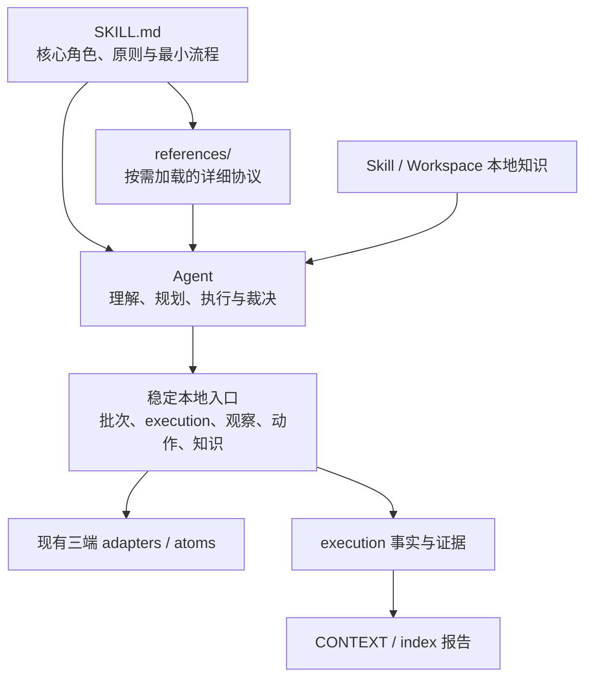
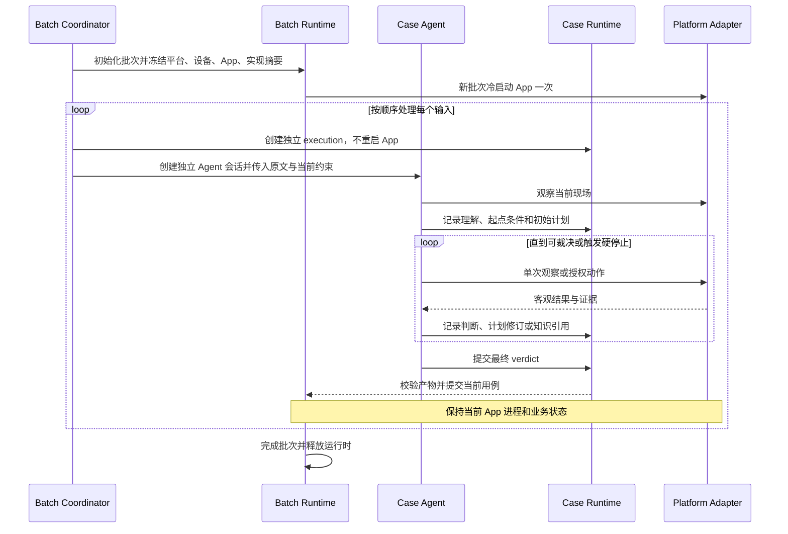

# Agent 驱动的移动端 AI 视觉测试技术实现方案

> **历史归档：** 本文记录切换前的实现设计，所述目标文件和迁移状态可能已失效。当前架构与执行协议分别以 `../architecture.md` 和 `../../SKILL.md` 为准。

> 技术实现评审稿 · 2026-08-12
> 本文承接《Agent 驱动的移动端 AI 视觉测试方案》，用于确认重构落地方式、文件职责、运行时契约、迁移顺序和验收方法；本文不包含具体代码实现。

## 实现原则与硬性不变量

以下内容是实现阶段不得偏离的约束，优先级高于局部兼容和历史代码复用：

1. **仍然是一个本地 Codex Skill，并保留明确的测试工作空间。** 由 `SKILL.md`、按需加载的 `references/`、本地脚本和工作空间产物组成；当前目录只允许是空目录或带有效标记的既有工作空间，不建设独立服务，不引入数据库、向量服务、模型 SDK 或新的强制运行时依赖。
2. **原始输入是最高业务依据。** 任意非空、可读取的文本输入都先原样保存；解析结果、检查点和执行计划只是 Agent 的工作草稿，不是拒绝输入或裁决业务结果的固定契约。空文件或仅含空白字符的输入在前置环节直接报错。
3. **Agent 持有业务决策权。** 用例理解、起点条件、检查点、动作策略、计划修订、知识适用性、断言和最终结论由 Agent 负责；脚本不生成固定业务路径，也不按固定步骤状态机归约 PASS/FAIL。
4. **计划可修订，测试目标不可静默改变。** 检查点可以增加、删除、合并、拆分或重排，辅助操作可多可少；每次修订必须记录原因及其与原始输入的映射。
5. **复用 App 状态，不复用用例上下文。** 同一批次保持设备和 App 暖会话；每个用例仍建立独立 execution、Agent 会话、执行时限、计划、证据和结果，不继承上一用例对话或业务证据。
6. **新用例先重新建立起点。** 当前页面只作为现场输入；Agent 必须重新观察，并选择直接复用、少量转换或导航锚点恢复。准备阶段事实不能替代业务检查点证据。
7. **疑似失败先调查。** Agent 在 FAIL、INCONCLUSIVE 或业务相关 BLOCKED 前，必须核对原文、重新观察、尝试合理恢复并查询本地知识；计划错误或低置信度假设不能直接形成产品 FAIL。
8. **脚本只执行精准的客观约束。** 环境绑定、能力白名单、参数合法性、副作用授权绑定、单用例 30 分钟时限、产物来源和证据完整性由脚本确定性检查；页面语义、业务进展和知识结论不由脚本判断。
9. **任何非空可读取输入都产生可解释结果。** 即使无法提取明确目标或无法可靠断言，也应输出 `INCONCLUSIVE` 或 `BLOCKED` 报告，而不是因格式或内容质量失败；空文本没有测试目标，不进入执行链。
10. **历史结果可读，正式执行只有一条主链路。** 已完成产物继续兼容展示；正式切换时由目标执行核心一次性接管，并同步删除现有业务执行核心。开发期隔离不形成用户可选的并行执行模式。

## 1. 实现范围与现状差距

### 1.1 本次实现范围

本次重构覆盖 Skill 的指令、输入、执行、批次、知识、结果和报告主链路：

- 重写 `SKILL.md` 的 Agent 职责和最小执行流程。
- 将原始用例导入改为“原样保存 + 最小身份信息”，取消步骤数量和格式质量门槛。
- 将固定步骤归约器替换为 Agent 驱动的计划与行动循环。
- 将逐用例冷启动改为批次暖会话，并增加用例起点建立阶段。
- 增加无外部依赖的本地知识检索与引用审计。
- 调整动作授权、执行时限、证据、结果和报告契约。
- 提供历史产物兼容读取和分阶段迁移能力。

平台 adapter 和 atoms 已经提供稳定的观察与操作能力，不在本次重构中推倒重写。除非新契约暴露出真实缺口，HarmonyOS、Android、iOS 的截图、控件树、前台识别、点击、输入、滑动和启动实现保持不变。

### 1.2 当前实现与目标实现

| 领域 | 当前实现 | 目标实现 | 主要影响 |
| --- | --- | --- | --- |
| 输入 | Markdown 必须解析出至少一个固定步骤 | 保存任意非空可读取文本；零步骤可执行，空文本前置报错 | `parse-case.js`、`case-contract.js` |
| 计划 | parser 和 preflight 生成固定步骤、前置条件计划及哈希 | Agent 在 execution 内生成并修订计划 | `preflight-preconditions.js`、`execution-reducer.js` |
| Agent | 只回答 Case Engine 发出的单次视觉决策 | 主导理解、规划、操作、调查和裁决 | `SKILL.md`、执行参考资料 |
| 执行推进 | `execute-next-work.js` 决定唯一 NextWork | Agent 决定下一步，脚本返回客观事实与约束结果 | `execute-next-work.js`、`run-case.js` |
| 动作授权 | 固定 `stepId + intentSha` | 当前计划修订 + 阶段 + 检查点/起点条件绑定 | `step-intent.js`、`action.sh` |
| 通过条件 | 每个 parser 步骤必须存在 assertion PASS | 总体结论由 Agent形成，脚本只校验证据引用 | finalize、result、metrics |
| App 生命周期 | 每个 execution 自动 `restartApp` | 批次启动一次；用例间保持暖状态 | `run-case.js`、`batch-runtime.js` |
| 用例边界 | 冷启动建立固定起点 | 新用例重新观察并动态建立起点 | 新执行阶段与事件 |
| 知识 | 无正式本地知识链路 | Markdown 知识候选检索 + Agent 适用性判断 | 新 `knowledge/` 与查询入口 |
| 报告 | 围绕固定步骤、Flow 和失败码展示 | 展示原文、计划修订、起点、知识和结论依据 | `context-format.md`、render |

### 1.3 工作空间入口边界

当前目录是唯一工作空间根目录，只接受两种状态：

1. **空目录：** 忽略 `.DS_Store` 后没有其他内容，由 Skill 原子初始化。
2. **既有工作空间：** 非空目录必须包含可读取且 schema 受支持的 `workspace.json`，其中 `type` 固定为 `mobile-ai-visual-test-workspace`。

其他非空目录统一返回 `WORKSPACE_INVALID`，不写入任何文件。实现不得向父目录递归查找，不自动切换当前目录，不根据 `cases/`、`knowledge/`、`runs/` 或 `index.html` 等目录形状猜测工作空间，也不自动为无标记的历史目录补写 marker。marker 存在但损坏、类型不符或 schema 不支持时同样停止，不静默覆盖。

空目录初始化后至少包含：

```text
workspace.json
cases/
knowledge/
runs/
index.html
```

不再创建 `flows/`。原始用例文件或目录可以通过显式路径位于工作空间外；导入后，原文快照、case 身份、执行产物、知识、证据和报告都以当前工作空间为存储边界。这样用户只需要在 Codex 中进入空目录或已有工作空间，不需要额外指定输出根目录。

## 2. 目标 Skill 结构

“模块”在本文中只表示 Skill 内的职责区域，不代表独立服务、进程或新增依赖。



### 2.1 职责模块

| 模块 | 载体 | 职责 |
| --- | --- | --- |
| 核心指令 | `SKILL.md` | 定义 Agent 身份、不可偏离原则、最小工作流、何时读取哪些 reference |
| 工作空间入口 | `scripts/lib/workspace.js`、`references/workflow.md` | 校验当前目录、初始化空目录、维护 marker 和统一存储边界，不猜测或切换目录 |
| 输入与用例身份 | `scripts/case/`、`references/case-format.md` | 保存原文、生成稳定 case 身份、管理用户补充，不评价用例质量 |
| 批次暖会话 | `batch-runtime.js` | 绑定设备/App/平台、批次级启动、串行推进、恢复与实现摘要 |
| 用例 execution | `run-case.js` 及 `scripts/execution/` | 创建逻辑边界、记录事实、执行时限与 finalize，不决定业务下一步 |
| Agent 执行协议 | `references/agent-execution.md` | 规定理解、计划、起点、执行、修订、异常调查和结论流程 |
| 客观能力与守卫 | `observe.sh`、`action.sh`、`scripts/lib/` | 观察、单动作、参数校验、环境绑定、授权绑定、证据和执行时限 |
| 本地知识 | `knowledge/`、工作空间 `knowledge/`、查询脚本 | 返回已准入的可信资料；由 Agent 只判断范围和现象是否适用于当前场景 |
| 结果与报告 | `scripts/report/`、`references/result-contract.md` | 验证结果结构和证据存在性，渲染执行过程与最终依据 |

### 2.2 `SKILL.md` 与 references 的拆分

目标 `SKILL.md` 保持短小，只保留：

1. Skill 触发范围和 Agent 职责。
2. 十条实现不变量的精简版本。
3. 批次级与单用例级最小执行流程。
4. 稳定入口白名单和禁止直接调用底层命令。
5. references 的按需读取导航。

详细内容只在一个 reference 中维护，避免重复：

| 目标 reference | 内容 | 读取时机 |
| --- | --- | --- |
| `references/workflow.md` | 批次初始化、恢复、串行提交和结束 | 批次协调器启动时 |
| `references/agent-execution.md` | 用例理解、计划、起点、动态执行和失败复核 | case Agent 启动时 |
| `references/interfaces.md` | 稳定 CLI、事件和 JSON 契约 | 需要写正式事实或诊断契约时 |
| `references/action-schema.md` | 三端动作参数、坐标证据和作用域 | 提交动作前 |
| `references/knowledge.md` | 知识目录、查询、适用性和冲突规则 | 疑似异常或起点恢复困难时 |
| `references/result-contract.md` | verdict、证据、知识引用和 finalize | 准备形成结论时 |
| `references/failure-policy.md` | 技术阻塞、执行时限、安全和结果状态语义 | 异常或停止时 |
| `references/case-format.md` | 原始输入、case 身份和兼容字段 | 导入或刷新输入时 |

现有 `case-executor-contract.md`、`context-format.md` 和 `agent-runtime.md` 中仍有效的内容并入上表对应文件；确认无引用后删除或改为短跳转说明，避免 Agent 同时读取新旧冲突协议。

## 3. 运行时主链路

### 3.1 批次与用例双层生命周期



批次暖会话指目标 App 和设备现场连续存在，不等于复用同一个 Agent 对话。继续保留每用例独立 Agent Runtime，可以阻止上一用例的推理、截图和结论污染下一用例，同时不损失暖 App 带来的效率。

### 3.2 批次初始化

`batch-runtime.js init` 在 `runs/<batchId>/` 固化：

- 当前 Skill 合约摘要与实现摘要。
- 平台、设备、App、入口和环境摘要。
- case 顺序和每个输入的稳定身份。
- 单用例 30 分钟执行时限。
- 暖会话状态 `INITIALIZING | READY | DEGRADED | CLOSED`。

每个新批次固定冷启动 App 一次并写 `batchBootstrap` 事实。冷启动只重启 App 进程，不清除应用数据、登录态或业务数据。后续 `run-case --start` 只创建 execution 和快照，不再自动调用 `restartApp`。

恢复同一个批次不视为新批次，优先复核并继续现有 App 现场，不重复执行批次冷启动。只有 App 意外退出、无响应或自动化会话失效等客观技术事实，才进入受控恢复。

### 3.3 单用例阶段

每个 execution 使用以下阶段，但阶段只限制事实归属，不限制 Agent 的业务策略：

| 阶段 | Agent 工作 | 脚本工作 |
| --- | --- | --- |
| `UNDERSTAND` | 阅读完整原文，提取目标、起点条件和初始检查点 | 保存原文快照和 Agent 产物 |
| `ESTABLISH_START` | 观察现场，直接复用、少量转换或导航锚点恢复 | 记录准备动作、耗时和证据，禁止混入业务证据 |
| `EXECUTE` | 自主选择观察、动作、断言和计划修订 | 校验单动作、授权绑定、环境和剩余时间 |
| `INVESTIGATE` | 核对原文、复观、恢复、查询知识和判断适用性 | 返回知识候选并记录查询审计 |
| `CONCLUDE` | 形成总体 verdict 和逐要求依据 | 校验结构、证据文件、引用与执行绑定 |
| `FINALIZED` | 不再写业务事实 | 锁定结果、生成 metrics 和报告 |

Agent 可以在 `EXECUTE` 与 `INVESTIGATE` 间多次切换，也可以在新证据推翻理解时提交计划修订；脚本不得用阶段状态推导唯一业务 NextWork。

## 4. 输入、理解与动态计划

### 4.1 宽松输入契约

导入阶段只执行技术性检查：路径存在、文件可读取、内容可保存，并且去除 BOM 后至少包含一个非空白字符。标题、前置条件、步骤、预期结果、表格格式和表达完整性都不是门槛。

目标 case 资产：

```text
cases/<case>/
  source.md                 # 原始输入，最高业务依据
  case.json                 # 稳定身份和源文件摘要，不保存权威执行步骤
  notes.jsonl               # 用户补充，不直接改写 source.md
  platforms/<platform>/
    executions/<executionId>/
      source.snapshot.md    # 本次执行使用的原文快照
      execution.json
      understanding.json
      plan.json
      timeline.jsonl
      result.json
      metrics.json
      screenshots/
      layouts/
      logs/
      agent/
```

`case.json` 只要求 `identity.caseKey`、标题回退值、源摘要和导入来源。现有 `preconditions`、`steps`、`globalRules` 在开发迁移期仅作为测试基线读取，不写入正式切换后的新 case 文件，也不再成为 execution 的冻结业务契约。

空文件或仅含空白字符的文本返回前置错误 `CASE_INPUT_EMPTY`，不创建 case、execution、Agent session 或执行报告，也不操作设备。这是输入存在性的最低要求，不属于格式或内容质量校验。

非空但无法提取明确目标的文本仍能创建 execution。Agent 在 `UNDERSTAND` 阶段说明无法形成可靠测试目标，最终可输出 `INCONCLUSIVE`。文件不可读等问题同样在创建 execution 前返回输入错误；只有 execution 创建后的环境或工具问题才可能形成技术 `BLOCKED`。

### 4.2 Agent 理解产物

`understanding.json` 是 Agent 对本次原文的可审计理解，不是 parser 输出：

```json
{
  "schemaVersion": 1,
  "revision": 1,
  "summary": "验证最新 AI 回复是否展示单条语音播放按钮",
  "startConditions": [
    {"id": "start-001", "text": "已进入包含 AI 回复的会话", "basis": "implied", "sourceRefs": ["src-001"]}
  ],
  "requirements": [
    {"id": "req-001", "text": "最新回复展示单条语音播放按钮", "basis": "explicit", "sourceRefs": ["src-002"]}
  ],
  "sourceRefs": [
    {"id": "src-001", "sourceSha": "source-...", "lineStart": 2, "lineEnd": 2, "quote": "进入包含 AI 回复的会话"},
    {"id": "src-002", "sourceSha": "source-...", "lineStart": 3, "lineEnd": 3, "quote": "最新回复展示单条语音播放按钮"}
  ],
  "uncertainties": []
}
```

`basis` 只允许 `explicit | implied | assumed`。`sourceRefs` 绑定本次 `source.snapshot.md` 的摘要、行号和原文摘录，脚本校验摘录与快照一致，但不判断 Agent 的语义解释。`assumed` 可以帮助导航，不能单独支撑 FAIL；`implied` 只有在 Agent 能说明其为完成原目标的必要条件时才可支撑 FAIL。

理解也允许被现场证据修正，但不能静默覆盖。修改 `summary`、起点条件或 requirements 时递增 revision，并在 timeline 记录修改前后内容、原因和 sourceRefs。原文中的明确要求要么映射为当前 requirement，要么作为歧义或不适用项保留解释，不能通过修改 understanding 使其消失。

### 4.3 计划版本

`plan.json` 保存最新快照，完整修订历史写入 `timeline.jsonl`：

```json
{
  "schemaVersion": 1,
  "revision": 3,
  "reason": "当前已位于目标会话，删除原导航检查点",
  "checkpoints": [
    {
      "id": "cp-002",
      "goal": "确认最新回复区域的播放按钮状态",
      "requirementRefs": ["req-001"],
      "requiredAction": false,
      "status": "ACTIVE"
    }
  ]
}
```

实现规则：

- 检查点描述“要达到或验证什么”，不冻结点击次数和页面路径。
- `requiredAction=true` 只用于原文明确要求动作必须实际发生的场景。
- Agent 可增删改检查点，但修订必须保留 `reason`、旧新 revision 和 `requirementRefs`。
- 脚本只检查 revision 单调递增、引用目标存在和 JSON 结构，不评价计划是否正确。
- finalize 不要求每个历史检查点 PASS；Agent 必须对当前 understanding 中的全部 requirement 给出 finding，并说明被修订理解的去向。

## 5. 起点建立与暖会话

### 5.1 用例切换

上一用例完成后，批次仅记录它的 executionId 和 App 暖会话仍可用。新 Agent 不读取上一用例 timeline、计划、截图或推理摘要，而是为新 execution 采集自己的第一条 observation。

起点建立采用三档策略：

1. **直接复用：** 当前状态已满足起点，记录零操作确认。
2. **少量转换：** 关闭弹窗、返回、切换主 Tab 等有限操作后复核。
3. **导航锚点恢复：** 当前页面过深或无进展时，先返回本地知识描述的稳定锚点，再进入目标区域。

准备动作使用 `scope=case-prepare`，业务动作使用 `scope=case-business`。两类事实可出现在同一个 timeline，但报告和证据校验必须分区；`case-prepare` observation 不能直接作为业务 requirement 的通过证据。

### 5.2 冷启动例外

逐用例冷启动从默认动作改为受控例外，只允许：

- 原始用例明确要求冷启动，并能引用原文。
- App 崩溃、无响应、自动化会话失效或平台能力要求重建会话，并存在客观事实。

实现上由 `batch-runtime.js recover-app` 统一发起，Agent 不直接调用 `restartApp`。请求包含 `triggerType`、`sourceRefs/evidenceRefs` 和当前 execution，并按 5.3 节校验同一退出事故的恢复次数。成功后暖会话 generation 加一，新用例继续重新观察；恢复失败或超过 D-01 允许次数时当前用例 `BLOCKED`，并根据环境是否仍可靠决定是否结束批次。

不允许因为“找不到页面”“计划不确定”或“希望起点更干净”而冷启动。这些情况应先使用导航锚点或输出不确定性。

### 5.3 App 意外退出处理

观察或动作发现 App 不在前台时，先采集进程、前台应用、平台日志、最后成功动作和退出时间，不把“页面不可见”直接等同于进程被杀。随后按客观证据分类：

| 退出类型 | 处理方式 |
| --- | --- |
| 用例明确要求打开系统页或第三方 App | 作为正常业务路径继续，不触发恢复 |
| 有证据表明当前被测操作导致 App 崩溃 | 当前用例记录产品异常；可恢复 App 以保存现场或继续后续用例，但不能把当前用例恢复成 PASS |
| 有证据表明由系统资源回收、人工操作或外部环境导致 | 执行一次受控恢复，重新建立当前用例现场后继续 |
| 原因未知 | 允许一次调查性恢复；无法确认关键动作效果时输出 `INCONCLUSIVE` |
| App 无法重新启动或自动化连接无法恢复 | 当前用例 `BLOCKED`，结束批次 |

恢复后不得自动重放最后动作。导航、返回等幂等动作由 Agent 根据新现场重新决定；输入、提交、发布、删除、支付等结果可能已经生效的动作，在无法确认效果时不得重放。同一次退出事故只允许一次自动恢复；恢复后在同一检查点再次意外退出时停止当前用例：有明确崩溃证据则 `FAIL`，环境或原因仍不明确则 `BLOCKED` 并结束批次。

### 5.4 批次恢复

保留现有 `reconcile-current` 的确定性恢复思想，但恢复对象改为双层状态：

- execution 遗留：恢复或收尾当前逻辑用例，不能新建第二个活动 execution。
- 暖会话遗留：重新探测设备、App 前台和自动化连接；无法证明仍可用时标记 `DEGRADED`。
- Runtime 遗留：中断或释放旧 case Agent session，不把旧对话交给下一用例。
- 实现摘要不一致：结束或只读收尾已有批次，不使用另一代码版本继续写入。

## 6. Agent 行动循环与客观守卫

### 6.1 稳定入口

目标主链路收敛为以下入口：

| 入口 | 目标职责 |
| --- | --- |
| `resolve-execution-targets.js` | 解析输入引用，不评价用例内容 |
| `parse-case.js` | 原样导入或刷新 source，建立最小 case 身份 |
| `probe-env.sh` / `prepare-env.sh` / `update-env.js` | 现有环境探测、准备和绑定 |
| `batch-runtime.js` | 批次初始化、暖会话、串行推进、恢复和提交 |
| `agent-runtime.js` | 独立 case Agent 会话、deadline、结果验证和释放 |
| `run-case.js` | execution 创建、事实提交、执行时限检查和 finalize |
| `observe.sh` | 采集当前 screenshot、layout、foreground、logs |
| `action.sh` / `action-observe.sh` | 执行一个已授权动作并记录客观结果 |
| `commit-agent-turn.js` | 提交理解、计划修订、判断、知识适用性和 verdict 草稿 |
| `query-knowledge.js` | 从本地 Markdown 返回候选知识及命中片段 |
| `render-context.js` / `render-index.js` | 渲染历史与当前 execution 报告 |

`execute-next-work.js` 不再生成唯一业务 NextWork。开发期仅由现有回归测试覆盖，不接入目标执行链；正式切换时删除该业务入口，case Agent 直接调用观察、动作、知识和事实提交入口。

### 6.2 动作授权

现有 `stepId + intentSha` 依赖固定 parser 步骤，应改为 execution 内计划授权：

```json
{
  "source": "agent-plan",
  "executionId": "execution-id",
  "phase": "case-business",
  "planRevision": 3,
  "checkpointId": "cp-002",
  "purpose": "进入最新回复的操作菜单",
  "requirementRefs": ["req-001"]
}
```

准备阶段改用 `startConditionId`；恢复阶段绑定 recovery request。脚本确定性校验：

- execution、阶段、计划 revision 和目标 id 与当前产物一致。
- 动作类型、字段、坐标证据和平台能力合法。
- 设备、App 和平台仍与批次绑定一致。
- 当前作用域有效且单用例执行未达到 30 分钟。
- 原始用例明确要求的高风险副作用包含可回溯的 requirement/source 引用。

脚本验证“引用存在且未过期”，不判断引用语义是否足以授权；语义责任保留给 Agent。准备阶段不得执行业务副作用，业务阶段不得把一个检查点的授权扩散到无关操作。

### 6.3 精准约束的实现位置

| 风险 | 客观信号 | 实现位置 | 触发结果 |
| --- | --- | --- | --- |
| 操作错误设备或 App | execution 与 batch 绑定不一致 | `action.sh`、`observe.sh` | 拒绝调用 adapter |
| 使用未开放能力 | action type/参数不合法 | `action-contract.js` | 返回可修正拒绝，不直接业务 FAIL |
| 越权副作用 | 缺少当前 requirement/source 绑定 | action authorization | 拒绝动作并要求 Agent 重评估 |
| 无边界探索 | 单用例执行达到 30 分钟 | `run-case.js` elapsed-time guard | 停止新的设备操作，进入 `CONCLUDE` |
| 重复无新信号 | 连续相同动作、截图/控件树无变化 | metrics/turn response | 提醒 Agent 反思，不自动判失败 |
| 证据伪造或漂移 | 文件缺失、SHA/PNG 解码不一致 | evidence validator | 拒绝相应结论引用 |
| 静默冷启动 | 非 batch bootstrap/recovery 作用域 | `action.sh`、`batch-runtime.js` | 拒绝 `restartApp` |
| 计划静默改题 | revision 或 requirement 映射缺失 | plan contract | 拒绝计划写入，要求补齐留痕 |

执行预算只保留单 case 30 分钟硬时限，从 execution 创建成功开始计时，覆盖起点建立、业务执行和异常调查。到时后停止新的设备操作，但仍允许 Agent 使用已经取得的观察、证据和知识完成结论；不得因为时间到达而覆盖已有充分依据的 `PASS` 或 `FAIL`。

动作数、观察数、准备动作数和知识查询次数只记录为指标，不设置硬上限或脚本软阈值。Agent 发现重复操作或长期没有新信息时，应自行反思和调整策略；该提示不裁决业务结果，也不阻止 Agent 继续执行。App 意外退出的恢复次数由 D-01 单独控制，不重复纳入执行预算。

## 7. 本地知识实现

### 7.1 存储与准入语义

知识源采用普通 Markdown：

```text
<skill-root>/knowledge/       # 跨项目可复用的平台/框架知识
<workspace>/knowledge/        # 当前产品、版本和业务知识
```

知识库采用“准入即可信”：能进入任一知识目录的内容，均视为准确且能够作为结论依据，框架不再按来源类型、维护者或其他条件进行可信度分级。知识内容的准确性由知识库维护方在准入和维护环节负责。

工作空间知识通常更贴近当前产品，但不自动覆盖 Skill 知识，也不代表可信度更高。候选出现表面冲突时，Agent 不比较可信等级，而是检查 App、平台、版本、页面状态、触发条件和有效期是否存在适用范围差异；无法消除冲突时不得套用任一结论。知识正文使用固定标题帮助检索和审阅：

```markdown
# K-00123 Android 端该入口在灰度关闭时不展示

## 适用范围
- App: com.example.app
- Platform: android
- Version: 5.2.x
- Page: AI 助手会话页
- Valid until: 2026-12-31

## 可观察现象
...

## 结论与处理建议
...

## 追溯信息
- 原始资料链接或维护记录
```

首期不引入 YAML parser、数据库或向量索引。Markdown 是唯一知识源，可选的 `knowledge-index.json` 只是脚本生成的可删除缓存，不能成为第二事实源。

### 7.2 查询链路

`query-knowledge.js` 接收平台、App、版本、页面、操作、现象和关键词，使用 Node.js 文件遍历及文本匹配返回候选文件、条目 ID、内容摘要、命中片段和候选分数。分数只用于排序，不能表示知识适用；后续 assessment 和 result 必须绑定条目 ID 与当次内容摘要，知识文件更新不能静默改变历史结论依据。

Agent 对候选只进行适用性判断：

1. App、平台和版本范围是否一致。
2. 页面、前置状态、操作和可观察现象是否一致。
3. 条目是否仍在有效期内。
4. 是否与其他候选存在无法用适用范围解释的冲突。
5. 条目描述的是正常差异、恢复路径还是调查方向，其用途是否匹配当前判断。

每次查询写 `knowledgeQuery` 事件；被采用的条目再写 `knowledgeAssessment`，包含 `APPLICABLE | NOT_APPLICABLE | CONFLICTING | INSUFFICIENT`、理由和对计划/结论的影响。

### 7.3 知识对结论的影响

- 直接视觉证据满足原始要求：`verdictBasis=DIRECT_EVIDENCE`。
- 当前表现与字面预期不同，但适用知识证明其为正常：`verdictBasis=KNOWLEDGE_SUPPORTED`。
- 知识仅提供恢复方式：修订策略继续执行，不直接改变 verdict。
- 知识范围不匹配、已过期或存在无法消除的适用性冲突：不能用于改变 verdict。

## 8. 事实、结果与报告契约

### 8.1 timeline 事件

保留 append-only `timeline.jsonl`，事件按职责分为：

| 类别 | 事件示例 | 写入方 |
| --- | --- | --- |
| 生命周期 | `executionStart`、`phaseChanged`、`executionRecovery` | Runtime Core |
| Agent 理解 | `caseUnderstood`、`planRevised`、`checkpointFinding` | 受保护 Agent 提交入口 |
| 设备事实 | `observation`、`actionResult`、`actionRejected` | 正式脚本 |
| 调查知识 | `knowledgeQuery`、`knowledgeAssessment` | 查询脚本与 Agent 提交入口 |
| 结论复核 | `verdictReview`、`result` | Agent + finalize |
| 客观约束 | `timeLimitWarning`、`timeLimitReached`、`agentRuntime` | Runtime Core |

`perception`、`decision`、`assertion` 等旧事件继续只读兼容。新事件不要求按照 parser stepId 顺序出现，也不由 reducer 推断业务终态。

### 8.2 最终结果

结果同时表达业务结论和执行完整性：

```json
{
  "schemaVersion": 2,
  "executionId": "execution-id",
  "verdict": "PASS",
  "executionStatus": "COMPLETED",
  "verdictBasis": "KNOWLEDGE_SUPPORTED",
  "summary": "当前版本灰度关闭时入口不展示，符合适用产品规则。",
  "requirementFindings": [
    {
      "requirementId": "req-001",
      "status": "SATISFIED",
      "evidenceRefs": ["screenshots/observe-008.png"],
      "knowledgeRefs": ["workspace:K-00123"]
    }
  ],
  "uncertainties": [],
  "technicalFailureCode": null
}
```

`verdict` 使用 `PASS | FAIL | INCONCLUSIVE | BLOCKED`；`executionStatus` 使用 `COMPLETED | STOPPED_BY_BUDGET | TECHNICALLY_BLOCKED | INTERRUPTED`。脚本不根据 checkpoint 数量重算 verdict，只检查：

- 所有引用文件存在且属于当前 execution。
- FAIL finding 能回溯到 `explicit` 或有必要性说明的 `implied` requirement。
- `KNOWLEDGE_SUPPORTED` 必须引用 `APPLICABLE` 的知识评估。
- PASS/FAIL 至少包含当前用例业务阶段的可用证据。
- FAIL、INCONCLUSIVE 和业务相关 BLOCKED 必须有 `verdictReview`，并引用本次 knowledgeQuery；零命中也是有效查询结果。
- finalize 前不存在未关闭的设备动作或运行时写入。

不满足结构或证据契约时，不把业务结论改写为 FAIL，而是拒绝 finalize，要求 Agent 修正；达到执行时限后仍无法修正时输出 `INCONCLUSIVE` 或技术 `BLOCKED`，并保留请求的原结论用于审计。

### 8.3 报告调整

单平台报告按以下顺序展示：

1. 原始用例与最终 verdict。
2. Agent 对目标、起点和 requirement 的理解。
3. 起点建立策略、准备动作和新用例第一条观察。
4. 初始计划、修订历史和检查点 findings。
5. 业务动作、观察和截图证据。
6. 知识查询、适用性判断及其对结论的影响。
7. FAIL 前复核或不确定性说明。
8. 批次暖会话 generation、冷启动例外和单用例耗时。

总览统计从“固定步骤通过率”调整为 verdict 数量、直接证据/知识支持 PASS、INCONCLUSIVE、技术阻塞、平均准备动作、暖会话复用率和冷启动例外次数。

## 9. 文件级改造方案

| 当前文件/区域 | 处理方式 | 目标变化 |
| --- | --- | --- |
| `SKILL.md` | 重写 | 从状态机操作手册改为 Agent 角色、最小流程、精准约束和 references 导航 |
| `references/workflow.md` | 重写 | 批次暖会话与逐用例逻辑闭环 |
| `references/case-format.md` | 重写 | 非空文本输入、空文本前置错误、原文快照、最小 case 身份和历史字段读取 |
| `references/interfaces.md` | 精简并升级 | 当前稳定入口、阶段、事件、授权和 result |
| `references/action-schema.md` | 修改 | `case-prepare`、`case-business`、`batch-bootstrap/recovery` 作用域 |
| `references/failure-policy.md` | 修改 | 区分业务 verdict、技术状态和执行时限停止 |
| `references/context-format.md` | 合并/替换 | 并入新的 result/report 契约 |
| `references/case-executor-contract.md` | 合并/退出 | 并入 `agent-execution.md`，避免冲突职责 |
| `references/agent-runtime.md` | 修改 | 保留独立 case Agent，会话不继承；移除逐 case 冷启动前提 |
| `scripts/case/parse-case.js` | 重构 | 只保存原文和最小身份；旧 parser 作为非权威兼容提取器 |
| `scripts/lib/common.js` 中工作空间逻辑 | 抽出并收紧 | 移入 `scripts/lib/workspace.js`；删除目录形状自动认领；空目录初始化不再创建 `flows/` |
| `scripts/lib/case-contract.js` | 正式切换时删除 | 只服务现有固定步骤执行核心，不在目标链路继续复用 |
| `scripts/execution/contracts/case-contract.js` | 新增 | 非空文本输入身份契约，只拒绝空文本，不包含格式或内容质量校验 |
| `scripts/execution/contracts/execution-event-contract.js` | 新增 | 当前阶段、Agent、知识与客观事实事件契约 |
| `scripts/execution/contracts/result-contract.js` | 新增 | 当前 verdict、技术状态、证据和知识引用契约 |
| `scripts/preflight-preconditions.js` | 删除 | 正式切换时退出主链路并删除，不再冻结业务前置计划 |
| `<workspace>/flows/preconditions/` | 按需迁移 | 可转换为导航/恢复知识；不再由状态机自动执行。Skill 仓库当前没有内置 Flow 数据 |
| `scripts/lib/execution-reducer.js` | 删除 | 正式切换时删除，不再按前置条件和固定步骤生成唯一 NextWork |
| `scripts/execute-next-work.js` | 删除 | 正式切换时与目标执行核心接管同步删除 |
| `scripts/execution/run-case.js` | 拆分重构 | 保留生命周期、事实、执行时限、证据和 finalize；移除业务归约 |
| `scripts/lib/step-intent.js` | 替换 | 改为 execution plan authorization |
| `scripts/action.sh` | 修改 | 校验新作用域、计划 revision 与批次暖会话绑定 |
| `scripts/batch-runtime.js` | 扩展 | 批次 bootstrap、warmSession、generation、受控恢复和实现摘要 |
| `scripts/agent-runtime.js` | 调整 | 请求包含 source/knowledge roots/开始时间和截止时间；继续每 case 独立 session |
| `build/validate-case-agent-*` | 更新 schema | 绑定 source、plan、result 和 warmSession generation |
| `scripts/report/`、`scripts/lib/common.js` | 重构 | 渲染新事件与指标，同时兼容读取旧结果 |
| `scripts/platform/` | 原则上保留 | 仅补充新作用域透传和确有必要的能力 |
| `scripts/self-test.js` | 拆分扩展 | 增加 contract、runtime、knowledge、report 与迁移测试组 |

为控制 `run-case.js` 当前过大的职责，实施时按现有 `scripts/lib/` 风格抽出纯模块，例如 plan contract、result contract、knowledge query 和 warm-session contract；顶层 CLI 保持稳定，不新增服务层或依赖注入框架。

## 10. 兼容、开发隔离与正式切换

### 阶段 0：冻结现有基线

- 为现有主链路补齐关键 characterization tests。
- 保存三端动作、环境、证据和历史报告的基准样例。
- 明确哪些 failureCode 只用于历史产物读取。

### 阶段 1：建立目标契约与历史 reader

- 引入 `source.snapshot.md`、`understanding.json`、`plan.json`、当前 result 契约和对应 schema。
- 报告按产物自身的 `schemaVersion` 分派历史与当前 reader，未知 schema 明确拒绝。
- 此阶段的目标模块只由单元测试和 fixture 调用，不增加用户可选协议，也不提前改变正式输入与执行行为。

### 阶段 2：抽取客观内核并完成目标闭环

- 从现有实现中抽出生命周期、证据、执行计时和发布等可复用能力。
- 在测试入口中完成宽松输入、暖会话、动态执行、本地知识和当前报告闭环。
- 开发隔离使用未接入正式入口的模块、模拟 adapter 和测试 fixture；不使用对外 CLI 参数维持两条生产执行路径。

### 阶段 3：切换前验证

- 通过行为 eval、模拟批次和三端真机完成前向验证。
- 验证期间继续由现有正式入口服务用户；目标执行核心只通过开发测试入口运行。
- 切换门禁未全部通过时不发布部分能力，尤其不单独发布跨用例暖会话。

### 阶段 4：原子切换与删除

同一个正式发布中一次完成：

1. 停止接收新批次，并等待或明确终止活动 execution。
2. 更新 `SKILL.md`、manifest 和稳定入口，使目标执行核心成为唯一正式主链路。
3. 同步删除 `execute-next-work.js`、固定 preflight、业务 reducer、自动 Flow 状态机和冲突 references。
4. 保留历史 schema reader、展示 formatter 和历史 failureCode 映射，但它们不能创建或续写 execution。
5. 新建文件与对外文档统一使用中性名称，不保留代际命名。

批次 `contract.json` 固定 `contractSha` 和 `implementationSha`。已由旧代码开始的批次不得交给切换后的代码续写；正式切换失败时回退整个代码版本和对应 Skill 资料，不在当前版本中保留旧执行开关。

## 11. 测试与评估

### 11.1 确定性测试

- 输入：自由文本、表格、无标题、无步骤、只有预期、模糊非空文本、空文件/纯空白拒绝、历史 case 读取。
- 契约：计划 revision、引用存在性、作用域、授权、当前结果和历史 schema 读取。
- 暖会话：批次只启动一次、用例间不 restart、generation 变化和 D-01 恢复次数。
- 隔离：新 Agent request 不包含上一用例 timeline、截图或对话；新证据只属于当前 execution。
- 知识：候选排序、范围过滤辅助信息、过期/冲突记录和路径安全。
- 证据：文件缺失、SHA 漂移、截图损坏、跨 execution 引用拒绝。
- 报告：历史与当前 execution 混合工作空间、可信 completion、HTML 转义和无步骤输入展示。

### 11.2 Agent 行为评估

确定性单测无法证明 Agent 是否发挥了推理能力，需要建立小规模离线/真机 eval 集：

| 场景 | 期望行为 |
| --- | --- |
| 当前已在目标页 | 删除导航型辅助检查点，保留原文要求的核心动作 |
| 实际路径比计划多一步 | 修订策略继续，不因路径变化 FAIL |
| 初始计划包含错误页面假设 | 记录修订并回到原始 requirement |
| 上一用例停留深层页面 | 新用例重新观察并建立起点，不复用旧证据 |
| 已知版本差异 | 查询知识、校验范围并输出 `KNOWLEDGE_SUPPORTED` |
| 相似但不适用知识 | 拒绝套用，继续调查或输出不确定性 |
| 原文模糊 | 执行合理部分并输出 `INCONCLUSIVE`，不在导入阶段拒绝 |
| 达到 30 分钟时限 | 停止新的设备操作，仍生成带尝试轨迹的结果 |
| 明确产品缺陷 | FAIL 可回溯原文、当前证据和失败前复核 |

评估关注结论依据、计划调整能力和边界遵守，不要求每次点击路径完全一致。

### 11.3 三端验收

每个平台至少执行：直接复用起点、少量转换、导航锚点、知识命中、真实 FAIL、INCONCLUSIVE、工具 BLOCKED、执行时限停止和受控冷启动恢复。验证截图/控件树、输入、前台识别、报告链接及批次串行闭环。

## 12. 可观测性与指标

建议在 `metrics.json` 和 batch 汇总增加：

- `warmSession.appStartCount`、`reuseCaseCount`、`recoveryRestartCount`。
- `startEstablishment.strategy`、准备动作数和耗时。
- `plan.initialCheckpointCount`、`revisionCount`、增加/删除/合并数量。
- `knowledge.queryCount`、候选数、采用数、冲突数。
- `verdictBasis` 分布和 FAIL 前复核完成情况。
- 动作/观察/知识查询总数、Agent 主动反思次数和 30 分钟时限触发次数。
- Agent Runtime 用时、合约错误和释放失败。

这些指标用于发现执行成本和设计偏差，不用于用固定阈值判断产品业务失败。

## 13. 风险与回滚

| 风险 | 实现控制 |
| --- | --- |
| Agent 自由度提高后行为漂移 | 原文快照、understanding、计划 revision、逐 requirement finding 和 eval 回归 |
| 暖状态导致顺序依赖 | 新用例独立观察、准备/业务分区、批次顺序和 warm generation 审计 |
| 起点恢复消耗过大 | 导航锚点、单用例 30 分钟时限和完整结果输出 |
| 知识被错误套用 | 候选与适用性分离，核对 App、平台、版本、页面状态、触发条件和有效期，知识支持 PASS 显式标识 |
| 切换时执行状态相互污染 | 切换前停止新批次，活动 execution 不跨实现续写，历史 reader 只读 |
| `run-case.js` 重构回归面过大 | 先抽纯契约模块，再切主链路；平台 adapter 保持稳定 |
| Agent 结果无法确定性复算 | 接受业务结论由 Agent负责，脚本验证来源、引用、执行时限和证据完整性 |

回滚单位是完整代码版本：停止目标版本创建的新批次，回退代码、`SKILL.md` 和 manifest，再按回退版本重新创建批次。任何已开始的 execution 都不得跨实现版本继续写入。

## 14. 实现验收标准

- 任意非空可读取文本都能创建 case 和 execution；零解析步骤不会触发 `CASE_STEPS_REQUIRED`。空文件或纯空白输入以 `CASE_INPUT_EMPTY` 在前置环节结束，且不创建设备执行产物。
- case Agent 能读取完整 `source.snapshot.md`，生成 understanding 和可修订计划。
- 正式执行不调用固定 preflight 业务计划和 `execution-reducer` 唯一 NextWork。
- 计划增删、合并、重排或实际操作数变化不会被脚本直接判为业务失败。
- FAIL 必须有原始 requirement、当前 execution 证据和失败前复核记录。
- understanding 的修订必须保留前后版本和 sourceRefs，不能通过删除 requirement 规避原文要求。
- 同一批次默认只有一次 App 启动；用例间无隐式 `restartApp`。
- 每个新用例使用独立 Agent session 和 execution，并重新采集起始 observation。
- 起点准备事实与业务 evidence 在契约和报告中明确分区。
- 冷启动例外只能通过 batch recovery，并有原文或客观技术事实、恢复次数和耗时记录。
- 本地知识无需外部服务即可查询；采用知识时有范围判断和引用。
- `KNOWLEDGE_SUPPORTED` PASS 与 `DIRECT_EVIDENCE` PASS 可在结果和总览中区分。
- 30 分钟时限只停止新的设备操作，不阻止形成完整结果，也不自动改写 verdict。
- 三端现有观察和动作能力通过回归，历史 execution 仍可展示。
- 正式切换后只有目标执行核心可以创建新 execution；现有业务执行核心已删除。

## 15. 实现决策

### 已确认

1. **D-01 批次首次启动策略：** 每个新批次固定冷启动 App 一次；批次内用例保持暖会话。同一批次恢复不重复冷启动，App 意外退出时按 5.3 节执行一次受控恢复。
2. **D-02 正式切换策略：** 选择方案 A。正式切换与现有业务执行核心删除在同一发布完成；不保留用户可选的并行协议。新文件、模块名和对外口径统一使用中性命名；回退只能回退完整代码版本。
3. **D-03 知识库可信语义：** 知识库准入即代表内容准确、可信且具有说服力；框架不进行可信度分级。Agent 只判断知识对当前 App、平台、版本、页面状态和触发条件是否适用；来源信息仅用于追溯，内容准确性由知识库维护方负责。
4. **D-04 单用例执行时限：** 只保留单用例 30 分钟硬时限。动作、观察、准备和知识查询次数不设限制；到时停止新的设备操作，但允许基于已有材料完成结论，且不因超时自动改判结果。
5. **D-05 空文本处理：** 空文件或仅含空白字符的输入无法生成测试目标和检查点，在导入/前置环节返回 `CASE_INPUT_EMPTY`；不创建 case、execution、Agent session 或报告。非空文本仍不做格式和质量校验。
6. **D-06 导航 Flow 处理：** 不保留导航 Flow 机制。已有 Flow 中的页面特征、适用范围、导航入口、可行路径和恢复建议按需迁入知识库；Agent 结合当前现场自主导航，目标状态必须由当前 execution 的实际观察确认。正式切换时删除 Flow 加载、匹配、执行、状态机和专用失败处理。
7. **D-07 工作空间入口：** 当前目录只允许为空目录或带有效 `workspace.json` 的既有测试工作空间。空目录自动初始化；其他非空目录返回 `WORKSPACE_INVALID`。不向上查找、不按目录形状自动认领、不自动升级无标记目录；用例可从工作空间外显式导入。

## 结论

本方案不是在旧状态机上增加更多分支，而是重新划分职责：Agent 负责业务理解和动态执行，本地脚本负责设备能力、客观边界和可信记录。App 状态在批次内保持暖态，用例在 execution 和 Agent 会话层保持隔离；原始输入不设质量门槛，计划可以随现场修订，异常必须经过知识与证据调查后再形成结论。

实现上最大化复用现有三端 adapter、环境绑定、事实存储、证据校验、Runtime 和报告基础设施，重点替换固定用例契约、逐 case 冷启动、NextWork reducer 和逐步骤 PASS 归约。这样既能释放 Agent 的推理能力，也能保留测试执行必须具备的安全、执行时限和审计边界。
