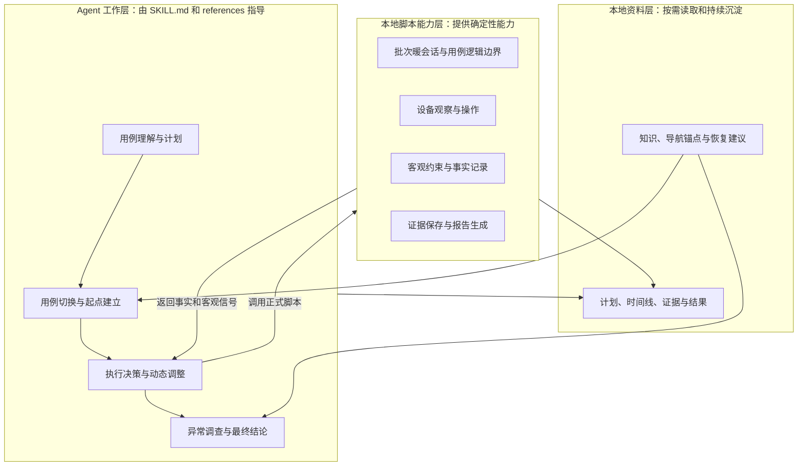
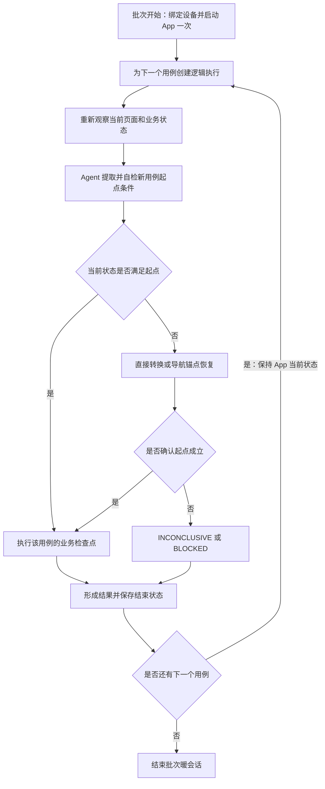
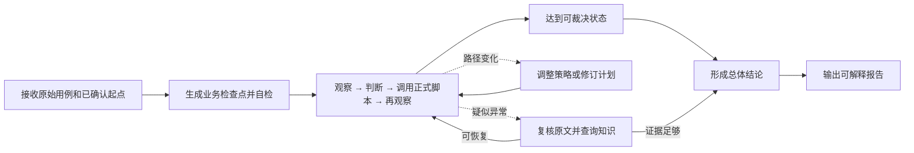
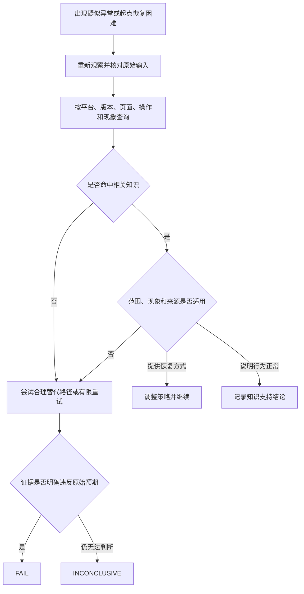
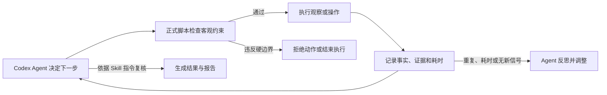

# Agent 驱动的移动端 AI 视觉测试方案

> **历史归档：** 本文记录重构方向评审，不是当前操作手册。当前架构与执行协议分别以 `../architecture.md` 和 `../../SKILL.md` 为准。

> 方向评审稿 · 2026-08-06 
> 本文用于确认产品与技术方向，不展开脚本接口、数据结构或改造排期等实现细节。

## 核心原则

以下原则是后续设计与实现不可偏离的方向约束：

1. **保持 Codex Skill 和测试工作空间形态。** 仍由 Codex Agent 读取 `SKILL.md` 和按需参考资料、调用本地脚本完成测试；当前目录必须是空目录或带有效标记的既有测试工作空间，不建设独立应用服务，不引入数据库、模型 SDK 或新的强制运行时依赖。
2. **Agent 是测试执行主体。** Agent 负责理解用例、规划检查点、选择操作、适应页面变化、执行断言并形成业务结论；本地脚本不替 Agent 固化业务路径或判断页面语义。
3. **不限制原始用例输入。** Skill 不因格式、字段、步骤数量、预期结果完整性或表达歧义拒绝用例；结构化只用于 Agent 内部规划，不是输入契约。
4. **检查点保持业务语义，操作路径允许动态变化。** 一个检查点可以包含零次、一次或多次操作；计划可以修订，但不能静默改变原始测试目标。
5. **批次保持暖会话，用例保持逻辑隔离。** 同一设备和 App 的批次原则上只启动一次；后续用例复用当前进程与业务状态，但独立保存输入、计划、执行时限、证据和结果。
6. **计划错误不能直接成为产品失败。** FAIL 必须回到原始输入核对；Agent 的导航假设、页面惯例或低置信度推断不能单独导致 FAIL。
7. **异常先调查，再裁决。** 疑似异常先重新观察、调整策略并查询本地知识；知识只有经过场景、平台、版本、现象和来源核对后才能影响结论。
8. **精准约束，始终输出可解释结果。** 本地脚本只约束权限、安全、单用例 30 分钟执行时限和证据完整性；无论 PASS、FAIL、INCONCLUSIVE 还是 BLOCKED，都输出完整依据。

## 方案概览

当前 Skill 的主要问题不是规则数量本身，而是职责边界倒置：本地脚本把业务流程拆成确定性状态和固定决策请求，Agent 主要在指定时机进行局部视觉分类，难以发挥自然语言理解、现场适应和综合推理能力。

目标方案将执行方式从“本地状态机驱动 Agent”调整为“Codex Agent 驱动测试，Skill 提供确定性本地能力”。Agent 从任意形式的原始用例中提取业务检查点，并根据真实页面动态选择操作、修订计划和形成结论。

批次执行时，同一设备和 App 原则上只在开始时启动一次。上一用例的结束状态成为下一用例的现场输入；Agent 重新观察，通过直接复用、少量转换或导航锚点恢复建立新用例起点。App 状态可以延续，但不同用例的证据和结论不能混用。

疑似失败不会立即归类。Agent 先核对原文与计划、尝试有限纠偏，并查询 Skill 内的本地知识资料。知识命中不是自动 PASS，计划偏差也不是产品 FAIL。

本次调整不把 Skill 改造成应用系统。`SKILL.md` 和 `references/` 提供工作方法，现有本地脚本提供设备能力与客观边界，本地文件保存知识、计划、证据和报告。

用户在 Codex 中发起测试时，当前目录就是测试工作空间根目录。空目录由 Skill 自动初始化；非空目录必须已经包含有效 `workspace.json`，否则直接停止。Skill 不向上查找工作空间，不根据 `cases/`、`index.html` 等目录形状猜测，也不自动接管普通项目目录。原始用例可通过显式路径从工作空间外导入，执行产物统一保存在工作空间内。

## 目标与边界

### 方案目标

- 允许任意自然语言或半结构化用例直接执行并产生结果。
- 让 Agent 基于完整输入和现场状态生成、执行和修订业务检查点。
- 在疑似失败时使用本地知识辅助恢复和裁决。
- 批次内默认复用 App 暖会话，不因开始新用例自动冷启动。
- 保持用例级计划、执行时限、证据、知识引用和结果隔离。
- 让报告清楚展示 Agent 理解了什么、做了什么以及为何得到该结论。

### 非目标

- 不评价或拦截原始用例质量，也不保证低质量输入仍能得到正确业务结论。
- 不通过知识掩盖真实缺陷，也不允许无依据地将异常解释为正常。
- 不取消设备安全、执行隔离、单用例执行时限、证据完整性和审计要求。
- 不建设独立应用、微服务、数据库、向量检索服务或模型调用服务。
- 不以新增第三方运行时依赖作为方案成立的前提。

## Skill 整体架构

本方案中的“模块”是 Skill 内部的职责分区，不代表微服务、独立进程或远程接口。整体分为三层：

| 层级 | 主要职责 | 明确不负责 |
| --- | --- | --- |
| Agent 工作层 | 理解原始用例、建立起点、生成检查点、决定下一步、查询知识、执行断言和形成结论 | 不被脚本限定为固定决策类型 |
| 本地脚本能力层 | 管理批次与用例边界，提供三端观察和操作，检查客观约束，记录事实并生成报告 | 不判断页面业务语义，不生成固定业务路径，不自动裁决 PASS 或 FAIL |
| 本地资料层 | 保存产品知识、导航锚点、原始输入、计划、时间线、截图、知识引用和结果 | 不通过文件状态驱动另一套业务状态机 |

依赖自然语言语义、页面上下文或业务权衡的工作交给 Agent；涉及设备权限、安全、副作用授权、单用例执行时限和证据完整性的工作交给本地脚本。Planner、Start State Manager、Recovery Engine、Decision Engine 或 Assertion Engine 不应成为独立的确定性业务引擎。

## 批次连续执行与用例切换

### 两级执行边界

| 边界 | 管理内容 | 生命周期 |
| --- | --- | --- |
| 批次暖会话 | 设备、目标 App、平台、进程状态、登录态和冷启动策略 | 批次开始时建立，最后一个用例结束或环境失效时关闭 |
| 用例逻辑执行 | 原始输入、起点条件、检查点、准备与业务操作、执行时限、证据、知识引用和结果 | 每个用例独立创建和结束 |

设备、目标 App 或平台绑定变化时，应结束当前批次并建立新批次，不能在同一批次中隐式切换目标。

### 连续执行流程

上一用例的结束状态只是下一用例的现场输入，不是新用例已经满足的证据。每个用例必须重新观察并确认起点。

### 起点建立策略

起点条件描述核心业务动作开始前必须具备的账号、登录态、权限、业务区域、页面状态、已有数据和弹窗状态。它同样标记为 `explicit`、`implied` 或 `assumed`；Agent 可以用假设选择路径，但不能因为假设不成立就输出业务 FAIL。

| 策略 | 适用情况 | 处理方式 |
| --- | --- | --- |
| 直接复用 | 当前现场已经满足起点 | 零操作确认，并采集新用例自己的起始观察 |
| 少量转换 | 只需关闭弹窗、返回或切换 Tab 等有限操作 | Agent 逐次观察、操作和复核 |
| 导航锚点恢复 | 页面较深、直接路径不确定或重复尝试无进展 | 先回到少量稳定锚点，再进入目标起点 |

导航锚点是本地知识中的稳定参照，例如登录后首页、未登录入口或主业务 Tab。它只提供页面特征和恢复建议，不冻结完整导航路径，也不自动驱动设备。

### 隔离、失败与冷启动

- 起点建立的观察和操作归入新用例的准备阶段，不归入上一用例，也不作为业务检查点通过证据。
- 准备阶段不能跳过原文明确要求必须发生的核心动作，也不得执行新用例未授权的业务副作用。
- 起点含义不明确时输出 `INCONCLUSIVE`；设备、App 或操作能力无法继续时输出 `BLOCKED`。没有原文依据时不能输出业务 FAIL。
- `INCONCLUSIVE` 可以记录后继续下一用例；如果 `BLOCKED` 已破坏设备、App、平台或自动化会话绑定，则结束批次。

逐用例冷启动不再是默认流程。只有原始用例明确要求，或 App 崩溃、无响应、平台会话恢复必须重启等客观技术事实，才允许将冷启动作为候选。任何中途冷启动都必须记录触发事实、采用理由和后续观察，不能静默发生，也不能作为业务通过证据。

## Agent 单用例执行

### 业务检查点

原始输入始终是最高依据。Agent 保存原文，再生成表达“需要完成或验证什么”的业务检查点；检查点不是固定操作脚本。

| 内容 | 作用 |
| --- | --- |
| 目标与预期 | 当前阶段需要达到或验证的业务状态 |
| 必须动作 | 原文明确要求实际发生、不能被已有状态替代的核心动作 |
| 原文依据 | 防止计划偏离原始测试意图 |
| 依据类型 | `explicit`、`implied` 或 `assumed` |
| 当前置信度 | 展示 Agent 的理解确定性，不作为执行门槛 |

`explicit` 是原文明确要求；`implied` 是完成目标必然包含的语义；`assumed` 只用于选择执行路径。只有 `explicit` 和能够说明必然性的强 `implied` 可以支持 FAIL。

检查点可以零次、一次或多次操作完成。当前状态已经满足导航型检查点时可以零操作确认；路径更长时可以增加辅助操作；原文要求的核心动作不能因目标状态已经存在而跳过。

### 动态计划与失败复核

计划是执行假设，不是不可变脚本。页面结构变化、检查点已经满足、出现弹窗或登录态变化、知识说明平台差异、首次理解被现场证据推翻时，Agent 都可以修订计划，但必须记录修改前后内容、原因和原文依据。

任何业务 FAIL 前必须确认：

1. 失败项来自原文明确要求或必然隐含语义。
2. 当前证据真正与该要求冲突。
3. 异常不是导航假设、页面命名或辅助条件不成立。
4. 已尝试合理的重新观察、等待或替代路径。
5. 本地知识不存在能够恢复执行或解释当前表现的适用条目。

如果失败只建立在 Agent 假设上，应修订计划继续执行；原文含义或证据仍不确定时输出 `INCONCLUSIVE`。

## 本地知识

本地知识用于补充通用模型不知道的产品规则、平台与版本差异、灰度策略、已知问题、导航锚点和恢复建议。首期使用 Skill 或工作空间中的 Markdown/JSON 文件以及现有 Node.js 和标准文件检索能力，不需要数据库、向量库、Embedding 服务或额外模型调用。

Agent 在预期页面未出现、实际表现与预期不同、操作无反馈、起点恢复困难，或准备输出 FAIL、INCONCLUSIVE、业务相关 BLOCKED 时查询知识。正常步骤不要求每次检索。

知识引用前必须核对 App、平台、版本、页面和操作上下文、可观察现象、来源权威性及有效期。关键词相似、范围不完整、来源不足或条目冲突时，知识只能作为调查线索。

知识支持的正常差异仍使用 `PASS`，但必须标记 `verdictBasis=KNOWLEDGE_SUPPORTED` 并突出差异、引用条目和适用性理由；直接符合预期的通过标记为 `DIRECT_EVIDENCE`。

## 结果与报告

每次输入都产生结果，但业务是否通过与执行是否完整需要区分：

| 结论 | 含义 | 主要依据 |
| --- | --- | --- |
| `PASS` | 原始目标已满足，或可靠知识证明当前差异属于正常行为 | 直接视觉证据，或视觉证据加适用知识 |
| `FAIL` | 实际表现明确违反原文明确或必然隐含的预期 | 原文依据、失败证据和失败前复核记录 |
| `INCONCLUSIVE` | 原文歧义、起点含义、证据或知识冲突导致无法可靠判断 | Agent 解释、不确定性和已尝试路径 |
| `BLOCKED` | 设备、App、平台工具或安全边界导致无法继续 | 客观技术事实和阻塞阶段 |

报告既是结果，也是用例提供方优化输入的反馈，至少展示：

1. 原始用例和 Agent 对目标的理解。
2. 初始检查点及 `explicit`、`implied`、`assumed` 标识。
3. 新用例起点条件、准备操作和起始观察。
4. 业务操作轨迹、计划修订和每个检查点证据。
5. 知识查询、命中条目、适用性判断和影响。
6. 冷启动触发事实、理由和后续观察。
7. 总体结论、结论依据和不确定性。
8. 可选的用例改进提示，但不把提示作为执行门槛。

## 精准约束

Agent 获得更高业务自由度，不代表取消约束。每条约束都必须对应明确风险、基于客观信号、作用于最小必要范围，并说明触发后的恢复或结束方式。

| 约束对象 | 生效方式 | 触发后的处理 |
| --- | --- | --- |
| 设备、App、平台和环境 | 批次绑定与正式脚本入口校验 | 拒绝越界动作 |
| 可用设备能力 | 脚本白名单与平台参数校验 | 拒绝未开放能力 |
| 批次 App 生命周期 | 默认暖会话与冷启动例外记录 | 无客观依据时拒绝逐用例重启 |
| 高风险副作用 | 原始用例授权依据 | 无授权不执行 |
| 单用例执行时间 | 从 execution 创建开始计时 30 分钟 | 到时停止新的设备操作，继续完成结论 |
| 重复动作或长期无新信号 | 客观运行指标 | 触发 Agent 反思，不直接失败 |
| 计划不能静默改题 | 原文映射与修订记录 | 要求留痕并重新评估 |
| 知识和最终结论 | 知识适用性说明与证据引用检查 | 依据不足时输出不确定性 |

本地脚本可以记录截图相似度、控件树变化、前台页面变化、重复动作和剩余时间，但不按动作、观察、准备或知识查询次数限制 Agent，也不判断“业务是否有进展”。业务价值、恢复策略、知识适用性和最终结论始终由 Agent 判断。

## 主要风险

| 风险 | 影响 | 控制方式 |
| --- | --- | --- |
| Agent 误解原始用例 | 执行方向或结论偏差 | 保存原文、标注依据类型、计划自检、运行时修订和 FAIL 前复核 |
| 上一用例状态污染下一用例 | 从错误起点开始或复用旧证据 | 每个用例重新观察和确认起点，准备与业务分段，证据逻辑隔离 |
| 起点恢复过长或不稳定 | 暖会话收益被导航成本抵消 | 使用三档策略、少量导航锚点和单用例 30 分钟时限 |
| 用例顺序影响结果 | 同一用例产生不同准备路径 | 保存批次顺序、上一用例结束状态和当前用例起始观察 |
| 知识掩盖真实缺陷 | 错误 PASS | 核对平台、版本、场景、现象、来源和有效期，突出知识支持结论 |
| 动态执行降低可复现性 | 同一输入选择不同路径 | 保留计划、修订、操作轨迹和证据，不强求路径完全一致 |
| 过度探索增加成本 | 执行时间不可控 | 单用例 30 分钟后停止新设备操作，仍基于已有材料输出完整结果 |

## 方向验收标准

- 任意非空可读取的用例都能启动执行并生成报告，不因内容格式被前置拒绝；空文件和纯空白输入因无法形成测试目标而在前置环节报错。
- Agent 在设备操作前能够看到完整原始输入和当前现场，并自主生成检查点。
- 同一设备和 App 的批次默认只启动一次，后续用例不会自动冷启动。
- 每个新用例都重新观察、提取起点条件并确认起点，不沿用上一用例的业务证据。
- 起点建立与业务执行分段记录；起点失败不会在没有原文依据时变成业务 FAIL。
- 一个检查点可以容纳零次、一次或多次操作，操作数量变化不直接触发失败。
- 页面路径变化时，Agent 能够调整策略和修订计划。
- 任何 FAIL 都能追溯到原始用例中的明确或必然隐含要求。
- 疑似失败能够触发知识查询，并展示命中和适用性判断。
- 知识支持的 PASS 与直接证据 PASS 能够明确区分。
- 任何中途冷启动都能追溯到明确用例要求或客观技术事实。
- 环境、安全、单用例 30 分钟执行时限和证据问题由本地脚本确定性控制，业务判断不被脚本接管。
- 方案仍以 `SKILL.md`、按需 `references/`、现有本地脚本和本地产物交付。

## 方向评审记录

1. **批次内冷启动例外。** 推荐默认不重启；原始用例明确要求或客观技术恢复时允许审计化冷启动。备选方案是批次内绝对禁止重启，异常时直接 `BLOCKED` 并结束批次。
2. **知识支持的正常差异。** 推荐保持 `PASS`，强制标记 `KNOWLEDGE_SUPPORTED`；备选方案是增加独立 `ACCEPTED` 状态。
3. **`implied` 是否支持 FAIL。** 推荐只允许完成原测试目标必然要求的强隐含语义支持 FAIL。
4. **知识库可信语义（已确认）。** 知识库准入即可信，框架不做可信度分级，只判断场景适用性。
5. **单用例执行时限（已确认）。** 只保留 30 分钟硬时限；其他次数不限制，到时停止新设备操作但允许完成结论。
6. **空文本处理（已确认）。** 空文件或纯空白输入在前置环节报错，不创建 case、execution、Agent session 或报告；非空文本仍不做格式和质量校验。
7. **导航 Flow 处理（已确认）。** 不保留导航 Flow 机制；已有有效导航信息按需迁入知识库，Agent 结合现场自主导航并以实际观察确认目标状态。
8. **工作空间入口（已确认）。** 当前目录必须为空目录或带有效 `workspace.json` 的既有测试工作空间；空目录自动初始化，其他非空目录直接报错，不向上查找或按目录形状自动认领。

## 总结

目标方案让移动端 AI 视觉测试从“规则和状态机驱动”转向“Agent 理解和推理驱动”：输入保持自由，检查点保持业务语义，操作路径动态变化；批次保持暖会话，用例保持逻辑隔离；异常先调查和查询知识，结论回到原始输入与当前证据。

这仍然是一个本地 Codex Skill。Agent 负责理解、规划、现场适应和业务裁决；现有脚本负责设备能力、客观边界和事实记录；本地知识与报告提供场景依据和可解释性。
