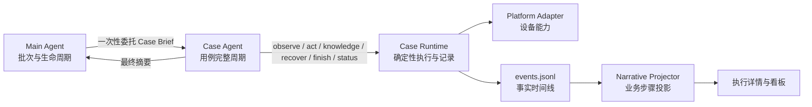
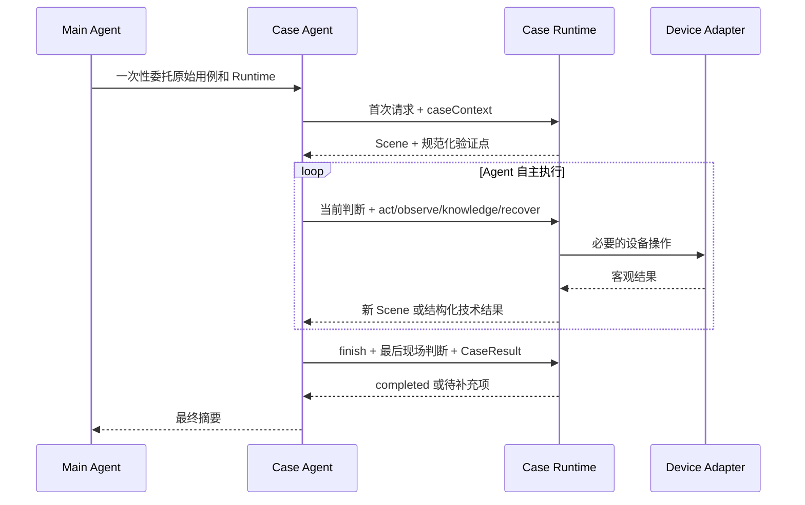
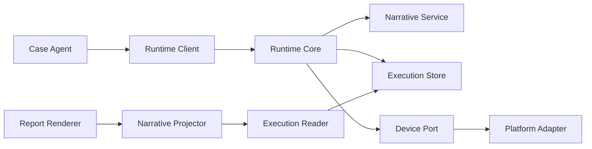

# 用例执行可追溯性技术方案

> 状态：实现中；第 14 节全量验收完成后转为已实现；015 真机回归由用户执行
> 确认日期：2026-09-04
> 适用范围：Case Agent 的用例理解、执行计划、过程决策、证据闭环和执行详情报告

## 1. 文档定位

本文基于当前 `mobile-ai-visual-test` 架构设计执行可追溯能力。后续实现、评审和验收均以本文为基线；如本文与 `docs/architecture.md` 在执行语义记录、结果完整性或报告信息架构上冲突，以本文为准，其余基础架构继续遵循 `docs/architecture.md`。

方案以简单、独立、宿主中立的执行架构为基础，只保留对业务复盘真正有价值的语义信息。

## 目录

1. 文档定位
2. 业务目标
3. 设计取舍
4. 设计原则
5. 目标架构
6. 单用例交互流程
7. Runtime 契约
8. 事件与产物闭环
9. 报告信息架构
10. 代码模块设计
11. 依赖约束
12. 协议边界
13. 测试策略
14. 验收标准
15. 实施顺序
16. 变更纪律

## 2. 业务目标

执行产物必须支持两类核心判断：

1. 对失败用例，还原失败发生在什么现场、Agent 为什么这样操作、观察到了什么以及为什么最终失败。
2. 对成功用例，证明 Agent 理解了正确的验证目标、覆盖了全部预期，并由有效现场证据支持 PASS。

每个用例执行完成后，应能从产物和报告中回答：

- Agent 如何理解原始用例。
- Agent 识别出了哪些前置条件和验证点。
- Agent 的初始执行计划是什么。
- 每一步操作基于什么现场、目的是什么、期望得到什么结果。
- 操作后观察到了什么，形成了什么结论。
- Agent 为什么继续、调整计划、恢复 App 或结束用例。
- 最终检查是否覆盖全部验证点，结论由哪些证据支持。
- 异常来自产品表现、测试判断还是技术执行环境。

记录的是可审计的业务判断摘要，不保存冗长的内部思维链，也不记录与复盘无关的框架事务细节。

## 3. 设计取舍

### 3.1 保持的架构能力

- Main Agent、Case Agent、Case Runtime、Platform Adapter 和 Report 的分层。
- 主 Agent 一次委托，Case Agent 独立负责一个用例的完整周期。
- Case Agent 直接调用唯一的 Runtime Client，主 Agent 不转发中间消息。
- `events.jsonl` 作为 execution 的唯一事实时间线。
- Scene、Capability、原子动作事务、组件摘要和 Telemetry。
- 批次暖会话、iOS Appium session 复用、增量报告和宿主平台中立。

### 3.2 业务记录范围

- 可见的用例理解和初始计划。
- 每步操作的业务目的与期望结果。
- 操作后的观察、结论和计划调整。
- 原始预期到最终检查和证据的完整关联。
- 验证点覆盖、现场证据和最终结论的一致性校验。

### 3.3 简化原则

- Case Agent 使用一个 Runtime 入口，自主完成整个用例。
- 业务语义附加到已有请求，Runtime 自动维护事件关系和技术状态。
- 知识查询、步骤数量和执行路径由 Case Agent 根据现场决定。
- Agent 委托保持宿主中立，叙事记录缺失时保留缺口并继续可执行操作。

## 4. 设计原则

1. **业务复盘优先**：只记录能够解释结果可信度和失败原因的信息。
2. **Case Agent 自主**：框架提供信息和能力，不规定 Agent 必须按固定阶段执行。
3. **记录随请求提交**：语义信息附加到现有 Runtime 请求，不为记录增加设备调用或额外流程。
4. **Runtime 自动关联**：Scene、时间、operationId、版本和证据关系由 Runtime 生成，Agent 不维护框架 ID。
5. **事实与展示分离**：Runtime 保存事实事件，Projector 生成业务步骤，Renderer 只负责展示。
6. **结果不被改写**：Runtime 校验结论是否闭合，但不替 Case Agent 修改 verdict 或 checks。
7. **单一协议**：所有新执行使用同一套契约；其他格式的 execution 需要重新执行。
8. **模块局部变化**：本需求不修改 Batch、暖会话或 Platform Adapter 的业务边界。

## 5. 目标架构



### 5.1 Main Agent

主 Agent 只负责工作空间、环境确认、批次、Case Agent 创建与等待、commit、资源释放和报告发布。单用例执行期间不读取或干预 Case Agent 的逐步决策。

### 5.2 Case Agent

一个 Case Agent 负责一个用例的完整周期：理解用例、形成计划、建立现场、执行操作、调查异常、调整路径、完成检查和提交结论。

Case Agent 只需要理解业务用例和当前 Scene。框架要求它提供简短的业务语义，但不要求理解 execution phase、事务、generation、报告生成或宿主调度。

### 5.3 Case Runtime

Case Runtime 提供稳定的设备能力并自动保存客观事实，同时接收 Case Agent 的业务语义摘要。Runtime 不理解用例业务，也不生成 PASS/FAIL。

### 5.4 Narrative Projector

Narrative Projector 是报告层的只读投影模块。它把 Agent 决策、设备动作、前后 Scene 和最终检查聚合为可阅读的业务步骤，不回写 execution 产物。

## 6. 单用例交互流程



首次 Runtime 请求携带 Agent 对原始用例的理解：没有可用 Scene 时使用 `observe`，已有可用 Scene 时可随第一个业务操作提交。之后的业务判断附加到 Agent 本来就要发起的 Runtime 请求中。最后一个现场的判断随 `finish` 提交，因此记录能力不引入单独的 `understand`、`plan` 或 `checkpoint` 调用。

## 7. Runtime 契约

### 7.1 用例上下文

Case Agent 首次调用 Runtime 时提交；以下以需要刷新现场的 `observe` 为例：

```json
{
  "operation": "observe",
  "caseContext": {
    "summary": "验证我的作品页面各类型 TAB 是否正确展示",
    "preconditions": ["用户已经登录", "能够进入创作页"],
    "expectations": [
      "页面显示全部 TAB",
      "页面显示已发布 TAB"
    ],
    "initialPlan": [
      "进入我的作品页面",
      "确认页面加载完成",
      "逐项检查作品类型 TAB"
    ],
    "uncertainties": []
  }
}
```

Runtime 规范化后返回稳定的 expectation 引用，例如 `E1`、`E2`。编号、contextVersion、时间和修订关系由 Runtime 自动生成。

Case Agent 可以在后续请求中携带修订后的 `caseContext`。Runtime 记录变更原因和新版本，但不要求 Agent 手工维护 revision。

### 7.2 当前判断和操作目的

`decision` 可以附加到 `act`、`observe`、`knowledge`、`recover` 或 `finish`：

```json
{
  "operation": "act",
  "decision": {
    "observation": "创作页已显示我的作品入口",
    "conclusion": "用例起点已经建立",
    "purpose": "进入我的作品页面",
    "expectedOutcome": "页面显示作品类型 TAB",
    "expectationRefs": ["E1", "E2"]
  },
  "capabilityId": "scene-0003:tap:el-8"
}
```

需要调整计划时增加：

```json
{
  "decision": {
    "observation": "当前页没有直接显示我的作品入口",
    "conclusion": "初始路径需要调整",
    "purpose": "先进入创作页寻找入口",
    "expectedOutcome": "创作页显示我的作品入口",
    "planUpdate": {
      "reason": "入口位置与初始预期不同",
      "next": ["先进入创作页", "再打开我的作品"]
    }
  }
}
```

Runtime 自动把 decision 绑定到当前 Scene 和随后执行的 operation。Agent 不提交 `basedOnSceneRef`、operationId 或时间戳。

下一次请求中的 observation 和 conclusion 用于解释上一次动作返回的 Scene；最后一次动作的结论由 `finish.decision` 闭合。这样可以还原每步判断，同时不增加 Runtime 调用次数。

### 7.3 知识调查闭环

知识查询保持为按需能力，不成为固定阶段。以下情况由 Case Agent 结合现场触发：现象与预期不一致、现象性质无法判断、涉及平台/版本/账号/配置差异、前置状态或执行路径异常，以及准备形成 FAIL、INCONCLUSIVE 或没有直接技术事实阻止验证点的 BLOCKED。

`knowledge` 返回候选后，Case Agent 在下一次已有请求的 `decision.knowledgeReview` 中提交候选适用性和理由。Runtime 以 `knowledgeReviewed` 保存复核，并把查询绑定到当时的 Scene、contextVersion 和 expectationRefs。零候选自动闭合为 `NO_MATCH`，不要求 Agent 再提交空评估。

适用知识影响最终检查时，check 通过 `knowledgeRefs` 引用条目 ID。引用必须来自当前 execution 已冻结的候选，且在相关验证点的调查中评估为 `APPLICABLE`。Runtime 不因查询命中直接改变 verdict。

### 7.4 最终结果

CaseResult 中的每个 check 引用规范化验证点：

```json
{
  "verdict": "PASS",
  "summary": "我的作品页面正确展示全部目标 TAB",
  "checks": [
    {
      "expectationRef": "E1",
      "status": "PASS",
      "actual": "页面顶部显示全部 TAB",
      "sceneRefs": ["scene-0005"],
      "knowledgeRefs": [],
      "technicalRefs": []
    }
  ],
  "uncertainties": []
}
```

`finish` 执行以下完整性检查：

- 每个当前有效的 expectation 都有一个最终 check。
- PASS/FAIL check 至少引用一个有效 Scene。
- check 引用有效 Scene；decision 声明 `expectationRefs` 时，报告展示验证点与相关 action、前后 Scene 的关系。
- 整体 verdict 与 checks 一致。
- FAIL、INCONCLUSIVE 和没有有效 `technicalRefs` 的 BLOCKED 已完成相关知识调查。
- `technicalRefs` 只引用当前 execution 中由 Runtime 生成、且直接阻止该验证点的技术事实。
- 知识支持的 PASS 引用了相关 `APPLICABLE` 条目。
- 未完成的验证点必须明确说明未验证原因，整体结果不得错误标记为 PASS。

检查失败时，Runtime 返回正常的结构化 `RESULT_INCOMPLETE` 响应，列出缺失项并允许 Case Agent 补充。Runtime 不用非零进程退出表示业务数据待补充，也不改写 Agent 的原始结论。

### 7.5 调用可靠性

保持 execution 内预绑定的唯一 Runtime Client：

- Case Brief 提供固定绝对 `runtime.command` 和固定 `runtime.requestPath`。
- Agent 不拼装脚本路径、设备 ID、App ID、位置参数或平台命令。
- Runtime 对所有操作返回统一 JSON；格式问题也返回结构化 `REQUEST_INVALID` 和最小可用示例。
- 叙事字段缺失不阻止设备动作，只记录 `narrativeGap`，由完成检查和报告提示记录不完整。
- Capability 与请求校验使用同一份代码定义，Prompt 示例由契约测试校验。
- Runtime Client 可从任意当前目录调用，调用方式在一个 execution 生命周期内保持不变。

该接口是本地、宿主中立的执行协议，不依赖任何宿主平台专用 Agent API。

## 8. 事件与产物闭环

### 8.1 新增业务语义事件

继续写入同一个 `events.jsonl`，只新增：

- `caseContextRecorded`：保存规范化后的理解、验证点、初始计划及修订关系。
- `agentDecisionRecorded`：保存某个 Scene 上的观察、结论、目的、期望结果和计划调整。
- `knowledgeQueried`：保存查询、现场上下文、相关验证点和冻结候选。
- `knowledgeReviewed`：保存候选适用性、理由和本次调查结论。

现有 `sceneObserved`、`actionRequested`、`actionCompleted`、`technicalIssue` 和 `caseFinished` 等事件继续表示客观执行事实。

技术事实由 Runtime 写入时自动绑定 `decisionId`、`expectationRefs`、`sceneId` 和 `generation`。只有同时满足以下条件的事实才可支撑技术 BLOCKED：事实属于当前 execution、关联该 check 的验证点、属于当前 generation、后续没有成功操作或恢复使其失效，且事实类型能够直接阻止继续验证。Case Agent 仍只复制 Runtime 返回的 `technicalFactRef`，不维护这些关联字段。

执行记录使用三态表示：

- `COMPLETE`：已记录用例理解和非空初始计划，所有 Agent 主动业务请求均有有效 decision，知识查询均已复核。
- `PARTIAL`：存在可用理解，但至少有一项语义缺口或未完成复核。
- `UNAVAILABLE`：没有可用的用例理解，无法重建 Agent 对用例的判断基础。

首次建立现场的 `observe` 只携带有效 `caseContext` 即可；之后 Agent 主动发起的 `observe`、`act`、`knowledge`、`recover` 和 `finish` 缺少 decision 时记录 `narrativeGap`，但不阻止可执行的设备操作。空初始计划同样形成记录缺口。

### 8.2 业务步骤投影

报告层按以下关系聚合一个步骤：

```text
操作前 Scene
-> Agent 当前观察与结论
-> 操作目的和期望结果
-> actionRequested / actionCompleted
-> 操作后 Scene
-> 下一次决策中的操作后结论
```

observe、knowledge 和 recover 同样进入时间线，但纯轮询、锁等待、文件写入等内部技术细节只进入技术信息，不占用业务步骤。

### 8.3 正式产物

正式产物保持收敛：

```text
execution.json
binding.snapshot.json
case.snapshot.json
source.snapshot.md
events.jsonl
scenes/
screenshots/
layouts/
logs/
operations/
knowledge/
telemetry/
coordinate-audits/
result.json
metrics.json
artifact-manifest.json
completion.json
```

不重新创建 `understanding.json`、`plan.json`、`turns/` 或 `checkpoints/`。理解和计划由 `events.jsonl` 保存，报告通过只读 Projector 生成展示模型，避免出现多份可漂移事实源。

## 9. 报告信息架构

用例详情页提供三个视图。

### 9.1 执行复盘

默认视图按业务阅读顺序展示：

1. 结果摘要和执行可信度。
2. 原始用例。
3. Agent 用例理解、验证点和不确定项。
4. 真正的初始执行计划，以及后续计划调整历史。
5. 按时间聚合的完整业务步骤。
6. 知识查询、候选适用性及其对结论的影响。
7. 独立的最终判断。
8. 最终验证点、相关步骤、现场证据、知识依据和直接技术事实；技术事实展示 code、message、时间、关联操作和当前有效状态。

### 9.2 证据

集中展示操作前后截图、Scene、目标元素或坐标标记，以及证据与验证点的关联。

### 9.3 技术信息

展示 Runtime 和 Adapter 耗时、调用格式问题、设备错误、恢复、generation、暖会话信息及可折叠的原始事件和日志。Agent 与调度间隔进一步拆为首次准备、步骤决策、结论整理和未归类间隔；这些是调用间隔，不表述为纯模型思考时间。

主看板点击用例时直接进入该用例最新平台执行详情。批次总览保留结果、耗时和异常摘要，不在总览重复完整过程。

## 10. 代码模块设计

### 10.1 Case Runtime

- `scripts/case-runtime/contract.js`：定义 `caseContext`、`decision` 和 CaseResult。
- `scripts/case-runtime/narrative-service.js`：规范化上下文、分配验证点 ID、持久化语义事件。
- `scripts/case-runtime/knowledge-review.js`：规范化候选评估、绑定查询与验证点，并提供结果校验索引。
- `scripts/case-runtime/runtime-core.js`：在对应设备操作前写入 decision，保证操作与目的顺序一致。
- `scripts/case-runtime/result-integrity.js`：验证 expectation、check、Scene、坐标覆盖图、知识和技术事实引用的闭环关系。
- `scripts/lib/technical-facts.js`：统一技术事实类型、稳定引用和报告归因。
- 保持 `runtime-client.js` 为 Case Agent 唯一入口，不把语义逻辑写入 Client。

### 10.2 Report

- `scripts/report/execution-narrative.js`：从事件投影理解、计划、业务步骤、操作前后 Scene 和验证覆盖。
- `scripts/report/current-report.js`：只消费 Narrative ViewModel，不自行匹配底层事件。
- `scripts/report/current-index.js`：详情链接直达最新平台 execution。
- Execution Reader 只读取当前协议，不承担格式转换。

### 10.3 不应变化的模块

- Batch 调度和 Case Agent 一次委托机制。
- `scripts/session/` 暖会话生命周期。
- iOS Appium session 复用策略。
- Platform Adapter 的设备能力协议。
- Workspace 用例导入和环境确认流程。

若实现中必须修改这些模块，应先更新本文说明必要性和影响范围，再进行代码变更。

## 11. 依赖约束



依赖规则：

1. Narrative Service 只负责语义规范化和事件保存，不调用设备。
2. Result Integrity 只校验闭环，不生成或修改业务 verdict。
3. Narrative Projector 只读 execution，不依赖 Runtime Core 或 Platform Adapter。
4. Renderer 不直接解析 `events.jsonl`，所有聚合逻辑位于 Projector。
5. Execution Reader 不被 execution 写入路径依赖。
6. Batch 和暖会话不依赖叙事事件内容。

## 12. 协议边界

- Runtime、Reader、Report 和测试只实现当前协议。
- CaseResult 使用 `expectationRef` 关联验证点，不包含协议选择字段。
- 不属于当前协议的 execution 不恢复、不转换、不重新生成报告，并明确提示重新执行。
- 已经生成的静态报告和历史文件不删除、不改写。

## 13. 测试策略

### 13.1 契约测试

- `caseContext` 首次请求提交、修订和 ID 自动分配。
- 所有 Runtime 操作可携带 decision，缺失 decision 不导致设备调用失败。
- Prompt 中每个请求示例均可由 Runtime 成功解析。
- 错误请求返回结构化 JSON，不出现 Agent 可见的脚本用法错误。
- Runtime Client 从任意当前目录调用时仍使用预绑定 execution。

### 13.2 完整性测试

- 漏掉任一验证点时不能完成可信 PASS。
- PASS check 无 Scene 证据时返回待补充项。
- FAIL、INCONCLUSIVE 和 BLOCKED 的 checks 与整体 verdict 一致。
- 负向结果缺少相关知识调查时返回待补充项，零命中或候选不适用视为有效调查。
- 历史瞬态技术事件不能豁免后续业务 BLOCKED；有效 `technicalRefs` 可以形成技术 BLOCKED。
- 知识支持的 PASS 必须引用已查询、已冻结且评估为适用的条目。
- 坐标覆盖图必须按 action operationId 独立保存并进入证据图。
- Case Agent 原始 result 在 commit 和报告发布过程中不被改写。

### 13.3 叙事投影测试

- decision、action、前后 Scene 正确聚合为一个业务步骤。
- 最后一次动作由 `finish.decision` 闭合，finish 独立投影为最终判断而非设备执行步骤。
- action、observe、knowledge、recover 和计划调整按时间正确展示，操作后 Scene 关联完整。
- 执行步骤展示关联验证点文本和最终状态，最终检查展示相关步骤。
- 坐标覆盖图进入截图查看器并与操作前截图叠加。
- 缺少必需语义的当前 execution 明确显示记录缺口，不生成虚构内容。

### 13.4 端到端测试

- 单用例 PASS、FAIL、INCONCLUSIVE、BLOCKED。
- 批量串行执行和 Case Agent 隔离。
- 批次暖会话和 iOS session 复用。
- 双用例批次只启动一次 App，第二个 execution 明确标记暖状态复用。
- 动作后中断、continuation Agent 恢复和 finish 重试。
- 015 真机回归：调用次数、格式错误、耗时分布、验证点覆盖和报告复盘。

## 14. 验收标准

1. 一个 Case Agent 仍完整负责一个用例，主 Agent 不进入中间执行链路。
2. 用例理解、验证点、初始计划、步骤目的、现场结论和计划调整均能从正式产物恢复。
3. 记录语义不增加独立 Runtime 调用，也不增加设备操作次数。
4. 每个必需验证点均有最终 check；PASS 有有效 Scene 证据。
5. 报告能解释失败原因，也能证明成功覆盖了正确目标。
6. Agent 不需要管理 phase、revision、turn、checkpoint、operationId 或证据文件路径。
7. Runtime 调用方式固定，常规执行不出现路径、参数或脚本用法错误。
8. 业务失败、技术异常和记录不完整在报告中明确区分。
9. 暖会话、批次调度和平台 Adapter 行为不因本需求退化。
10. 非当前协议的 execution 被明确拒绝并提示重新执行。

### 14.1 闭环验收矩阵

| 业务信息 | 写入 | 校验 | 投影 | 展示 | 自动化测试 |
| --- | --- | --- | --- | --- | --- |
| 用例理解 | `caseContextRecorded` | 必填语义与验证点唯一性 | `understandingHistory`、当前理解 | 用例理解及修订记录 | 契约、叙事投影、报告测试 |
| 初始与调整计划 | 首次 `initialPlan`、后续 `planUpdate` | 空初始计划形成缺口，调整计划语义有效 | `initialPlan`、`planHistory` | 初始计划与计划调整分开展示 | 记录完整性、叙事投影测试 |
| 每步业务判断 | `agentDecisionRecorded` | 后续主动请求缺 decision 形成缺口 | `steps`、`finalDecision` | 操作目的、预期、观察和结论 | Runtime、叙事投影、报告测试 |
| 知识调查 | `knowledgeQueried`、`knowledgeReviewed` | 负向结论调查闭合、适用引用有效 | `knowledgeInvestigations`、check 知识 | 候选、适用性及结论影响 | 知识闭环、结果矩阵测试 |
| 技术事实 | Runtime 技术事实事件及自动关联 | execution、验证点、generation、有效性和类型 | check 的完整 `technicalFacts` | code、message、时间、操作、状态 | 技术事实反向测试、报告测试 |
| 记录可信度 | `narrativeGap` 与已有语义事件 | 三态计算规则 | `recordingStatus`、`gaps` | 完整、部分、不可用 | 记录状态与空计划测试 |

只有矩阵每一行的五段链路均有实现且相应测试通过，本文状态才能改为“已实现”。015 真机执行由用户单独完成，不属于自动化实现步骤。

## 15. 实施顺序

### 阶段一：契约与测试基线

1. 固化事件和 CaseResult 契约。
2. 先增加失败测试，覆盖验证点遗漏、叙事聚合和调用可靠性。
3. 建立 Reader 拒绝非当前协议的测试样例。

完成标准：契约、输入输出和协议边界可以独立评审。

### 阶段二：Runtime 记录闭环

1. 实现 Narrative Service。
2. 在现有请求中接入 caseContext 和 decision。
3. 扩展 Result Integrity 和 `status` 恢复上下文。

完成标准：Fake Adapter 下能生成完整、可恢复的事实时间线，设备调用次数不增加。

### 阶段三：报告投影与详情页

1. 实现 Narrative Projector。
2. 重构详情页三个视图。
3. 修复主看板详情入口和无效指标。

完成标准：不读取 Agent 原生会话，仅靠正式 execution 产物即可还原执行过程。

### 阶段四：回归与文档收敛

1. 保持关键端到端、暖会话和角色边界测试覆盖当前架构。
2. 执行全量自测和三平台契约测试。
3. 在获得单独授权后，用 015 进行真机回归并复核报告。
4. 根据最终契约更新 `prompts/case-agent.md`、接口参考和总架构，删除重复说明。

完成标准：第 14 节全部验收项通过，且没有遗留双协议写入路径。

## 16. 变更纪律

后续实现遵循以下约束：

- 每个阶段开始前先读取本文和相关模块，按阶段范围修改。
- 如果实现需要改变已冻结的角色边界、事件事实源、一次委托模式或暖会话策略，先更新方案并说明业务原因。
- 不以顺手重构为理由扩大改动范围。
- 每完成一个阶段，同步更新测试和本文实施状态，避免代码与设计再次漂移。
- 最终以业务验收结果判断完成，不以新增字段或页面展示完成代替证据闭环。
